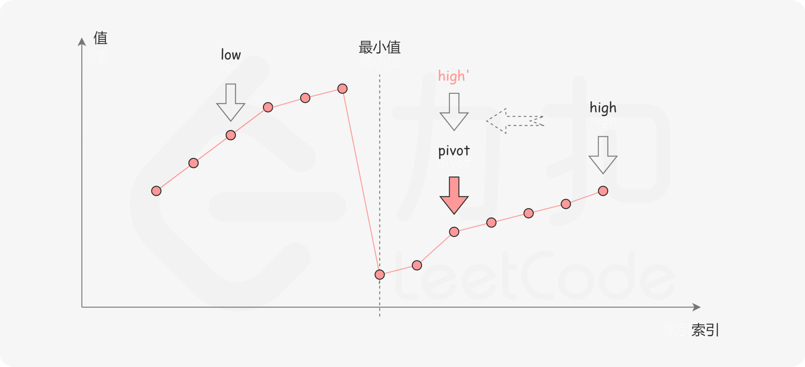
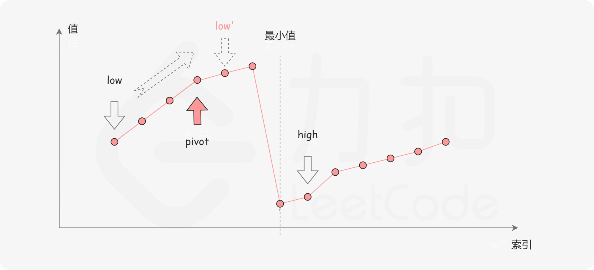

[#0153-find-minimum-in-rotated-sorted-array]
= 153. Find Minimum in Rotated Sorted Array

{leetcode}/problems/find-minimum-in-rotated-sorted-array/[LeetCode - Find Minimum in Rotated Sorted Array^]

Suppose an array sorted in ascending order is rotated at some pivot unknown to you beforehand.

(i.e.,  `[0,1,2,4,5,6,7]` might become  `[4,5,6,7,0,1,2]`).

Find the minimum element.

You may assume no duplicate exists in the array.

*Example 1:*

[subs="verbatim,quotes,macros"]
----
*Input:* [3,4,5,1,2] 
*Output:* 1
----

*Example 2:*

[subs="verbatim,quotes,macros"]
----
*Input:* [4,5,6,7,0,1,2]
*Output:* 0
----

== 思路分析

最省事的方式当然是遍历，但是，中等难度的题目不可能一个遍历就解决了。

针对有序数组，首先想到的就是二分查找。但是，这里的二分查找有需要做些特别处理：要判断最低点在哪个区间。

[[src-0153]]
[tabs]
====
一刷::
+
--
[{java_src_attr}]
----
include::{sourcedir}/_0153_FindMinimumInRotatedSortedArray.java[tag=answer]
----
--

二刷::
+
--
[{java_src_attr}]
----
include::{sourcedir}/_0153_FindMinimumInRotatedSortedArray_2.java[tag=answer]
----
--
====

== 参考资料

. https://leetcode.cn/problems/find-minimum-in-rotated-sorted-array/solutions/698479/xun-zhao-xuan-zhuan-pai-xu-shu-zu-zhong-5irwp/[153. 寻找旋转排序数组中的最小值 - 官方题解^]
