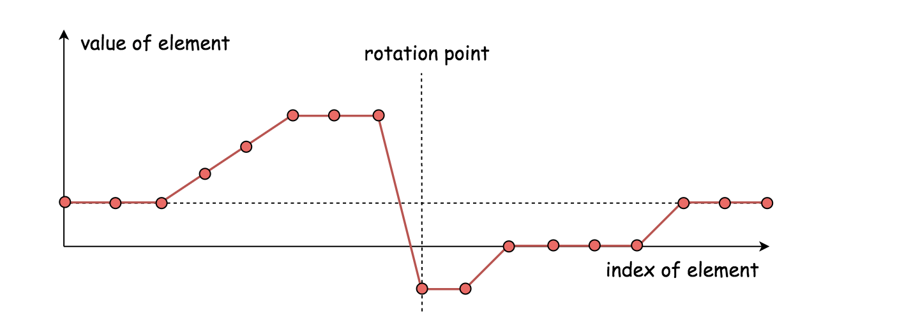
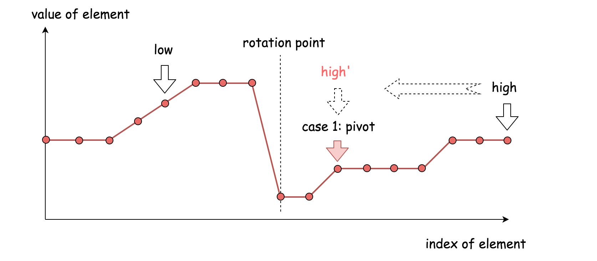
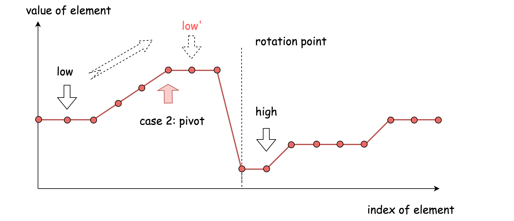
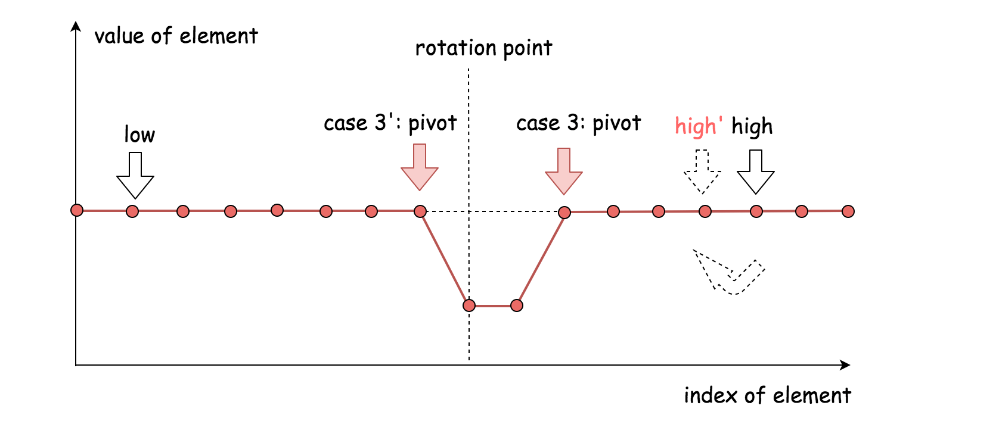

[#0154-find-minimum-in-rotated-sorted-array-ii]
= 154. Find Minimum in Rotated Sorted Array II

{leetcode}/problems/find-minimum-in-rotated-sorted-array-ii/[LeetCode - Find Minimum in Rotated Sorted Array II^]

Suppose an array sorted in ascending order is rotated at some pivot unknown to you beforehand.

(i.e.,  `[0,1,2,4,5,6,7]` might become  `[4,5,6,7,0,1,2]`).

Find the minimum element.

The array may contain duplicates.

*Example 1:*

[subs="verbatim,quotes,macros"]
----
*Input:* [1,3,5]
*Output:* 1
----

*Example 2:*

[subs="verbatim,quotes,macros"]
----
*Input:* [2,2,2,0,1]
*Output:* 0
----

*Note:*

* This is a follow up problem to <a href="{leetcode}/problems/find-minimum-in-rotated-sorted-array/description/">Find Minimum in Rotated Sorted Array</a>.
* Would allow duplicates affect the run-time complexity? How and why?

== 思路分析

这个算法的主结构跟二分查找是一样的：

* 维护两个指针 `low`、`high`，使其代表查找范围的左边界和右边界。
* 移动指针来缩小查找范围，通常将指针移动到 `low`、`high` 的中间(`pivot = (low + high)/2`)。这样查找范围就可以缩小一半，这也是二分查找名字的由来。
* 在找到目标元素或者两个指针重合时(low == high)，算法终止。

在传统的二分查找中，会将中轴元素(`nums[pivot]`)与目标元素相比较。但在这个问题里面，需要将中轴元素与右边界元素(`nums[high]`)相比较。

*二分查找算法的难点在于如何更新左右边界指针。*

. `nums[pivot] < nums[high]`
+

+
中轴元素跟右边界元素在**同一半边**。这时候最小元素在中轴元素**左边**，将右边界指针移动到中轴元素位置（`high = pivot`）。
+
. `nums[pivot] > nums[high]`
+

+
中轴元素跟右边界届元素在**不同半边**。这时候最小元素在中轴元素**右边**，将下届指针移动到中轴元素位置右边（`low = pivot + 1`）。
+
. `nums[pivot] == nums[high]`
+

+
在这种情况下，不能确定最小元素在中轴元素的左边还是右边。
+
为了缩小查找范围，安全的方法是将右边界指针减一（`high = high - 1`）。
+
上述策略可以有效地避免死循环，同时可以保证永远不会跳过最小元素。

综上所述，这个算法跟二分查找有两处不同：

* 这里我们将中轴元素与右边界元素相比较，传统的二分查找将中轴元素与目标元素相对比。
* 当比较结果相同时，这里我们将左移右边界指针，而在传统的二分查找中直接返回结果。

[[src-0154]]
[tabs]
====
一刷::
+
--
[{java_src_attr}]
----
include::{sourcedir}/_0154_FindMinimumInRotatedSortedArrayII.java[tag=answer]
----
--

二刷::
+
--
[{java_src_attr}]
----
include::{sourcedir}/_0154_FindMinimumInRotatedSortedArrayII_2.java[tag=answer]
----
--
====

== 参考资料

. https://leetcode.cn/problems/find-minimum-in-rotated-sorted-array-ii/solutions/9474/154-find-minimum-in-rotated-sorted-array-ii-by-jyd/?envType=study-plan-v2&envId=selected-coding-interview[154. 寻找旋转排序数组中的最小值 II - 二分查找，清晰图解^]

