[#0154-find-minimum-in-rotated-sorted-array-ii]
= 154. 寻找旋转排序数组中的最小值 II

https://leetcode.cn/problems/find-minimum-in-rotated-sorted-array-ii/[LeetCode - 154. 寻找旋转排序数组中的最小值 II^]

已知一个长度为 `n` 的数组，预先按照升序排列，经由 `1` 到 `n` 次 *旋转* 后，得到输入数组。例如，原数组 `nums = [0,1,4,4,5,6,7]` 在变化后可能得到：

* 若旋转 `4` 次，则可以得到 `+[4,5,6,7,0,1,4]+`
* 若旋转 `7` 次，则可以得到 `+[0,1,4,4,5,6,7]+`

注意，数组 `[a[0], a[1], a[2], ..., a[n-1]]` *旋转一次* 的结果为数组 `[a[n-1], a[0], a[1], a[2], ..., a[n-2]]` 。

给你一个可能存在 *重复* 元素值的数组 `nums`，它原来是一个升序排列的数组，并按上述情形进行了多次旋转。请你找出并返回数组中的 *最小元素*。

你必须尽可能减少整个过程的操作步骤。

*示例 1：*

....
输入：nums = [1,3,5]
输出：1
....

*示例 2：*

....
输入：nums = [2,2,2,0,1]
输出：0
....

*提示：*

* `n == nums.length`
* `1 \<= n \<= 5000`
* `-5000 \<= nums[i] \<= 5000`
* `nums` 原来是一个升序排序的数组，并进行了 `1` 至 `n` 次旋转

**进阶：**这道题与 https://leetcode-cn.com/problems/find-minimum-in-rotated-sorted-array/description/[寻找旋转排序数组中的最小值] 类似，但 `nums` 可能包含重复元素。允许重复会影响算法的时间复杂度吗？会如何影响，为什么？

== 思路分析

这个算法的主结构跟二分查找是一样的：

* 维护两个指针 `low`、`high`，使其代表查找范围的左边界和右边界。
* 移动指针来缩小查找范围，通常将指针移动到 `low`、`high` 的中间(`pivot = (low + high)/2`)。这样查找范围就可以缩小一半，这也是二分查找名字的由来。
* 在找到目标元素或者两个指针重合时(low == high)，算法终止。

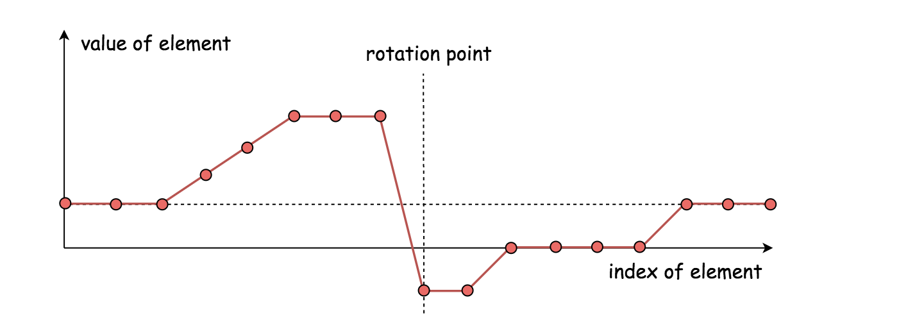

在传统的二分查找中，会将中轴元素(`nums[pivot]`)与目标元素相比较。但在这个问题里面，需要将中轴元素与右边界元素(`nums[high]`)相比较。

*二分查找算法的难点在于如何更新左右边界指针。*

. `nums[pivot] < nums[high]`
+
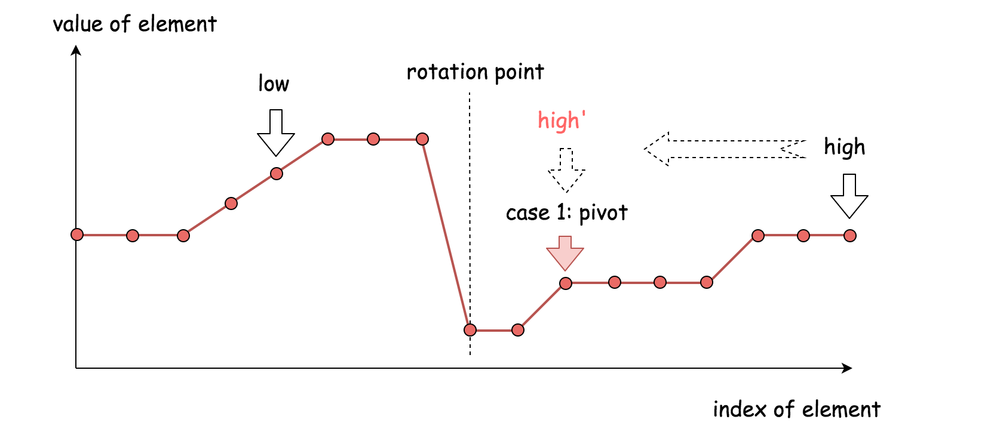
+
中轴元素跟右边界元素在**同一半边**。这时候最小元素在中轴元素**左边**，将右边界指针移动到中轴元素位置（`high = pivot`）。
+
. `nums[pivot] > nums[high]`
+
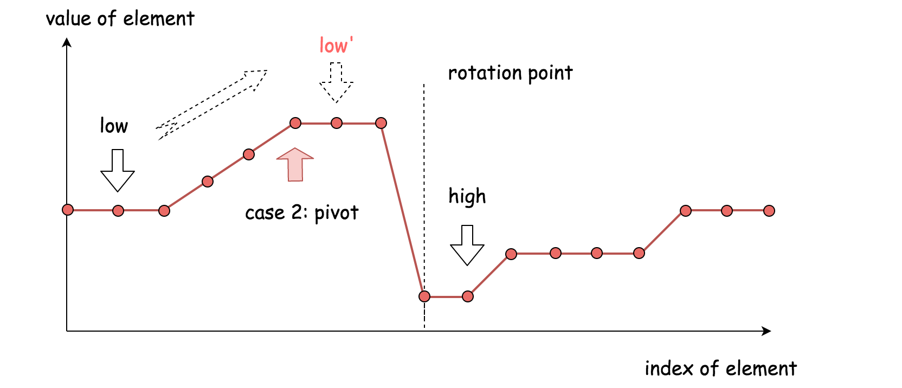
+
中轴元素跟右边界届元素在**不同半边**。这时候最小元素在中轴元素**右边**，将下届指针移动到中轴元素位置右边（`low = pivot + 1`）。
+
. `nums[pivot] == nums[high]`
+
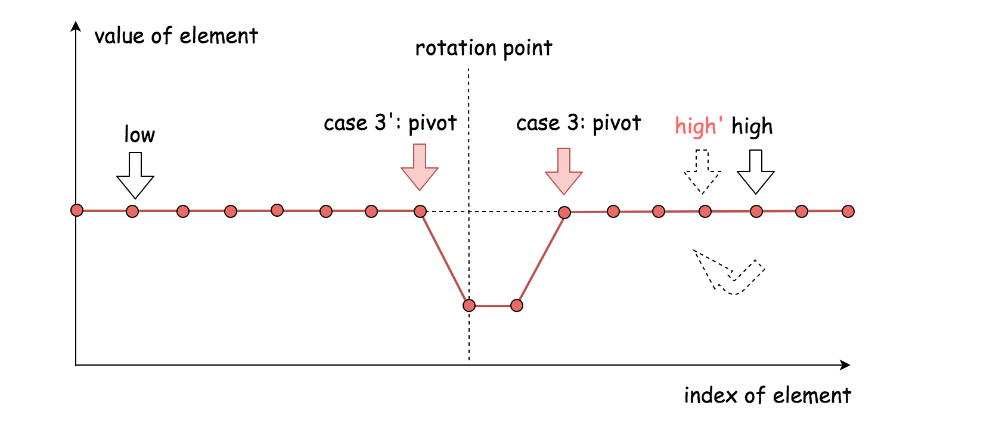
+
在这种情况下，不能确定最小元素在中轴元素的左边还是右边。
+
为了缩小查找范围，安全的方法是将右边界指针减一（`high = high - 1`）。
+
上述策略可以有效地避免死循环，同时可以保证永远不会跳过最小元素。

综上所述，这个算法跟二分查找有两处不同：

* 这里我们将中轴元素与右边界元素相比较，传统的二分查找将中轴元素与目标元素相对比。
* 当比较结果相同时，这里我们将左移右边界指针，而在传统的二分查找中直接返回结果。

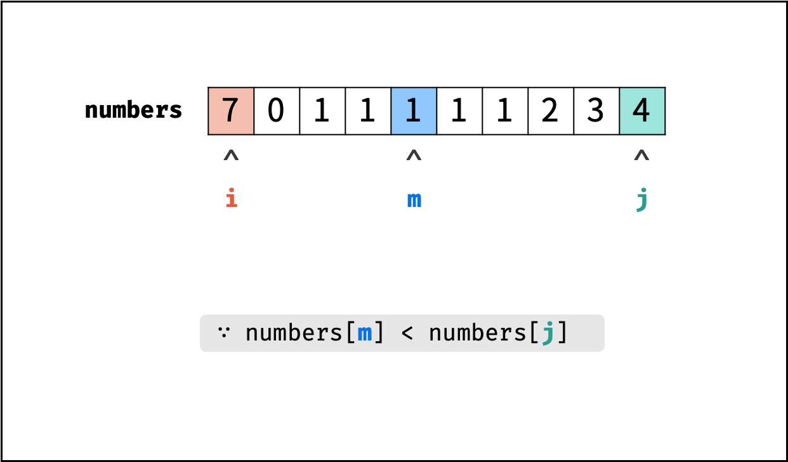

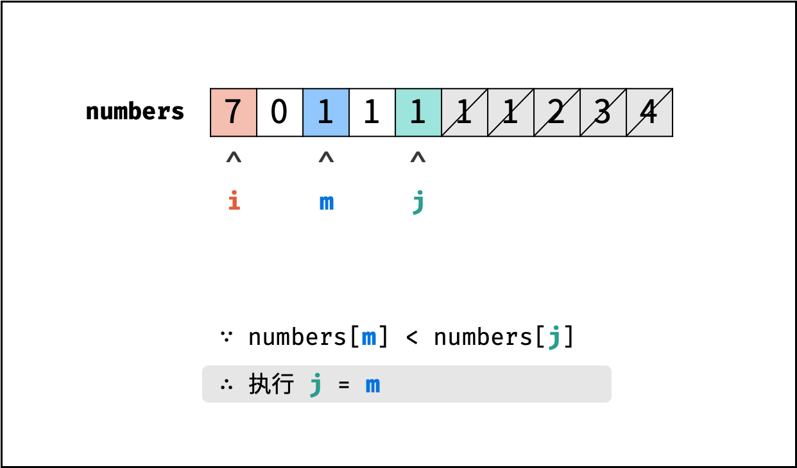

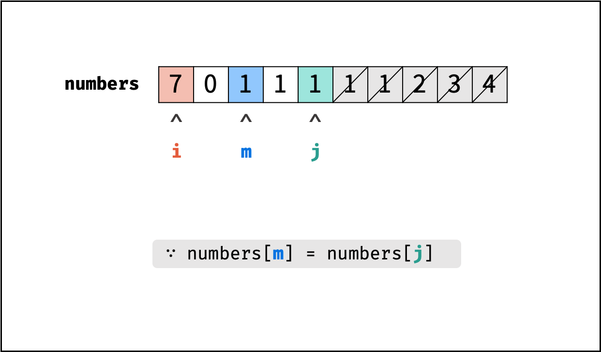

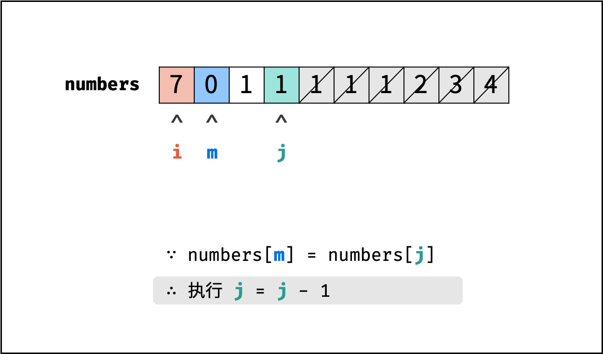

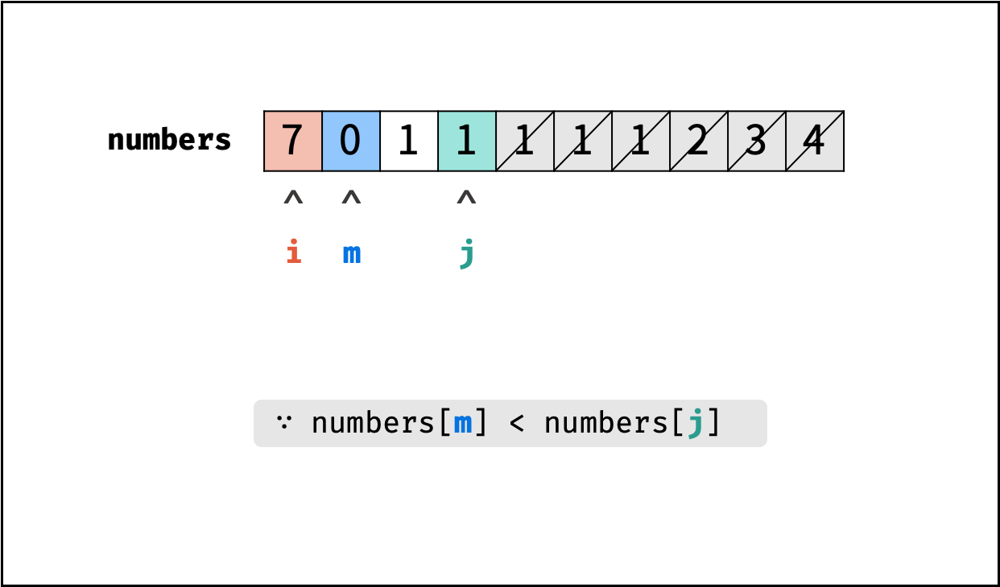

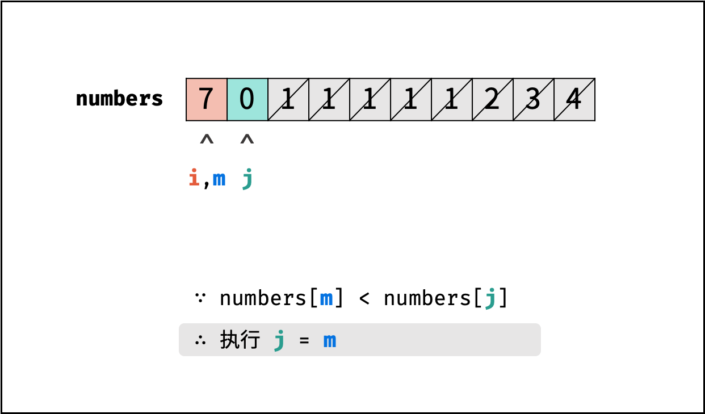

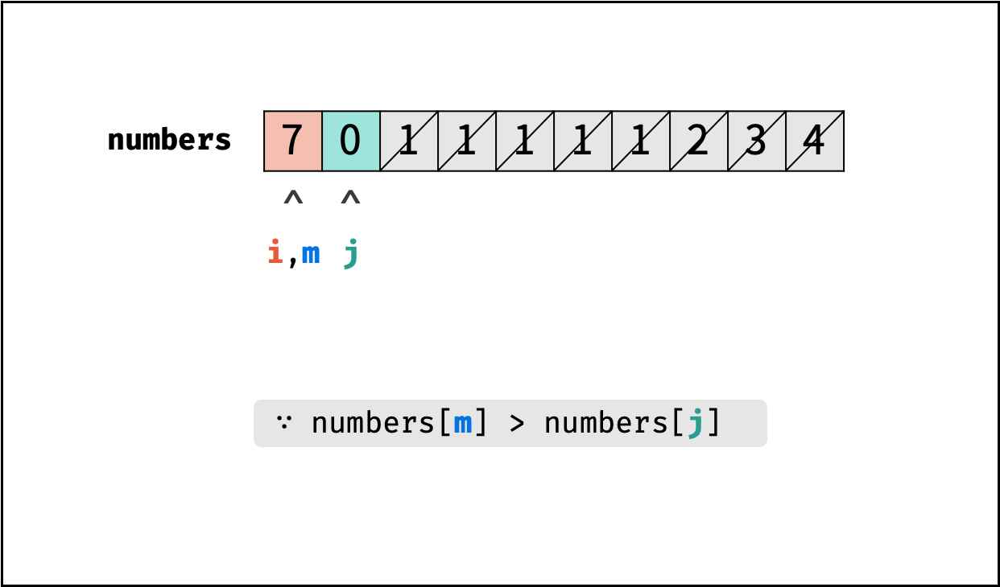

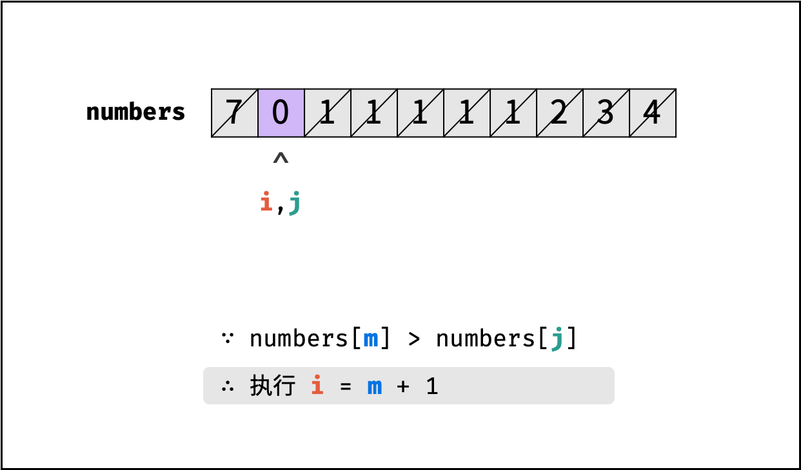

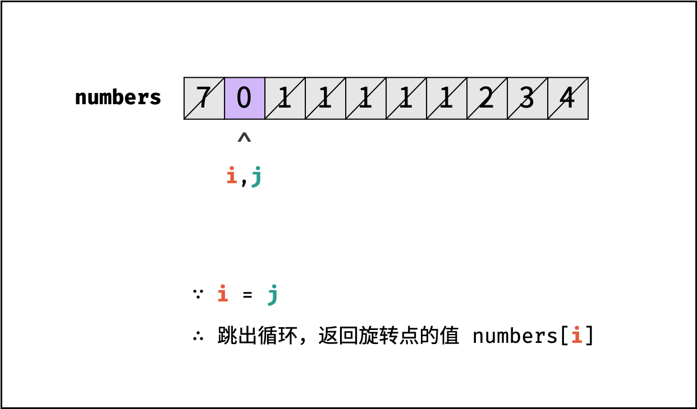

[[src-0154]]
[tabs]
====
一刷::
+
--
[{java_src_attr}]
----
include::{sourcedir}/_0154_FindMinimumInRotatedSortedArrayII.java[tag=answer]
----
--

二刷::
+
--
[{java_src_attr}]
----
include::{sourcedir}/_0154_FindMinimumInRotatedSortedArrayII_2.java[tag=answer]
----
--

三刷::
+
--
[{java_src_attr}]
----
include::{sourcedir}/_0154_FindMinimumInRotatedSortedArrayII_3.java[tag=answer]
----
--
====

== 参考资料

. https://leetcode.cn/problems/find-minimum-in-rotated-sorted-array-ii/solutions/9474/154-find-minimum-in-rotated-sorted-array-ii-by-jyd/[154. 寻找旋转排序数组中的最小值 II - 二分查找，清晰图解^]
. https://leetcode.cn/problems/find-minimum-in-rotated-sorted-array-ii/solutions/340800/xun-zhao-xuan-zhuan-pai-xu-shu-zu-zhong-de-zui--16/[154. 寻找旋转排序数组中的最小值 II - 官方题解^]
