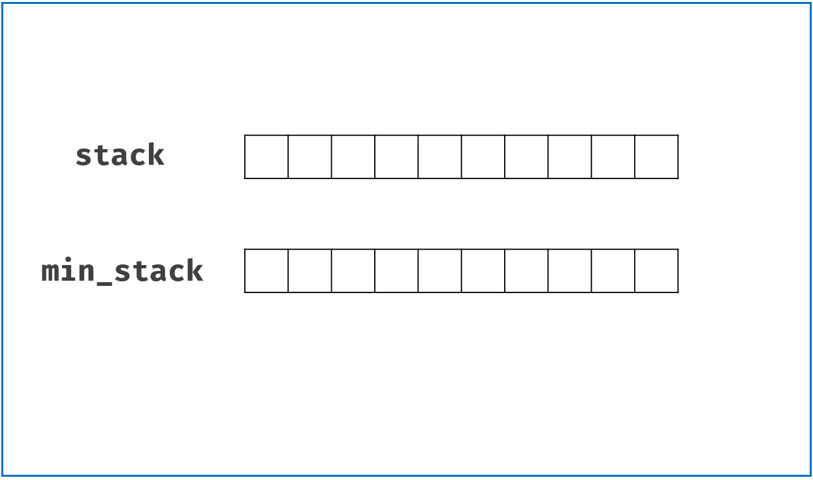

[#0155-min-stack]
= 155. 最小栈

https://leetcode.cn/problems/min-stack/[LeetCode - 155. 最小栈^]

设计一个支持 `push` ，`pop` ，`top` 操作，并能在常数时间内检索到最小元素的栈。

实现 `MinStack` 类:

* `MinStack()` 初始化堆栈对象。
* `void push(int val)` 将元素val推入堆栈。
* `void pop()` 删除堆栈顶部的元素。
* `int top()` 获取堆栈顶部的元素。
* `int getMin()` 获取堆栈中的最小元素。

*示例 1:*

....
输入：
["MinStack","push","push","push","getMin","pop","top","getMin"]
[[],[-2],[0],[-3],[],[],[],[]]

输出：
[null,null,null,null,-3,null,0,-2]

解释：
MinStack minStack = new MinStack();
minStack.push(-2);
minStack.push(0);
minStack.push(-3);
minStack.getMin();   --> 返回 -3.
minStack.pop();
minStack.top();      --> 返回 0.
minStack.getMin();   --> 返回 -2.
....

*提示：*

* `-2^31^ \<= val \<= 2^31^ - 1`
* `pop`、`top` 和 `getMin` 操作总是在 *非空栈* 上调用
* `push`, `pop`, `top`, and `getMin`最多被调用 `3 * 10^4^` 次

== 思路分析

使用两个栈，一个栈存原始数据，另外一个栈存当前栈的最小值。

image::images/0155-10.gif[{image_attr}]

不比每次都向最小栈里面添加数据，只在出现更小值的时候才向最小栈中添加数据。如下图：

// TODO 这道题解法还挺多。只使用一个栈的方案，还需要再思考思考。

[[src-0155]]
[tabs]
====
一刷::
+
--
[{java_src_attr}]
----
include::{sourcedir}/_0155_MinStack.java[tag=answer]
----
--

二刷::
+
--
[{java_src_attr}]
----
include::{sourcedir}/_0155_MinStack_2.java[tag=answer]
----
--

三刷::
+
--
[{java_src_attr}]
----
include::{sourcedir}/_0155_MinStack_3.java[tag=answer]
----
--

四刷::
+
--
[{java_src_attr}]
----
include::{sourcedir}/_0155_MinStack_4.java[tag=answer]
----
--
====

== 参考资料

. https://leetcode.cn/problems/min-stack/solutions/2974438/ben-zhi-shi-wei-hu-qian-zhui-zui-xiao-zh-x0g8/[155. 最小栈 - 本质是维护前缀最小值，简洁写法！附变形题^] -- 使用数对，就可以只使用一个栈来完成。
. https://leetcode.cn/problems/min-stack/solutions/42521/xiang-xi-tong-su-de-si-lu-fen-xi-duo-jie-fa-by-38/[155. 最小栈 - 详细通俗的思路分析，多解法^]
. https://leetcode.cn/problems/min-stack/solutions/242190/zui-xiao-zhan-by-leetcode-solution/[155. 最小栈 - 官方题解^]
. https://leetcode.cn/problems/min-stack/solutions/13496/shi-yong-fu-zhu-zhan-tong-bu-he-bu-tong-bu-python-/[155. 最小栈 - 使用辅助栈（同步和不同步，Python 代码、Java 代码）^]
. https://leetcode.cn/problems/min-stack/solutions/9036/min-stack-fu-zhu-stackfa-by-jin407891080/[155. 最小栈 - 辅助栈法，清晰图解^]

