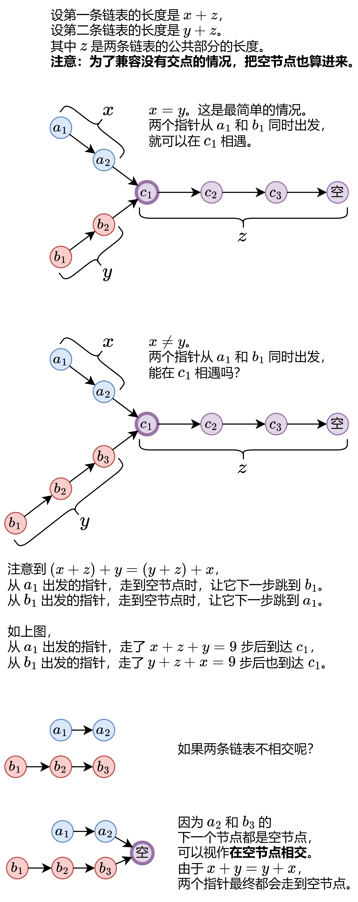

[#0160-intersection-of-two-linked-lists]
= 160. 相交链表

https://leetcode.cn/problems/intersection-of-two-linked-lists/[LeetCode - 160. 相交链表^]

给你两个单链表的头节点 `headA` 和 `headB`，请你找出并返回两个单链表相交的起始节点。如果两个链表不存在相交节点，返回
`null` 。

图示两个链表在节点 `c1` 开始相交**：**

image::images/0160-01.png[{image_attr}]

题目数据 *保证* 整个链式结构中不存在环。

*注意*，函数返回结果后，链表必须 *保持其原始结构* 。

*自定义评测：*

*评测系统* 的输入如下（你设计的程序 *不适用* 此输入）：

* `intersectVal` - 相交的起始节点的值。如果不存在相交节点，这一值为 `0`
* `listA` - 第一个链表
* `listB` - 第二个链表
* `skipA` - 在 `listA` 中（从头节点开始）跳到交叉节点的节点数
* `skipB` - 在 `listB` 中（从头节点开始）跳到交叉节点的节点数

评测系统将根据这些输入创建链式数据结构，并将两个头节点 `headA` 和 `headB` 传递给你的程序。如果程序能够正确返回相交节点，那么你的解决方案将被 *视作正确答案*。

*示例 1：*

image::images/0160-02.png[{image_attr}]

....
输入：intersectVal = 8, listA = [4,1,8,4,5], listB = [5,6,1,8,4,5], skipA = 2, skipB = 3
输出：Intersected at '8'
解释：相交节点的值为 8 （注意，如果两个链表相交则不能为 0）。
从各自的表头开始算起，链表 A 为 [4,1,8,4,5]，链表 B 为 [5,6,1,8,4,5]。
在 A 中，相交节点前有 2 个节点；在 B 中，相交节点前有 3 个节点。
— 请注意相交节点的值不为 1，因为在链表 A 和链表 B 之中值为 1 的节点 (A 中第二个节点和 B 中第三个节点) 是不同的节点。换句话说，它们在内存中指向两个不同的位置，而链表 A 和链表 B 中值为 8 的节点 (A 中第三个节点，B 中第四个节点) 在内存中指向相同的位置。
....

*示例 2：*

image::images/0160-03.png[{image_attr}]

....
输入：intersectVal = 2, listA = [0,9,1,2,4], listB = [3,2,4], skipA = 3, skipB = 1
输出：Intersected at '2'
解释：相交节点的值为 2 （注意，如果两个链表相交则不能为 0）。
从各自的表头开始算起，链表 A 为 [1,9,1,2,4]，链表 B 为 [3,2,4]。
在 A 中，相交节点前有 3 个节点；在 B 中，相交节点前有 1 个节点。
....

*示例 3：*

image::images/0160-04.png[{image_attr}]

....
输入：intersectVal = 0, listA = [2,6,4], listB = [1,5], skipA = 3, skipB = 2
输出：null
解释：从各自的表头开始算起，链表 A 为 [2,6,4]，链表 B 为 [1,5]。
由于这两个链表不相交，所以 intersectVal 必须为 0，而 skipA 和 skipB 可以是任意值。
这两个链表不相交，因此返回 null 。
....

*提示：*

* `listA` 中节点数目为 `m`
* `listB` 中节点数目为 `n`
* `1 \<= m, n \<= 3 * 10^4^`
* `1 \<= Node.val \<= 10^5^`
* `+0 <= skipA <= m+`
* `+0 <= skipB <= n+`
* 如果 `listA` 和 `listB` 没有交点，`intersectVal` 为 `0`
* 如果 `listA` 和 `listB` 有交点，`+intersectVal == listA[skipA] == listB[skipB]+`

**进阶：**你能否设计一个时间复杂度 `+O(m + n)+` 、仅用 `+O(1)+` 内存的解决方案？

== 思路分析

没想到竟然可以将两个链表"相加"就可以得出正确结果：两个"相加"，正好两个长度相等，最后部分就是重叠部分，双指针完美搞定！

链表 `x+z` 和 `y+z`，两个想拼接，则是 `(x+z+y)+z` 和 `(y+z+x)+z`，就可以通过相同的步骤找到最后的共同部分 `z`。

[[src-0160]]
[tabs]
====
一刷::
+
--
[{java_src_attr}]
----
include::{sourcedir}/_0160_IntersectionOfTwoLinkedLists.java[tag=answer]
----
--

二刷::
+
--
[{java_src_attr}]
----
include::{sourcedir}/_0160_IntersectionOfTwoLinkedLists_2.java[tag=answer]
----
--

三刷::
+
--
[{java_src_attr}]
----
include::{sourcedir}/_0160_IntersectionOfTwoLinkedLists_3.java[tag=answer]
----
--

四刷::
+
--
[{java_src_attr}]
----
include::{sourcedir}/_0160_IntersectionOfTwoLinkedLists_4.java[tag=answer]
----
--
====

== 参考资料

. https://leetcode.cn/problems/intersection-of-two-linked-lists/solutions/2958778/tu-jie-yi-zhang-tu-miao-dong-xiang-jiao-m6tg1/[160. 相交链表 - 【图解】一张图秒懂相交链表！^]
. https://leetcode.cn/problems/intersection-of-two-linked-lists/solutions/10774/tu-jie-xiang-jiao-lian-biao-by-user7208t/[160. 相交链表 - 图解相交链表^]
. https://leetcode.cn/problems/intersection-of-two-linked-lists/solutions/811625/xiang-jiao-lian-biao-by-leetcode-solutio-a8jn/[160. 相交链表 - 官方题解^]
. https://leetcode.cn/problems/intersection-of-two-linked-lists/solutions/12624/intersection-of-two-linked-lists-shuang-zhi-zhen-l/[160. 相交链表 - 双指针，清晰图解^]
