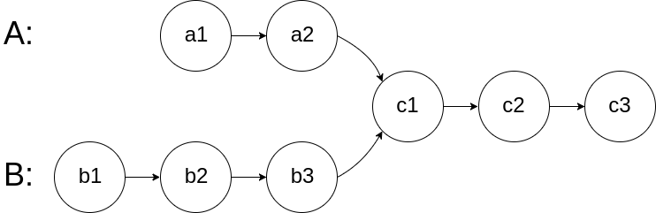
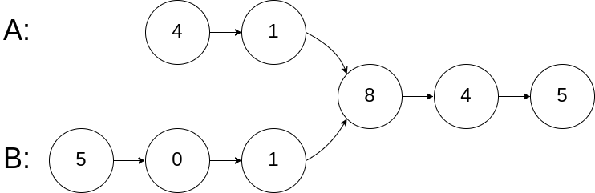

[#0160-intersection-of-two-linked-lists]
= 160. Intersection of Two Linked Lists

{leetcode}/problems/intersection-of-two-linked-lists/[LeetCode - Intersection of Two Linked Lists^]

Write a program to find the node at which the intersection of two singly linked lists begins.

For example, the following two linked lists:

begin to intersect at node c1.

*Example 1:*

[subs="verbatim,quotes,macros"]
----
*Input:* intersectVal = 8, listA = [4,1,8,4,5], listB = [5,0,1,8,4,5], skipA = 2, skipB = 3
*Output:* Reference of the node with value = 8
*Input Explanation:* The intersected node's value is 8 (note that this must not be 0 if the two lists intersect). From the head of A, it reads as [4,1,8,4,5]. From the head of B, it reads as [5,0,1,8,4,5]. There are 2 nodes before the intersected node in A; There are 3 nodes before the intersected node in B.
----

 

*Example 2:*

image::images/0160-03.png[{image_attr}]

[subs="verbatim,quotes,macros"]
----
*Input:* intersectVal = 2, listA = [0,9,1,2,4], listB = [3,2,4], skipA = 3, skipB = 1
*Output:* Reference of the node with value = 2
*Input Explanation:* The intersected node's value is 2 (note that this must not be 0 if the two lists intersect). From the head of A, it reads as [0,9,1,2,4]. From the head of B, it reads as [3,2,4]. There are 3 nodes before the intersected node in A; There are 1 node before the intersected node in B.

----

 

*Example 3:*

image::images/0160-04.png[{image_attr}]

[subs="verbatim,quotes,macros"]
----
*Input:* intersectVal = 0, listA = [2,6,4], listB = [1,5], skipA = 3, skipB = 2
*Output:* null
*Input Explanation:* From the head of A, it reads as [2,6,4]. From the head of B, it reads as [1,5]. Since the two lists do not intersect, intersectVal must be 0, while skipA and skipB can be arbitrary values.
*Explanation:* The two lists do not intersect, so return null.

----

 

*Notes:*

* If the two linked lists have no intersection at all, return `null`.
* The linked lists must retain their original structure after the function returns.
* You may assume there are no cycles anywhere in the entire linked structure.
* Your code should preferably run in O(n) time and use only O(1) memory.

== 思路分析

没想到竟然可以将两个链表"相加"就可以得出正确结果：两个"相加"，正好两个长度相等，最后部分就是重叠部分，双指针完美搞定！

[[src-0160]]
[{java_src_attr}]
----
include::{sourcedir}/_0160_IntersectionOfTwoLinkedLists.java[tag=answer]
----

[{java_src_attr}]
----
include::{sourcedir}/_0160_IntersectionOfTwoLinkedLists_2.java[tag=answer]
----

== 参考资料

. https://leetcode.cn/problems/intersection-of-two-linked-lists/solutions/10774/tu-jie-xiang-jiao-lian-biao-by-user7208t/[160. 相交链表 - 图解相交链表^]
. https://leetcode.cn/problems/intersection-of-two-linked-lists/solutions/811625/xiang-jiao-lian-biao-by-leetcode-solutio-a8jn/[160. 相交链表 - 官方题解^]
. https://leetcode.cn/problems/intersection-of-two-linked-lists/solutions/12624/intersection-of-two-linked-lists-shuang-zhi-zhen-l/[160. 相交链表 - 双指针，清晰图解^]
