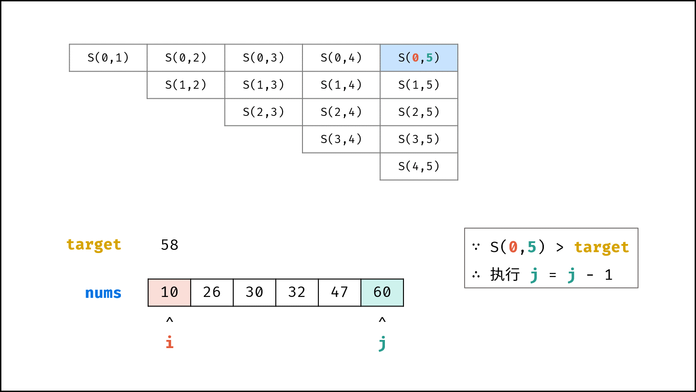
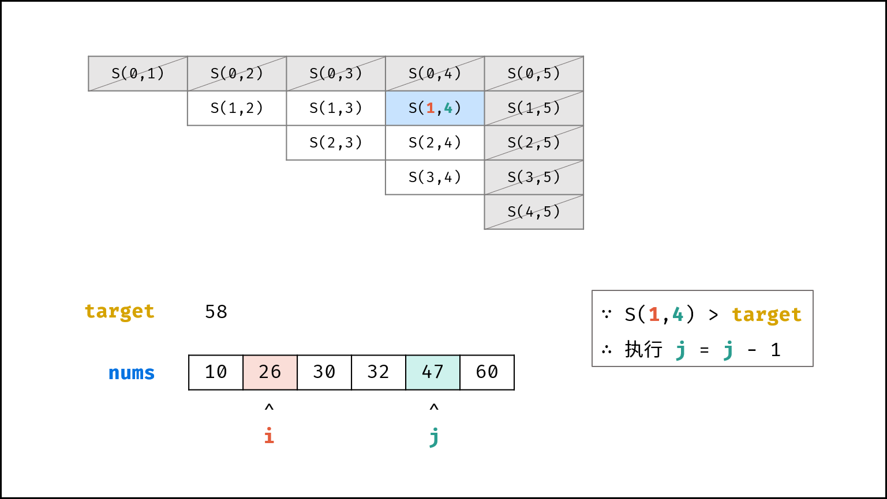
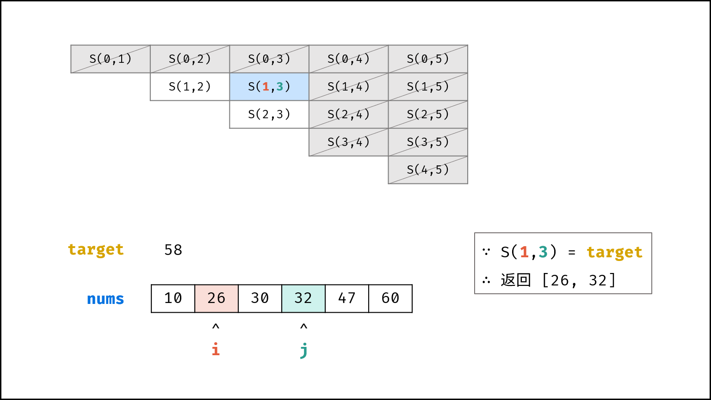
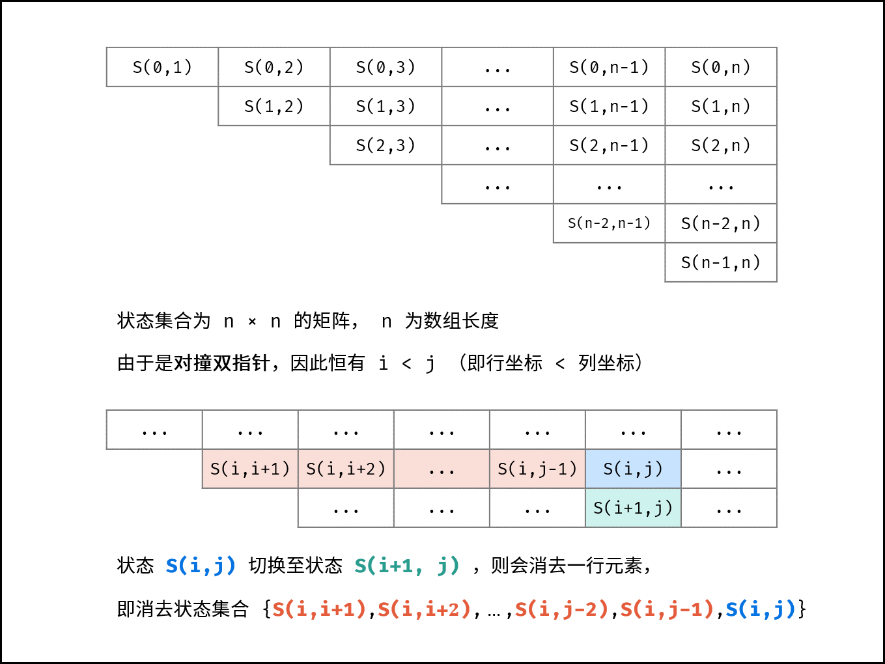

[#0167-two-sum-ii-input-array-is-sorted]
= 167. Two Sum II - Input array is sorted

{leetcode}/problems/two-sum-ii-input-array-is-sorted/[LeetCode - Two Sum II - Input array is sorted^]

Given an array of integers that is already **sorted in ascending order**, find two numbers such that they add up to a specific target number.

The function twoSum should return indices of the two numbers such that they add up to the target, where index1 must be less than index2.

*Note:*

* Your returned answers (both index1 and index2) are not zero-based.
* You may assume that each input would have *exactly* one solution and you may not use the *same* element twice.

.Example:
----
Input: numbers = [2,7,11,15], target = 9
Output: [1,2]
Explanation: The sum of 2 and 7 is 9. Therefore index1 = 1, index2 = 2.
----

== 思路分析

利用输入数组的有序性，可以从两边向中级"挤压"来查找正确解。

image::images/0167-02.png[{image_attr}]

[[src-0167]]
[tabs]
====
一刷::
+
--
[{java_src_attr}]
----
include::{sourcedir}/_0167_TwoSumIIInputArrayIsSorted.java[tag=answer]
----
--

二刷::
+
--
[{java_src_attr}]
----
include::{sourcedir}/_0167_TwoSumIIInputArrayIsSorted_2.java[tag=answer]
----
--

三刷::
+
--
[{java_src_attr}]
----
include::{sourcedir}/_0167_TwoSumIIInputArrayIsSorted_3.java[tag=answer]
----
--
====

== 参考资料

. https://leetcode.cn/problems/two-sum-ii-input-array-is-sorted/solutions/337156/liang-shu-zhi-he-ii-shu-ru-you-xu-shu-zu-by-leet-2/[167. 两数之和 II - 输入有序数组 - 官方题解^]
. https://leetcode.cn/problems/two-sum-ii-input-array-is-sorted/solutions/87919/yi-zhang-tu-gao-su-ni-on-de-shuang-zhi-zhen-jie-fa/[167. 两数之和 II - 输入有序数组 - 一张图告诉你 O(n) 的双指针解法的本质原理（C++/Java）^]
. https://leetcode.cn/problems/two-sum-ii-input-array-is-sorted/solutions/38241/shuang-zhi-zhen-on-shi-jian-fu-za-du-by-cyc2018/[167. 两数之和 II - 输入有序数组 - 双指针 O(N) 时间复杂度^]
. https://leetcode.cn/problems/two-sum-ii-input-array-is-sorted/solutions/2361541/167-liang-shu-zhi-he-ii-shu-ru-you-xu-sh-k3oy/[167. 两数之和 II - 输入有序数组 - 力扣（LeetCode）^]

