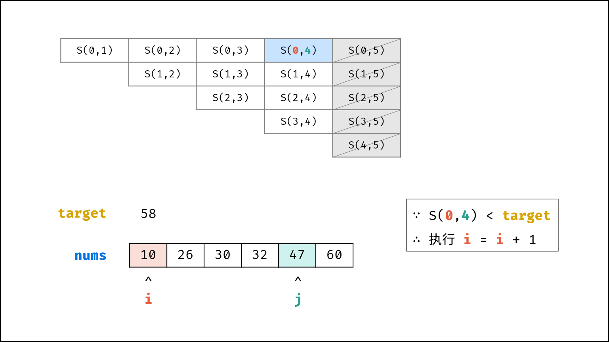

[#0167-two-sum-ii-input-array-is-sorted]
= 167. 两数之和 II - 输入有序数组

https://leetcode.cn/problems/two-sum-ii-input-array-is-sorted/[LeetCode - 167. 两数之和 II - 输入有序数组 ^]

给你一个下标从 *1* 开始的整数数组 `numbers` ，该数组已按 *非递减顺序排列* ，请你从数组中找出满足相加之和等于目标数 `target` 的两个数。如果设这两个数分别是 `+numbers[index~1~]+` 和 `+numbers[index~2~]+` ，则 `+1 <= index~1~ < index~2~ <= numbers.length+` 。

以长度为 2 的整数数组 `+[index~1~, index~2~]+` 的形式返回这两个整数的下标 `index~1~` 和 `index~2~`。

你可以假设每个输入 *只对应唯一的答案* ，而且你 *不可以* 重复使用相同的元素。

你所设计的解决方案必须只使用常量级的额外空间。

*示例 1：*

....
输入：numbers = [2,7,11,15], target = 9
输出：[1,2]
解释：2 与 7 之和等于目标数 9 。因此 index1 = 1, index2 = 2 。返回 [1, 2] 。
....

*示例 2：*

....
输入：numbers = [2,3,4], target = 6
输出：[1,3]
解释：2 与 4 之和等于目标数 6 。因此 index1 = 1, index2 = 3 。返回 [1, 3] 。
....

*示例 3：*

....
输入：numbers = [-1,0], target = -1
输出：[1,2]
解释：-1 与 0 之和等于目标数 -1 。因此 index1 = 1, index2 = 2 。返回 [1, 2] 。
....

*提示：*

* `2 \<= numbers.length \<= 3 * 10^4^`
* `+-1000 <= numbers[i] <= 1000+`
* `numbers` 按 *非递减顺序* 排列
* `+-1000 <= target <= 1000+`
* *仅存在一个有效答案*

== 思路分析

利用输入数组的有序性，可以从两边向中级"挤压"来查找正确解。

image::images/0167-01.png[{image_attr}]

image::images/0167-04.png[{image_attr}]

[[src-0167]]
[tabs]
====
一刷::
+
--
[{java_src_attr}]
----
include::{sourcedir}/_0167_TwoSumIIInputArrayIsSorted.java[tag=answer]
----
--

二刷::
+
--
[{java_src_attr}]
----
include::{sourcedir}/_0167_TwoSumIIInputArrayIsSorted_2.java[tag=answer]
----
--

三刷::
+
--
[{java_src_attr}]
----
include::{sourcedir}/_0167_TwoSumIIInputArrayIsSorted_3.java[tag=answer]
----
--

四刷::
+
--
[{java_src_attr}]
----
include::{sourcedir}/_0167_TwoSumIiInputArrayIsSorted_4.java[tag=answer]
----
--
====

== 参考资料

. https://leetcode.cn/problems/two-sum-ii-input-array-is-sorted/solutions/337156/liang-shu-zhi-he-ii-shu-ru-you-xu-shu-zu-by-leet-2/[167. 两数之和 II - 输入有序数组 - 官方题解^]
. https://leetcode.cn/problems/two-sum-ii-input-array-is-sorted/solutions/87919/yi-zhang-tu-gao-su-ni-on-de-shuang-zhi-zhen-jie-fa/[167. 两数之和 II - 输入有序数组 - 一张图告诉你 O(n) 的双指针解法的本质原理（C++/Java）^]
. https://leetcode.cn/problems/two-sum-ii-input-array-is-sorted/solutions/38241/shuang-zhi-zhen-on-shi-jian-fu-za-du-by-cyc2018/[167. 两数之和 II - 输入有序数组 - 双指针 O(N) 时间复杂度^]
. https://leetcode.cn/problems/two-sum-ii-input-array-is-sorted/solutions/2361541/167-liang-shu-zhi-he-ii-shu-ru-you-xu-sh-k3oy/[167. 两数之和 II - 输入有序数组 - 力扣（LeetCode）^]

