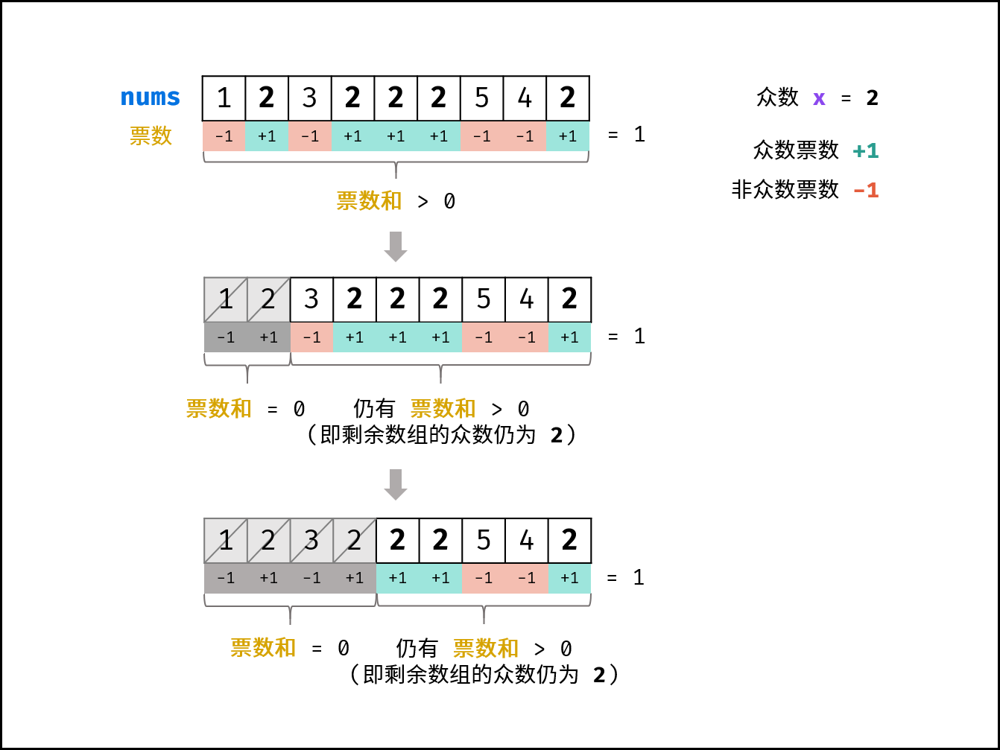

[#0169-majority-element]
= 169. Majority Element

{leetcode}/problems/majority-element/[LeetCode - Majority Element^]

Boyer-Moore Voting Algorithm 这个算法好巧妙啊！简直妙不可言！

{leetcode}/problems/majority-element/solution/[Majority Element solution - LeetCode^]

Given an array of size _n_, find the majority element. The majority element is the element that appears *more than* `&lfloor; n/2 &rfloor;` times.

You may assume that the array is non-empty and the majority element always exist in the array.

*Example 1:*

[subs="verbatim,quotes,macros"]
----
*Input:* [3,2,3]
*Output:* 3
----

*Example 2:*

[subs="verbatim,quotes,macros"]
----
*Input:* [2,2,1,1,1,2,2]
*Output:* 2

----

== 思路分析

哈希计数法最易想到，摩尔投票法最妙！

摩尔投票法更刺激的使用在 xref:0229-majority-element-ii.adoc[229. 多数元素 II]。

[[src-0169]]
[tabs]
====
一刷::
+
--
[{java_src_attr}]
----
include::{sourcedir}/_0169_MajorityElement.java[tag=answer]
----
--

二刷::
+
--
[{java_src_attr}]
----
include::{sourcedir}/_0169_MajorityElement_2.java[tag=answer]
----
--
====

== 参考资料

. https://leetcode.cn/problems/majority-element/solutions/2362000/169-duo-shu-yuan-su-mo-er-tou-piao-qing-ledrh/?envType=study-plan-v2&envId=selected-coding-interview[169. 多数元素 - 摩尔投票，清晰图解^]
