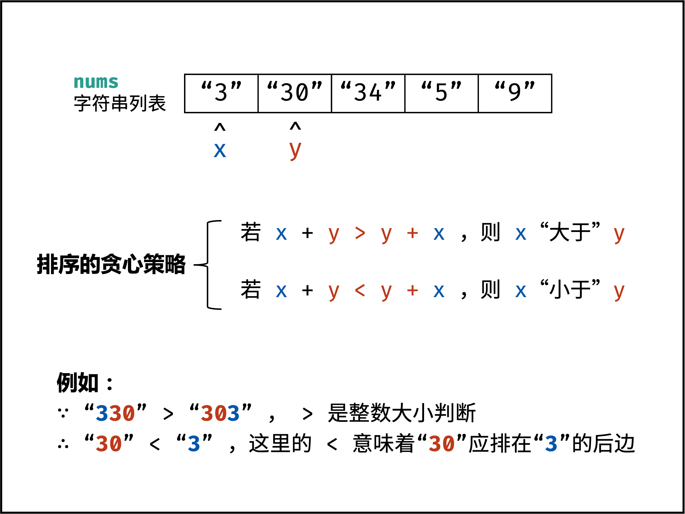

[#0179-largest-number]
= 179. Largest Number

{leetcode}/problems/largest-number/[LeetCode - Largest Number^]

Given a list of non negative integers, arrange them such that they form the largest number.

*Example 1:*

[subs="verbatim,quotes,macros"]
----
*Input:* `[10,2]`
*Output:* "`210"`
----

*Example 2:*

[subs="verbatim,quotes,macros"]
----
*Input:* `[3,30,34,5,9]`
*Output:* "`9534330"`
----

*Note:* The result may be very large, so you need to return a string instead of an integer.

== 思路分析

这道题很容易想到需要根据数字的字符串大小进行倒序排列（目的是将首个数字比较大的数字排在前面）。但如果直接比较数字对应的字符串大小，则在某些场景下不能满足要求。最简单省事的方式就是直接将排序的两个字符串相加（左右，右左）进行比较就可以了。

[[src-0179]]
[tabs]
====
一刷::
+
--
[{java_src_attr}]
----
include::{sourcedir}/_0179_LargestNumber.java[tag=answer]
----
--

二刷::
+
--
[{java_src_attr}]
----
include::{sourcedir}/_0179_LargestNumber_2.java[tag=answer]
----
--
====

== 参考资料

. https://leetcode.cn/problems/largest-number/solutions/2361893/179-zui-da-shu-tan-xin-qing-xi-tu-jie-by-wboz/?envType=study-plan-v2&envId=selected-coding-interview[179. 最大数 - 贪心，清晰图解^]
. https://leetcode.cn/problems/largest-number/solutions/715680/zui-da-shu-by-leetcode-solution-sid5/?envType=study-plan-v2&envId=selected-coding-interview[179. 最大数 - 官方题解^]

