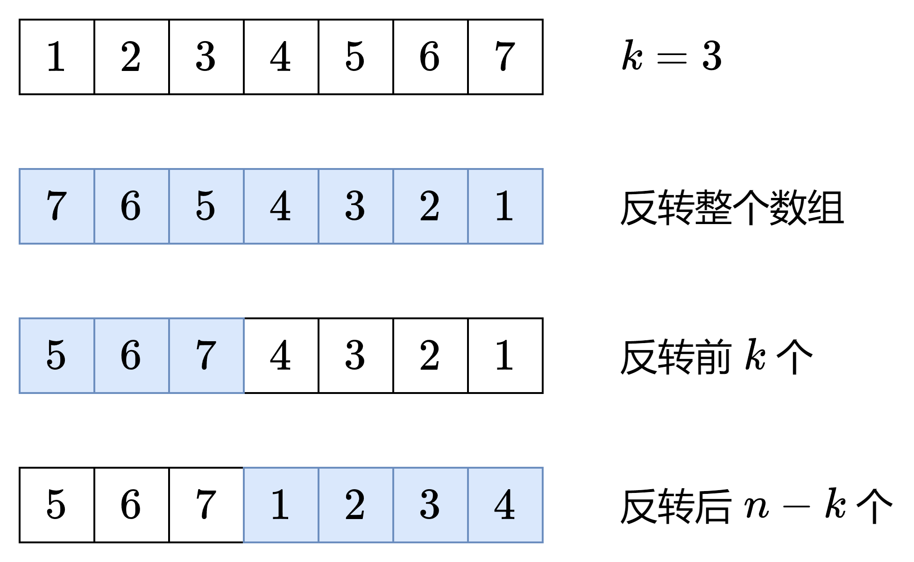
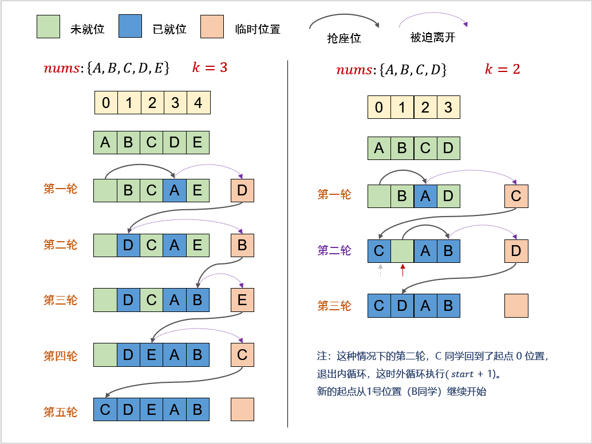

[#0189-rotate-array]
= 189. 轮转数组

https://leetcode.cn/problems/rotate-array/[LeetCode - 189. 轮转数组^]

给定一个整数数组 `nums`，将数组中的元素向右轮转 `k` 个位置，其中 `k` 是非负数。

*示例 1:*

....
输入: nums = [1,2,3,4,5,6,7], k = 3
输出: [5,6,7,1,2,3,4]
解释:
向右轮转 1 步: [7,1,2,3,4,5,6]
向右轮转 2 步: [6,7,1,2,3,4,5]
向右轮转 3 步: [5,6,7,1,2,3,4]
....

*示例 2:*

....
输入：nums = [-1,-100,3,99], k = 2
输出：[3,99,-1,-100]
解释:
向右轮转 1 步: [99,-1,-100,3]
向右轮转 2 步: [3,99,-1,-100]
....

*提示：*

* `1 \<= nums.length \<= 10^5^`
* `-2^31^ \<= nums[i] \<= 2^31^ - 1`
* `0 \<= k \<= 10^5^`

*进阶：*

* 尽可能想出更多的解决方案，至少有 *三种* 不同的方法可以解决这个问题。
* 你可以使用空间复杂度为 stem:[O(1)] 的 **原地 **算法解决这个问题吗？

== 思路分析

注意：这里是轮转数组！如果 `k > nums.length`，那么轮转 `k % nums.length` 次和轮转 `k` 次的效果是一样的。

整个过程如下：

AB → rev(B)rev(A) → rev(rev(B))rev(rev(A)) → BA

环状替代：

[[src-0189]]
[tabs]
====
一刷::
+
--
[{java_src_attr}]
----
include::{sourcedir}/_0189_RotateArray.java[tag=answer]
----
--

二刷::
+
--
[{java_src_attr}]
----
include::{sourcedir}/_0189_RotateArray_2.java[tag=answer]
----
--

三刷::
+
--
[{java_src_attr}]
----
include::{sourcedir}/_0189_RotateArray_3.java[tag=answer]
----
--
====

发现官网测试用例少了一个特殊情况：如果 `k` 大于两倍数组长度，提交的测试就会报错，但是官网却显示通过。

数组反转的方法也不错！反转时，直接使用界限的值进行加减比较简单省事！

== 参考资料

. https://leetcode.cn/problems/rotate-array/solutions/2784427/tu-jie-yuan-di-zuo-fa-yi-tu-miao-dong-py-ryfv/[189. 轮转数组 - 原地做法，一图秒懂！附数学证明^]
. https://leetcode.cn/problems/rotate-array/solutions/551039/xuan-zhuan-shu-zu-by-leetcode-solution-nipk/[189. 轮转数组 - 官方题解^] -- 环状替换有意思！
. https://leetcode.cn/problems/rotate-array/solutions/242188/xuan-zhuan-shu-zu-yuan-di-huan-wei-xiang-xi-tu-jie/[189. 轮转数组 - 原地换位，详细图解^]
