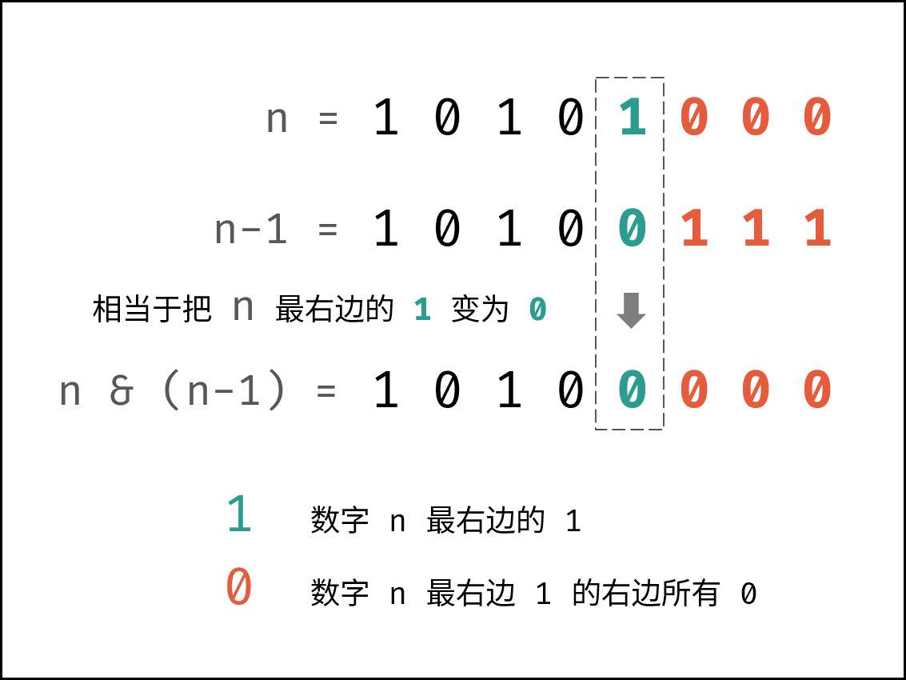
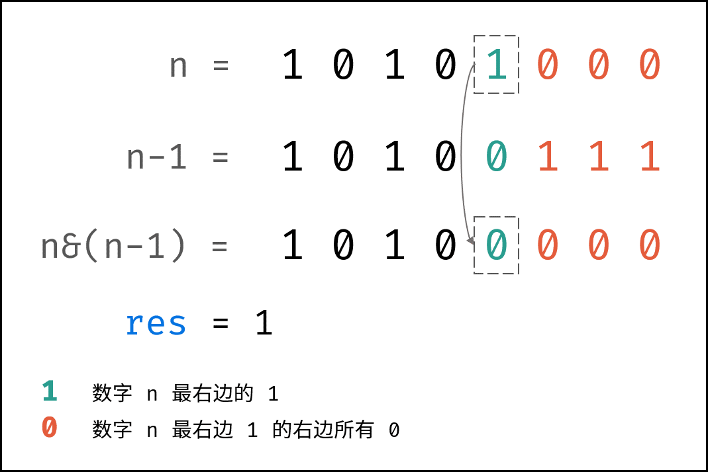
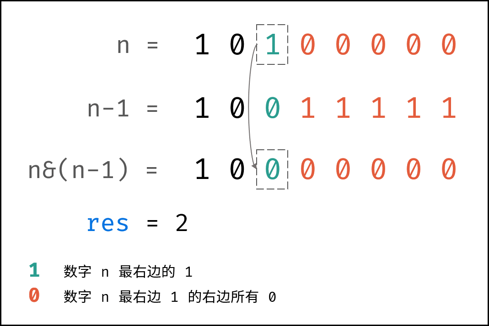
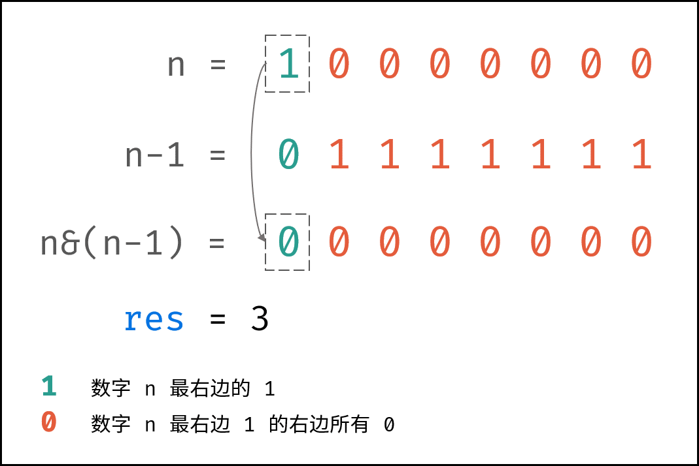
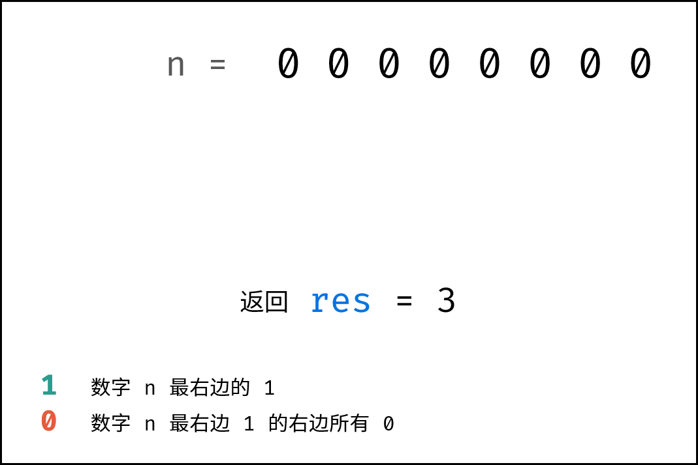
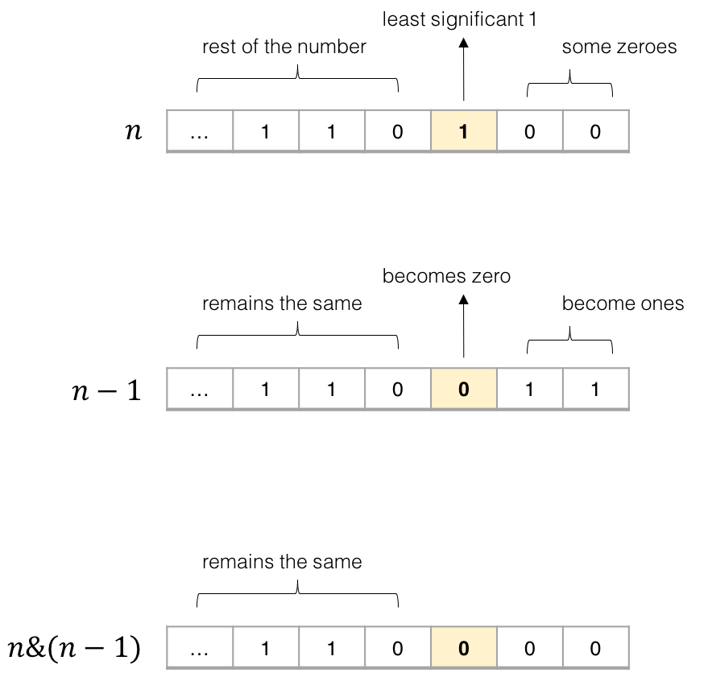

[#0191-number-of-1-bits]
= 191. Number of 1 Bits

{leetcode}/problems/number-of-1-bits/[LeetCode - Number of 1 Bits^]

Write a function that takes an unsigned integer and return the number of '1' bits it has (also known as the http://en.wikipedia.org/wiki/Hamming_weight[Hamming weight^]).

 

*Example 1:*

[subs="verbatim,quotes,macros"]
----
*Input:* 00000000000000000000000000001011
*Output:* 3
*Explanation:* The input binary string `*00000000000000000000000000001011* has a total of three '1' bits.`

----

*Example 2:*

[subs="verbatim,quotes,macros"]
----
*Input:* 00000000000000000000000010000000
*Output:* 1
*Explanation:* The input binary string *00000000000000000000000010000000* has a total of one '1' bit.

----

*Example 3:*

[subs="verbatim,quotes,macros"]
----
*Input:* 11111111111111111111111111111101
*Output:* 31
*Explanation:* The input binary string *11111111111111111111111111111101* has a total of thirty one '1' bits.
----

 

*Note:*

* Note that in some languages such as Java, there is no unsigned integer type. In this case, the input will be given as signed integer type and should not affect your implementation, as the internal binary representation of the integer is the same whether it is signed or unsigned.
* In Java, the compiler represents the signed integers using https://en.wikipedia.org/wiki/Two%27s_complement[2's complement notation^]. Therefore, in *Example 3* above the input represents the signed integer `-3`.

 

*Follow up*:

If this function is called many times, how would you optimize it?

== 思路分析

减法解法让人开眼界。但是有一个疑问：它的效率就一定高吗？

[[src-0191]]
[tabs]
====
一刷::
+
--
[{java_src_attr}]
----
include::{sourcedir}/_0191_NumberOf1Bits.java[tag=answer]
----
--

二刷::
+
--
[{java_src_attr}]
----
include::{sourcedir}/_0191_NumberOf1Bits_2.java[tag=answer]
----
--
====

== 参考资料

. https://leetcode.cn/problems/number-of-1-bits/solutions/2361978/191-wei-1-de-ge-shu-wei-yun-suan-qing-xi-40rw/?envType=study-plan-v2&envId=selected-coding-interview[191. 位1的个数 - 位运算，清晰图解^]

