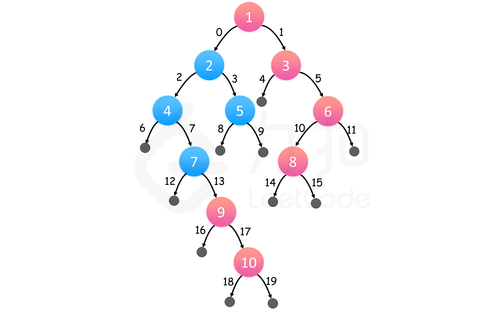

[#0199-binary-tree-right-side-view]
= 199. 二叉树的右视图

https://leetcode.cn/problems/binary-tree-right-side-view/[LeetCode - 199. 二叉树的右视图^]

给定一个二叉树的 *根节点* `root`，想象自己站在它的右侧，按照从顶部到底部的顺序，返回从右侧所能看到的节点值。

*示例 1:*

image::images/0199-01.jpg[{image_attr}]

....
输入: [1,2,3,null,5,null,4]
输出: [1,3,4]
解释:
   1            <---
 /   \
2     3         <---
 \     \
  5     4       <---
....

*示例 2:*

....
输入: [1,null,3]
输出: [1,3]
....

*示例 3:*

....
输入: []
输出: []
....

*提示:*

* 二叉树的节点个数的范围是 `[0, 100]`
* `+-100 <= Node.val <= 100+`

== 思路分析

最简单的思路就是利用 BFS 思想进行分层遍历，然后每层取最后一个节点的值。

深度优先遍历，按照 `<level, node>` 的格式，把每个节点都放到 `Map` 里，因为是先左后右，所以，每层最后只剩下了最右边的元素。

其实，可以不用 `Map`，直接用 `List` 即可。不过，要注意**先根遍历**和**中根遍历**的区别：先根遍历每层都是按顺序从上到下添加到 `List`；而中根遍历，每次都是最下层到，所以，要添加 `null` 占位符把 `List` 给撑起来，后续直接按照坐标设置。

注意：递归时，先右后左，只需要添加，无需更新；先左后右，则需要不断对应层级的元素。

另外，仔细体会一下“左中右遍历”和“右中左遍历”的区别。

右中左深度优先遍历

广度优先遍历

[[src-0199]]
[tabs]
====
一刷::
+
--
[{java_src_attr}]
----
include::{sourcedir}/_0199_BinaryTreeRightSideView.java[tag=answer]
----
--

一刷（深度优先）::
+
--
[{java_src_attr}]
----
include::{sourcedir}/_0199_BinaryTreeRightSideView_1.java[tag=answer]
----
--

二刷::
+
--
[{java_src_attr}]
----
include::{sourcedir}/_0199_BinaryTreeRightSideView_2.java[tag=answer]
----
--

三刷::
+
--
[{java_src_attr}]
----
include::{sourcedir}/_0199_BinaryTreeRightSideView_3.java[tag=answer]
----
--

四刷::
+
--
[{java_src_attr}]
----
include::{sourcedir}/_0199_BinaryTreeRightSideView_4.java[tag=answer]
----
--
====

这道题是 xref:0102-binary-tree-level-order-traversal.adoc[102. Binary Tree Level Order Traversal] 的延伸。

== 思考题

* [x] 这道题也可以使用深度优先遍历，思考如何实现？见上面代码。

== 参考资料

. https://leetcode.cn/problems/binary-tree-right-side-view/solutions/2015061/ru-he-ling-huo-yun-yong-di-gui-lai-kan-s-r1nc/[199. 二叉树的右视图 - 如何灵活运用递归？^]
. https://leetcode.cn/problems/binary-tree-right-side-view/solutions/214871/jian-dan-bfsdfs-bi-xu-miao-dong-by-sweetiee/[199. 二叉树的右视图 - 简单BFS/DFS, 🤷‍♀️必须秒懂！^]
. https://leetcode.cn/problems/binary-tree-right-side-view/solutions/213494/er-cha-shu-de-you-shi-tu-by-leetcode-solution/[199. 二叉树的右视图 - 官方题解^] -- 感觉官方的深度优先搜索的解法不对，或者实际是广度优先。
. https://leetcode.cn/problems/binary-tree-right-side-view/solutions/859784/dai-ma-sui-xiang-lu-wo-yao-da-shi-ge-er-mdkms/[199. 二叉树的右视图 - 我要打十个！二叉树层序遍历登场^]
