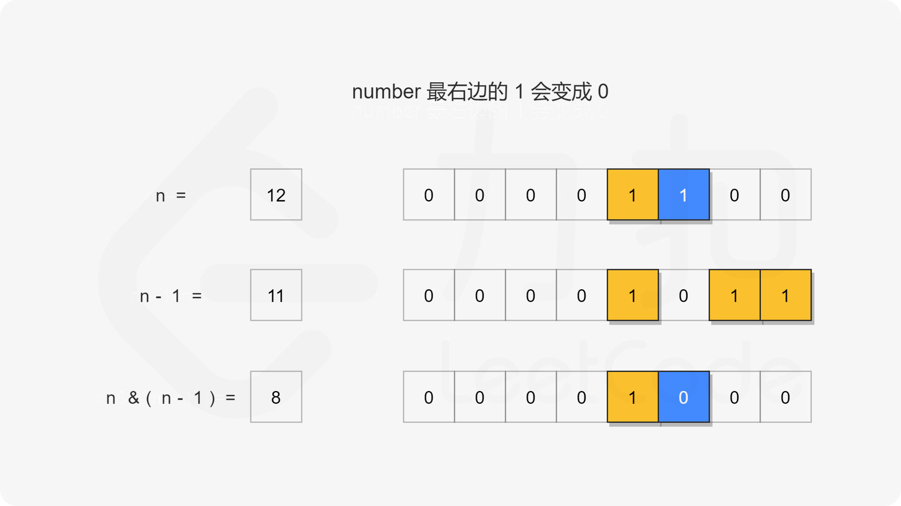
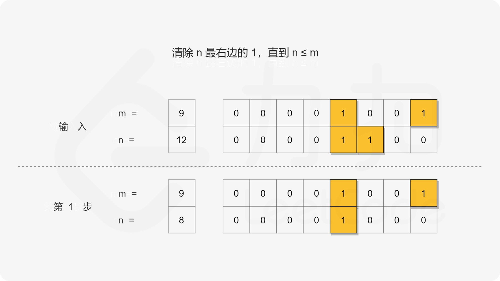
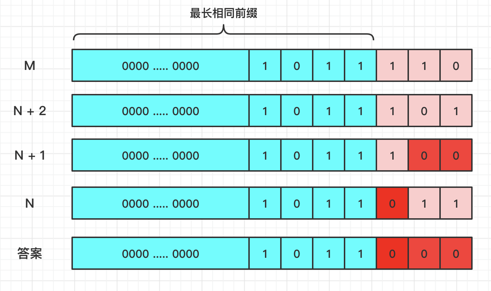

[#0201-bitwise-and-of-numbers-range]
= 201. 数字范围按位与

https://leetcode.cn/problems/bitwise-and-of-numbers-range/[LeetCode - 201. 数字范围按位与^]

给你两个整数 `left` 和 `right` ，表示区间 `[left, right]`，返回此区间内所有数字 *按位与* 的结果（包含 `left` 、`right` 端点）。

*示例 1：*

....
输入：left = 5, right = 7
输出：4
....

*示例 2：*

....
输入：left = 0, right = 0
输出：0
....

*示例 3：*

....
输入：left = 1, right = 2147483647
输出：0
....

*提示：*

* `0 \<= left \<= right \<= 2^31^ - 1`

== 思路分析

当计算 stem:[n & (n - 1)] 时，会把 `n` 最右边的 `1` 变成 `0`。

从另外一个角度来看，就是寻找指定范围内所有数字的公共前缀。

对于大于 `left` 的前面的 `1` 都会成为 `0`，可以忽略。在 `left` 和 `right` 之间，要么是中间相同，要么是全部不同。所以，可以通过异或，求出后面的不同之处的位数，然后移位减一取反，再相与即可求出“前缀”。

[[src-0201]]
[tabs]
====
一刷::
+
--
[{java_src_attr}]
----
include::{sourcedir}/_0201_BitwiseAndOfNumbersRange.java[tag=answer]
----
--

二刷::
+
--
[{java_src_attr}]
----
include::{sourcedir}/_0201_BitwiseAndOfNumbersRange_2.java[tag=answer]
----
--
====

== 参考资料

. https://leetcode.cn/problems/bitwise-and-of-numbers-range/solutions/384938/shu-zi-fan-wei-an-wei-yu-by-leetcode-solution/[201. 数字范围按位与 - 官方题解^]
. https://leetcode.cn/problems/bitwise-and-of-numbers-range/solutions/385466/ju-hao-li-jie-de-wei-yun-suan-si-lu-by-time-limit/[201. 数字范围按位与 - 巨好理解的位运算思路^]
. https://leetcode.cn/problems/bitwise-and-of-numbers-range/solutions/538550/golang-yi-xing-suan-fa-by-endlesscheng-iw6y/[201. 数字范围按位与 - O(1) 写法^]
. https://leetcode.cn/problems/bitwise-and-of-numbers-range/solutions/56903/xiang-xi-tong-su-de-si-lu-fen-xi-duo-jie-fa-by--41/[201. 数字范围按位与 - 详细通俗的思路分析，多解法^]

