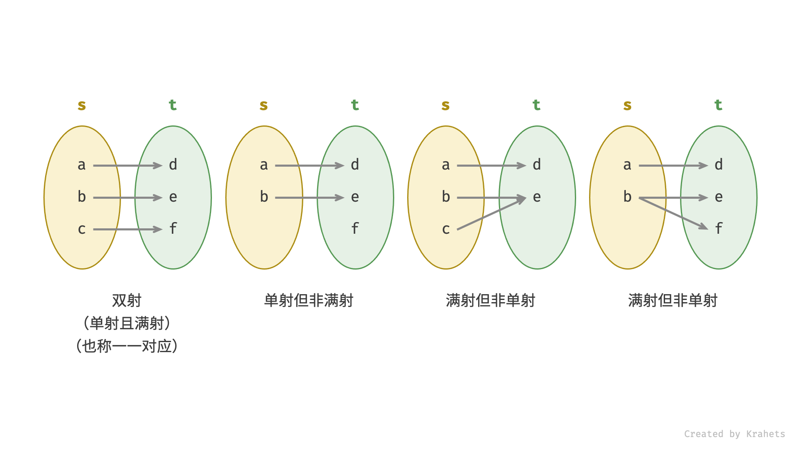

[#0205-isomorphic-strings]
= 205. Isomorphic Strings

{leetcode}/problems/isomorphic-strings/[LeetCode - Isomorphic Strings^]

Given two strings *_s_* and *_t_*, determine if they are isomorphic.

Two strings are isomorphic if the characters in *_s_* can be replaced to get *_t_*.

All occurrences of a character must be replaced with another character while preserving the order of characters. No two characters may map to the same character but a character may map to itself.

*Example 1:*

[subs="verbatim,quotes,macros"]
----
*Input:* *_s_* = `"egg", `*_t = _*`"add"`
*Output:* true

----

*Example 2:*

[subs="verbatim,quotes,macros"]
----
*Input:* *_s_* = `"foo", `*_t = _*`"bar"`
*Output:* false
----

*Example 3:*

[subs="verbatim,quotes,macros"]
----
*Input:* *_s_* = `"paper", `*_t = _*`"title"`
*Output:* true
----

*Note:*

You may assume both *_s _*and *_t _*have the same length.

== 思路分析

检查是否为一一映射。

[[src-0205]]
[tabs]
====
一刷::
+
--
[{java_src_attr}]
----
include::{sourcedir}/_0205_IsomorphicStrings.java[tag=answer]
----
--

// 二刷::
// +
// --
// [{java_src_attr}]
// ----
// include::{sourcedir}/_0205_IsomorphicStrings_2.java[tag=answer]
// ----
// --
====

== 参考资料

. https://leetcode.cn/problems/isomorphic-strings/solutions/536521/tong-gou-zi-fu-chuan-by-leetcode-solutio-s6fd/?envType=study-plan-v2&envId=selected-coding-interview[205. 同构字符串 - 官方题解^]
. https://leetcode.cn/problems/isomorphic-strings/solutions/1645867/by-jyd-i4wt/?envType=study-plan-v2&envId=selected-coding-interview[205. 同构字符串 - 哈希表，清晰图解^]
. https://leetcode.cn/problems/isomorphic-strings/solutions/536884/suo-yin-yuan-zu-dan-shuang-ha-xi-biao-5j-mxra/?envType=study-plan-v2&envId=selected-coding-interview[205. 同构字符串 - 索引 + 元组 + 单双哈希表（5解法，超99%）^]
