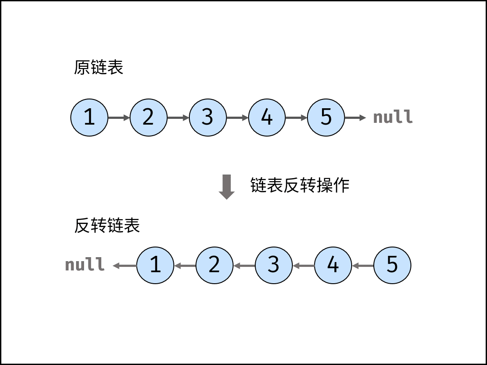

[#0206-reverse-linked-list]
= 206. 反转链表

{leetcode}/problems/reverse-linked-list/[LeetCode - 206. 反转链表^]

*示例 1：*

image::images/0206-00.jpg[{image_attr}]

....
输入：head = [1,2,3,4,5]
输出：[5,4,3,2,1]
....

*示例 2：*

image:images/0206-01.jpg[{image_attr}]

....
输入：head = [1,2]
输出：[2,1]
....

*示例 3：*

....
输入：head = []
输出：[]
....

*提示：*

* 链表中节点的数目范围是 `[0, 5000]`
* `+-5000 <= Node.val <= 5000+`

**进阶：**链表可以选用迭代或递归方式完成反转。你能否用两种方法解决这道题？

== 思路分析

递归解法非常妙！传一个参数，`next` 又 `next` 比较麻烦；传两个参数 `(head, pre)` 代码写起来简单很多。

[[src-0206]]
[tabs]
====
一刷::
+
--
[{java_src_attr}]
----
include::{sourcedir}/_0206_ReverseLinkedList.java[tag=answer]
----
--

二刷::
+
--
[{java_src_attr}]
----
include::{sourcedir}/_0206_ReverseLinkedList_2.java[tag=answer]
----
--

三刷::
+
--
[{java_src_attr}]
----
include::{sourcedir}/_0206_ReverseLinkedList_3.java[tag=answer]
----
--

四刷（递归）::
+
--
[{java_src_attr}]
----
include::{sourcedir}/_0206_ReverseLinkedList_41.java[tag=answer]
----
--

四刷（迭代）::
+
--
[{java_src_attr}]
----
include::{sourcedir}/_0206_ReverseLinkedList_42.java[tag=answer]
----
--

五刷（迭代）::
+
--
[{java_src_attr}]
----
include::{sourcedir}/_0206_ReverseLinkedList_5.java[tag=answer]
----
--
====

== 思考题

可以尝试一下递归！

另外，思考一下如何通过传参来简化代码。

递归需要加强一下，反转链表的递归细节再推敲推敲。

== 参考资料

. https://leetcode.cn/problems/reverse-linked-list/solutions/551596/fan-zhuan-lian-biao-by-leetcode-solution-d1k2/[206. 反转链表 - 官方题解^]
. https://leetcode.cn/problems/reverse-linked-list/solutions/2361282/206-fan-zhuan-lian-biao-shuang-zhi-zhen-r1jel/[206. 反转链表 - 双指针，清晰图解^]
. https://leetcode.cn/problems/reverse-linked-list/solutions/1992225/you-xie-cuo-liao-yi-ge-shi-pin-jiang-tou-o5zy/[206. 反转链表 - 两种方法：递归 / 迭代，本质是尾插法和头插法^]
