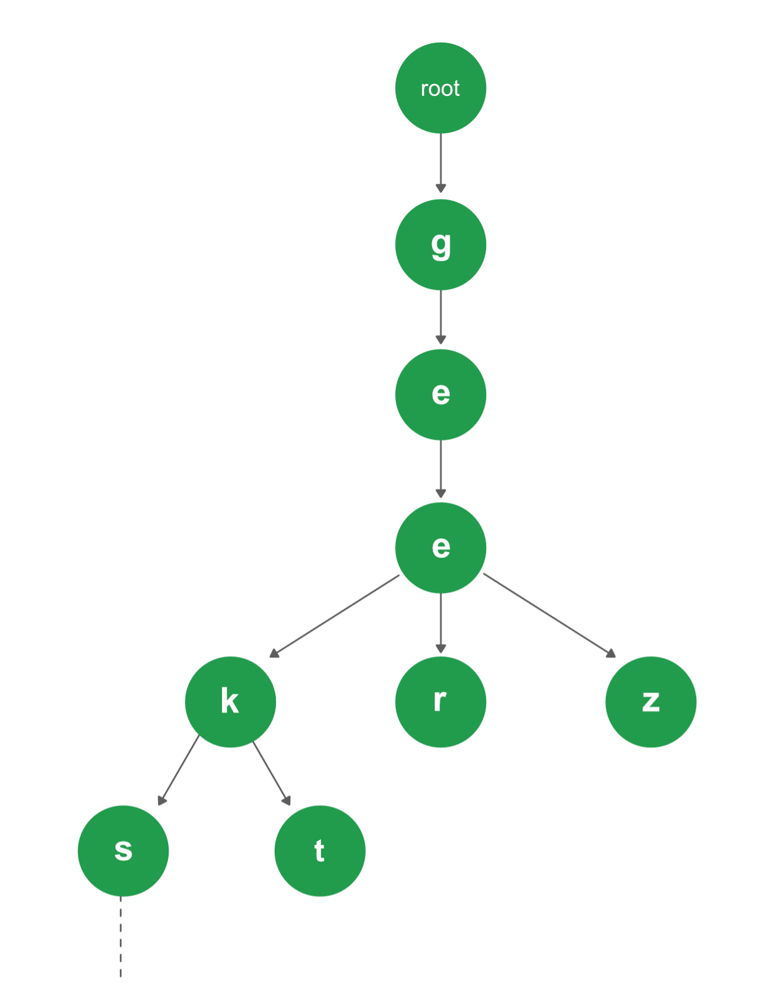

[#0208-implement-trie-prefix-tree]
= 208. 实现 Trie (前缀树)

https://leetcode.cn/problems/implement-trie-prefix-tree/[LeetCode - 208. 实现 Trie (前缀树) ^]

*link:https://baike.baidu.com/item/字典树/9825209?fr=aladdin[Trie]*（发音类似 "try"）或者说 *前缀树* 是一种树形数据结构，用于高效地存储和检索字符串数据集中的键。这一数据结构有相当多的应用情景，例如自动补全和拼写检查。

请你实现 Trie 类：

* `Trie()` 初始化前缀树对象。
* `void insert(String word)` 向前缀树中插入字符串 `word` 。
* `boolean search(String word)` 如果字符串 `word` 在前缀树中，返回 `true`（即，在检索之前已经插入）；否则，返回 `false` 。
* `boolean startsWith(String prefix)` 如果之前已经插入的字符串 `word` 的前缀之一为 `prefix` ，返回 `true` ；否则，返回 `false` 。

*示例：*

....
输入
["Trie", "insert", "search", "search", "startsWith", "insert", "search"]
[[], ["apple"], ["apple"], ["app"], ["app"], ["app"], ["app"]]
输出
[null, null, true, false, true, null, true]

解释
Trie trie = new Trie();
trie.insert("apple");
trie.search("apple");   // 返回 True
trie.search("app");     // 返回 False
trie.startsWith("app"); // 返回 True
trie.insert("app");
trie.search("app");     // 返回 True
....

*提示：*

* `+1 <= word.length, prefix.length <= 2000+`
* `word` 和 `prefix` 仅由小写英文字母组成
* `insert`、`search` 和 `startsWith` 调用次数 *总计* 不超过 `3 * 10^4^` 次

== 思路分析

没想到 Trie Tree 实现起来一点也不复杂！

思考题：如何实现一个工业级的 Trie Tree？

[[src-0208]]
[tabs]
====
一刷::
+
--
[{java_src_attr}]
----
include::{sourcedir}/_0208_ImplementTriePrefixTree.java[tag=answer]
----
--

二刷::
+
--
[{java_src_attr}]
----
include::{sourcedir}/_0208_ImplementTriePrefixTree_2.java[tag=answer]
----
--
====

== 参考资料

. https://en.wikipedia.org/wiki/Trie[Trie - Wikipedia^]
. https://www.geeksforgeeks.org/trie-insert-and-search/[Trie | (Insert and Search) - GeeksforGeeks^]

