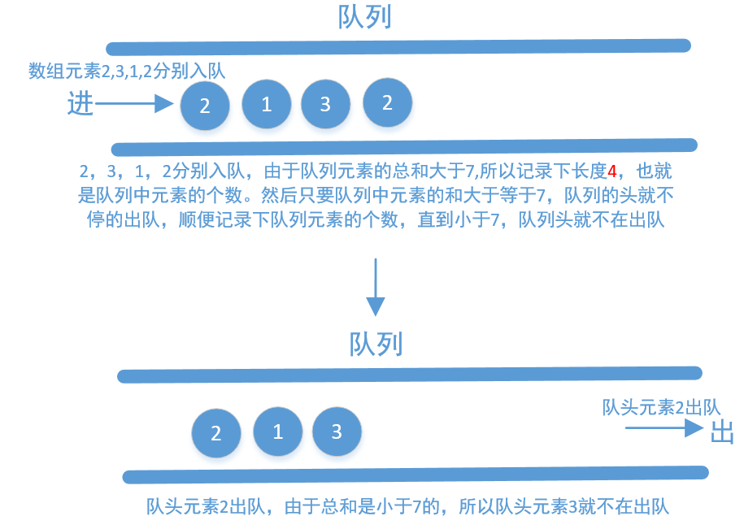
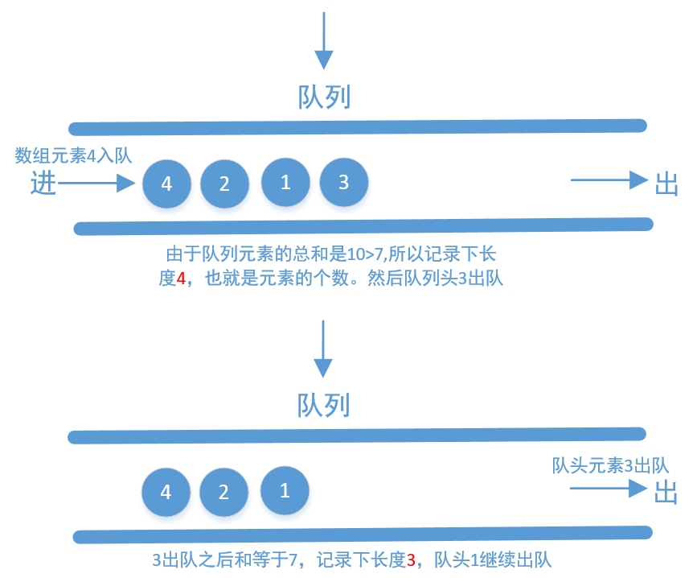
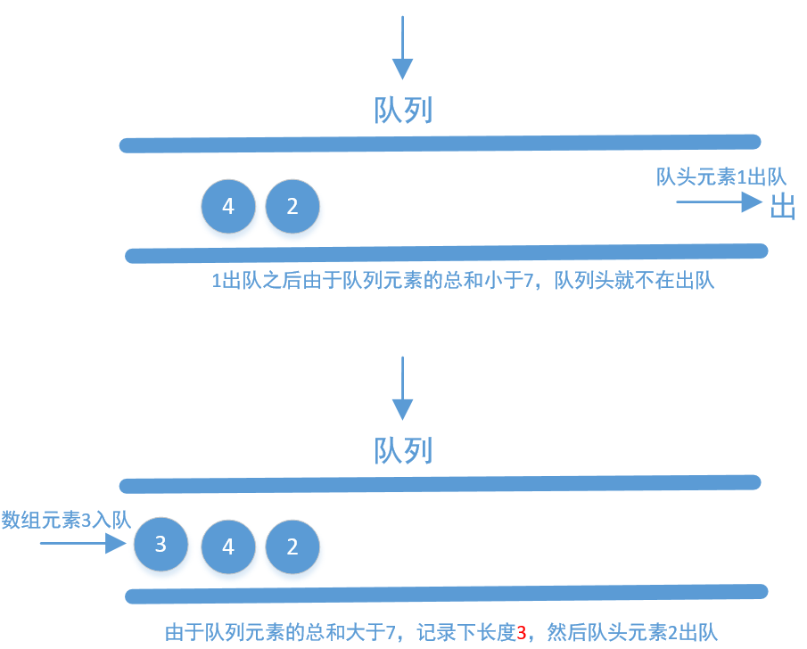
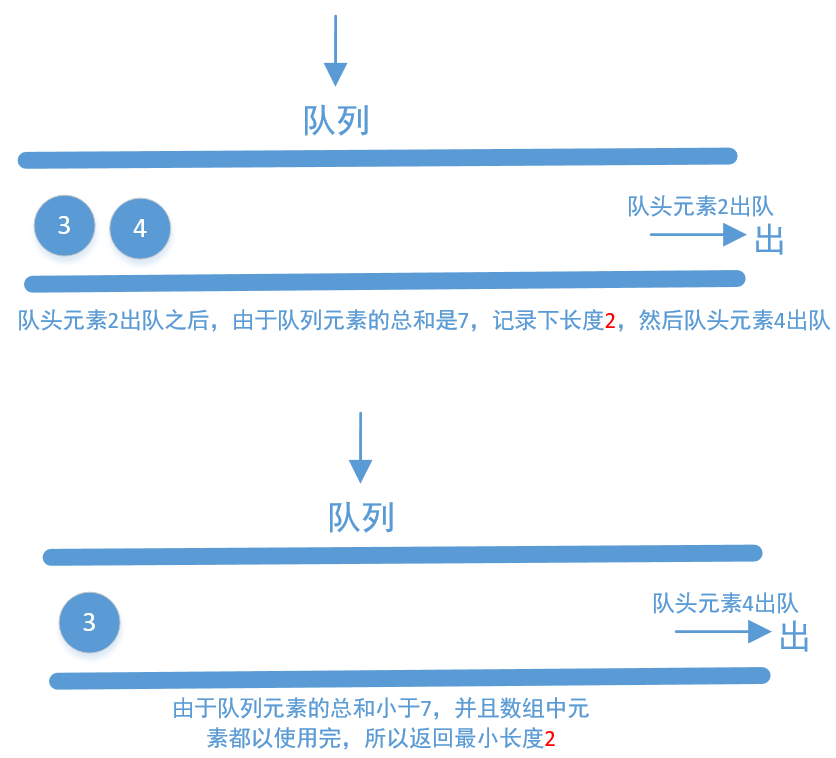

[#0209-minimum-size-subarray-sum]
= 209. 长度最小的子数组

https://leetcode.cn/problems/minimum-size-subarray-sum/[LeetCode - 209. 长度最小的子数组 ^]

给定一个含有 `n` 个正整数的数组和一个正整数 `target`。

找出该数组中满足其总和大于等于 **`target`** 的长度最小的 *子数组* `[nums~l~, nums~l+1~, ..., nums~r-1~, nums~r~]`，并返回其长度**。如果不存在符合条件的子数组，返回 `0` 。

*示例 1：*

....
输入：target = 7, nums = [2,3,1,2,4,3]
输出：2
解释：子数组 [4,3] 是该条件下的长度最小的子数组。
....

*示例 2：*

....
输入：target = 4, nums = [1,4,4]
输出：1
....

*示例 3：*

....
输入：target = 11, nums = [1,1,1,1,1,1,1,1]
输出：0
....

*提示：*

* `1 \<= target \<= 10^9^`
* `1 \<= nums.length \<= 10^5^`
* `1 \<= nums[i] \<= 10^5^`

*进阶：*

* 如果你已经实现 stem:[O(n)] 时间复杂度的解法, 请尝试设计一个 stem:[O(n log(n))] 时间复杂度的解法。

== 思路分析

滑动窗口!

没想到可以将队列用作滑动窗口！想想滑动窗口就等于队列：前面进，后面出，这就是 FIFO 啊。

[[src-0209]]
[tabs]
====
一刷::
+
--
[{java_src_attr}]
----
include::{sourcedir}/_0209_MinimumSizeSubarraySum.java[tag=answer]
----
--

// 二刷::
// +
// --
// [{java_src_attr}]
// ----
// include::{sourcedir}/_0209_MinimumSizeSubarraySum_2.java[tag=answer]
// ----
// --
====

== 参考资料

. https://leetcode.cn/problems/minimum-size-subarray-sum/solutions/305704/chang-du-zui-xiao-de-zi-shu-zu-by-leetcode-solutio/[209. 长度最小的子数组 - 官方题解^]
. https://leetcode.cn/problems/minimum-size-subarray-sum/solutions/306066/javade-jie-fa-ji-bai-liao-9985de-yong-hu-by-sdwwld/[209. 长度最小的子数组 - Java 的 5 种解法，最好的击败了 99.85% 的用户^]

