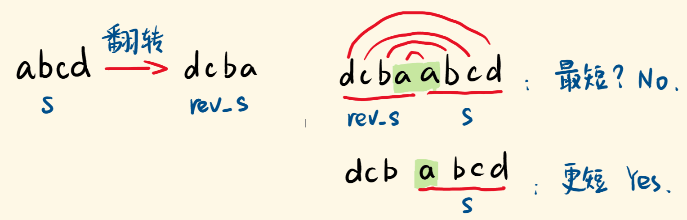

[#0214-shortest-palindrome]
= 214. 最短回文串

https://leetcode.cn/problems/shortest-palindrome/[LeetCode - 214. 最短回文串 ^]

给定一个字符串 *_s_*，你可以通过在字符串前面添加字符将其转换为回文串。找到并返回可以用这种方式转换的最短回文串。

*示例 1：*

....
输入：s = "aacecaaa"
输出："aaacecaaa"
....

*示例 2：*

....
输入：s = "abcd"
输出："dcbabcd"
....

*提示：*

* `0 \<= s.length \<= 5 * 10^4^`
* `s` 仅由小写英文字母组成

== 思路分析

将原来的字符串进行反转，再通过遍历寻找反转字符串结尾部分和原始字符串开头部分相同的起始坐标。然后，截取反转字符串的开头部分再加上元素字符串即可得到答案。通过 124 / 126 个测试用例，超时！可惜！

使用 `reversed.substring(index)` 代替逐个字母比较，答案通过！

[[src-0214]]
[tabs]
====
一刷::
+
--
[{java_src_attr}]
----
include::{sourcedir}/_0214_ShortestPalindrome.java[tag=answer]
----
--

// 二刷::
// +
// --
// [{java_src_attr}]
// ----
// include::{sourcedir}/_0214_ShortestPalindrome_2.java[tag=answer]
// ----
// --
====

== 参考资料

. https://leetcode.cn/problems/shortest-palindrome/solutions/392676/shou-hua-tu-jie-cong-jian-dan-de-bao-li-fa-xiang-d/[214. 最短回文串 - 「手画图解」从简单的暴力法想到 KMP^]
. https://zh.wikipedia.org/wiki/KMP%E7%AE%97%E6%B3%95[KMP算法 - 维基百科^]
. https://leetcode.cn/problems/shortest-palindrome/solutions/392561/zui-duan-hui-wen-chuan-by-leetcode-solution/[214. 最短回文串 - 官方题解^]
. https://leetcode.cn/problems/shortest-palindrome/solutions/80546/xiang-xi-tong-su-de-si-lu-fen-xi-duo-jie-fa-by--44/[214. 最短回文串 - 详细通俗的思路分析，多解法^]
. https://leetcode.cn/problems/shortest-palindrome/solutions/392911/tu-jie-kmpsuan-fa-by-yangbingjie/[214. 最短回文串 - 图解KMP算法^]
