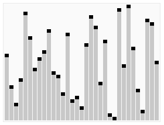

[#0215-kth-largest-element-in-an-array]
= 215. 数组中的第K个最大元素

https://leetcode.cn/problems/kth-largest-element-in-an-array/[LeetCode - 215. 数组中的第K个最大元素^]

给定整数数组 `nums` 和整数 `k`，请返回数组中第 *`k`* 个最大的元素。

请注意，你需要找的是数组排序后的第 `k` 个最大的元素，而不是第 `k` 个不同的元素。

你必须设计并实现时间复杂度为 stem:[O(n)] 的算法解决此问题。

*示例 1:*

....
输入: [3,2,1,5,6,4], k = 2
输出: 5
....

*示例 2:*

....
输入: [3,2,3,1,2,4,5,5,6], k = 4
输出: 4
....

*提示：*

* `1 \<= k \<= nums.length \<= 10^5^`
* `-10^4^ \<= nums[i] \<= 10^4^`

== 思路分析

没想到竟然可以使用快排的套路来解决这个问题。

image::images/0215-02.png[{image_attr}]

NOTE: 好久不写，生疏了！

[[src-0215]]
[tabs]
====
一刷::
+
--
[{java_src_attr}]
----
include::{sourcedir}/_0215_KthLargestElementInAnArray.java[tag=answer]
----
--

二刷::
+
--
[{java_src_attr}]
----
include::{sourcedir}/_0215_KthLargestElementInAnArray_2.java[tag=answer]
----
--

三刷::
+
--
[{java_src_attr}]
----
include::{sourcedir}/_0215_KthLargestElementInAnArray_3.java[tag=answer]
----
--

四刷::
+
--
[{java_src_attr}]
----
include::{sourcedir}/_0215_KthLargestElementInAnArray_4.java[tag=answer]
----
--

五刷::
+
--
[{java_src_attr}]
----
include::{sourcedir}/_0215_KthLargestElementInAnArray_5.java[tag=answer]
----
--

六刷::
+
--
[{java_src_attr}]
----
include::{sourcedir}/_0215_KthLargestElementInAnArray_6.java[tag=answer]
----
--

七刷::
+
--
[{java_src_attr}]
----
include::{sourcedir}/_0215_KthLargestElementInAnArray_7.java[tag=answer]
----
--
====

== 参考资料

. https://en.wikipedia.org/wiki/Quickselect[Quickselect - Wikipedia^]
. https://leetcode.cn/problems/kth-largest-element-in-an-array/solutions/307351/shu-zu-zhong-de-di-kge-zui-da-yuan-su-by-leetcode-/[215. 数组中的第K个最大元素 - 官方题解^]
. https://leetcode.cn/problems/kth-largest-element-in-an-array/solutions/2361969/215-shu-zu-zhong-de-di-k-ge-zui-da-yuan-d786p/[215. 数组中的第K个最大元素 - 分治，清晰图解^]
. https://leetcode.cn/problems/kth-largest-element-in-an-array/solutions/3717020/leetcode-215yi-ti-duo-jie-ji-shu-xuan-ze-664r/[215. 数组中的第K个最大元素 - 计数选择法，快速选择法，堆选择法，多种解法+写法，详细分析^]

