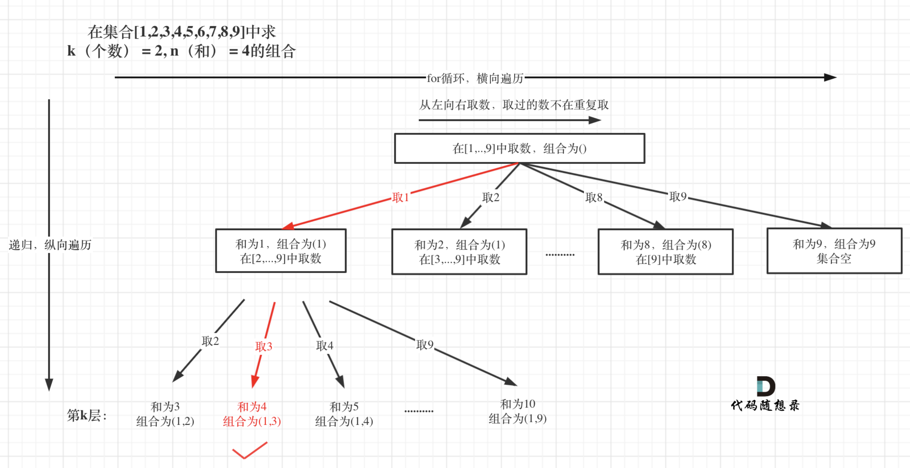

[#0216-combination-sum-iii]
= 216. 组合总和 III

https://leetcode.cn/problems/combination-sum-iii/[LeetCode - 216. 组合总和 III ^]

找出所有相加之和为 `n` 的 `k` 个数的组合，且满足下列条件：

* 只使用数字 `1` 到 `9`
* 每个数字 *最多使用一次*

返回 _所有可能的有效组合的列表_。该列表不能包含相同的组合两次，组合可以以任何顺序返回。

*示例 1:*

....
输入: k = 3, n = 7
输出: [[1,2,4]]
解释:
1 + 2 + 4 = 7
没有其他符合的组合了。
....

*示例 2:*

....
输入: k = 3, n = 9
输出: [[1,2,6], [1,3,5], [2,3,4]]
解释:
1 + 2 + 6 = 9
1 + 3 + 5 = 9
2 + 3 + 4 = 9
没有其他符合的组合了。
....

*示例 3:*

....
输入: k = 4, n = 1
输出: []
解释: 不存在有效的组合。
在[1,9]范围内使用4个不同的数字，我们可以得到的最小和是1+2+3+4 = 10，因为10 > 1，没有有效的组合。
....

*提示:*

* `+2 <= k <= 9+`
* `+1 <= n <= 60+`

== 思路分析

回溯

[[src-0216]]
[tabs]
====
一刷::
+
--
[{java_src_attr}]
----
include::{sourcedir}/_0216_CombinationSumIii.java[tag=answer]
----
--

// 二刷::
// +
// --
// [{java_src_attr}]
// ----
// include::{sourcedir}/_0216_CombinationSumIii_2.java[tag=answer]
// ----
// --
====

== 参考资料

. https://leetcode.cn/problems/combination-sum-iii/solutions/409198/zu-he-zong-he-iii-by-leetcode-solution/[216. 组合总和 III - 官方题解^] -- 二进制枚举的思路有意思。*在 xref:0077-combinations.adoc[77. Combinations] 的官方题解中，有一个子集枚举的解题框架。*
. https://leetcode.cn/problems/combination-sum-iii/solutions/857514/dai-ma-sui-xiang-lu-dai-ni-xue-tou-hui-s-petp/[216. 组合总和 III - 「代码随想录」带你学透回溯算法！^]
