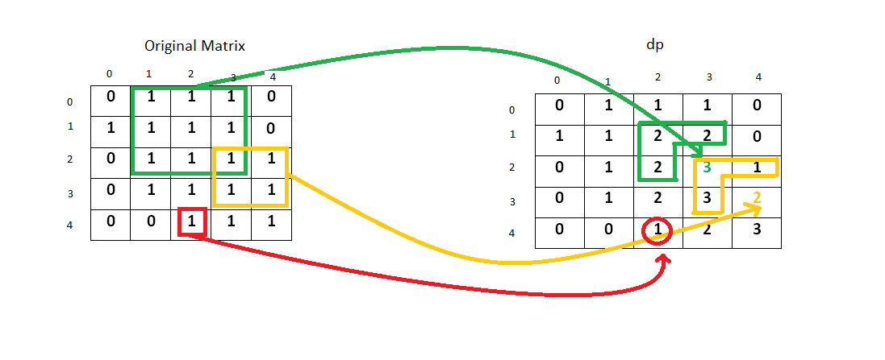
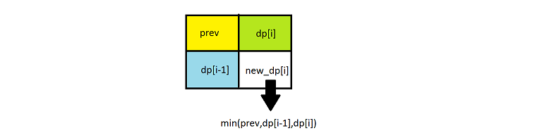

[#0221-maximal-square]
= 221. Maximal Square

{leetcode}/problems/maximal-square/[LeetCode - Maximal Square^]

Given a 2D binary matrix filled with 0's and 1's, find the largest square containing only 1's and return its area.

.Example:
----
Input:

1 0 1 0 0
1 0 1 1 1
1 1 1 1 1
1 0 0 1 0

Output: 4
----

根据左上、左边、上边加自身，确定一个最小正方形；然后再进一步，在小正方形基础上，从四周选择已有正方形中最小，然后扩大，再这个过程中记录下最大的正方形边长，即可得到结果。思路如下图：

简化一下，不需要矩阵来存储所有正方形的计算结果，只需要一行来记录上一行计算结果和当前行计算结果即可。

== 参考资料

. {leetcode}/problems/maximal-square/solution/[Maximal Square solution - LeetCode^]

Given a 2D binary matrix filled with 0's and 1's, find the largest square containing only 1's and return its area.

*Example:*

[subs="verbatim,quotes,macros"]
----
*Input: 
*
1 0 1 0 0
1 0 1 1 1
1 1 1 1 1
1 0 0 1 0

*Output:* 4
----

[[src-0221]]
[{java_src_attr}]
----
include::{sourcedir}/_0221_MaximalSquare.java[tag=answer]
----

