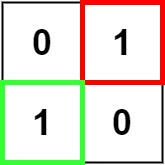
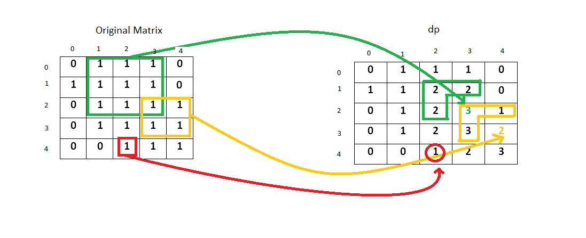

[#0221-maximal-square]
= 221. 最大正方形

https://leetcode.cn/problems/maximal-square/[LeetCode - 221. 最大正方形 ^]

在一个由 `0` 和 `1` 组成的二维矩阵内，找到只包含 `1` 的最大正方形，并返回其面积。

*示例 1：*

image::images/0221-01.jpg[{image_attr}]

....
输入：matrix = [["1","0","1","0","0"],["1","0","1","1","1"],["1","1","1","1","1"],["1","0","0","1","0"]]
输出：4
....

*示例 2：*

....
输入：matrix = [["0","1"],["1","0"]]
输出：1
....

*示例 3：*

....
输入：matrix = [["0"]]
输出：0
....

*提示：*

* `m == matrix.length`
* `n == matrix[i].length`
* `+1 <= m, n <= 300+`
* `matrix[i][j]` 为 `0` 或 `1`

== 思路分析

根据左上、左边、上边加自身，确定一个最小正方形；然后再进一步，在小正方形基础上，从四周选择已有正方形中最小，然后扩大，再这个过程中记录下最大的正方形边长，即可得到结果。思路如下图：

简化一下，不需要矩阵来存储所有正方形的计算结果，只需要一行来记录上一行计算结果和当前行计算结果即可。

image::images/0221-04.png[{image_attr}]

无需另外开辟矩阵存储中间结果，直接在参数矩阵上存储即可。

image::images/0221-05.png[{image_attr}]

[[src-0221]]
[tabs]
====
一刷::
+
--
[{java_src_attr}]
----
include::{sourcedir}/_0221_MaximalSquare.java[tag=answer]
----
--

二刷::
+
--
[{java_src_attr}]
----
include::{sourcedir}/_0221_MaximalSquare_2.java[tag=answer]
----
--
====

== 参考资料

. https://leetcode.cn/problems/maximal-square/solutions/234964/zui-da-zheng-fang-xing-by-leetcode-solution/[221. 最大正方形 - 官方题解^]
