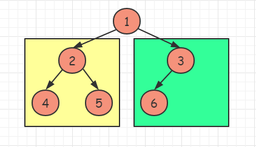
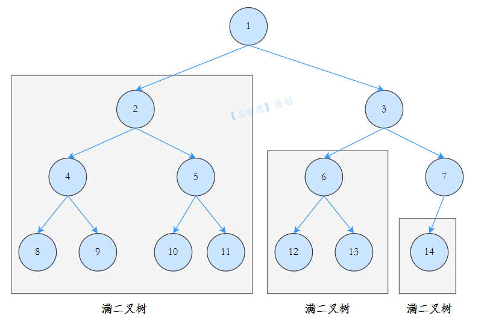

[#0222-count-complete-tree-nodes]
= 222. Count Complete Tree Nodes

https://leetcode.com/problems/count-complete-tree-nodes/[LeetCode - Count Complete Tree Nodes]

Given a *complete* binary tree, count the number of nodes.

*Note: *

*[.underline]#Definition of a complete binary tree from http://en.wikipedia.org/wiki/Binary_tree#Types_of_binary_trees[Wikipedia]:#*

In a complete binary tree every level, except possibly the last, is completely filled, and all nodes in the last level are as far left as possible. It can have between 1 and 2^h^ nodes inclusive at the last level h.

*Example:*

[subs="verbatim,quotes,macros"]
----
*Input:* 
    1
   / \
  2   3
 / \  /
4  5 6

*Output:* 6
----

== 思路分析

官方题解给的方案是：“二分查找 + 位运算”，坦白讲，这个方案有些扯淡。而且不容易理解。

参考 https://leetcode.cn/problems/count-complete-tree-nodes/solutions/21544/chang-gui-jie-fa-he-ji-bai-100de-javajie-fa-by-xia/[222. 完全二叉树的节点个数 - 常规解法和击败100%的Java解法^] 的解法：

完全二叉树是一棵空树或者它的叶子节点只出在最后两层，若最后一层不满则叶子节点只在最左侧。

满二叉的节点个数计算方法：如果满二叉树的层数为h，则总节点数为：2^h^ - 1.

对 `root` 节点的左右子树进行高度统计，分别记为 `left` 和 `right`，有以下两种结果：

. `left == right`。这说明，左子树一定是满二叉树，因为节点已经填充到右子树了，左子树必定已经填满了。所以左子树的节点总数我们可以直接得到，是 2^left^ - 1，加上当前这个 `root` 节点，则正好是 2^left^。再对右子树进行递归统计。
+
--

--
+
. `left != right`。说明此时最后一层不满，但倒数第二层已经满了，可以直接得到右子树的节点个数。同理，右子树节点 + `root` 节点，总数为 2^right^。再对左子树进行递归查找。
+
--
image::images/0222-02.png[{image_attr}]
--

根据下面这张图：

再结合代码，就更容易理解了。

如何计算 2^left^，最快的方法是移位计算。

[[src-0222]]
[{java_src_attr}]
----
include::{sourcedir}/_0222_CountCompleteTreeNodes.java[]
----

== 参考资料

. https://leetcode.cn/problems/count-complete-tree-nodes/solutions/495655/wan-quan-er-cha-shu-de-jie-dian-ge-shu-by-leetco-2/[222. 完全二叉树的节点个数 - 官方题解^]
. https://leetcode.cn/problems/count-complete-tree-nodes/solutions/21544/chang-gui-jie-fa-he-ji-bai-100de-javajie-fa-by-xia/[222. 完全二叉树的节点个数 - 常规解法和击败100%的Java解法^] -- 这个讲解+下面的配图，就容易理解了。
. https://leetcode.cn/problems/count-complete-tree-nodes/solutions/181466/c-san-chong-fang-fa-jie-jue-wan-quan-er-cha-shu-de/[222. 完全二叉树的节点个数 - C++ 三种方法解决完全二叉树的节点个数^]

