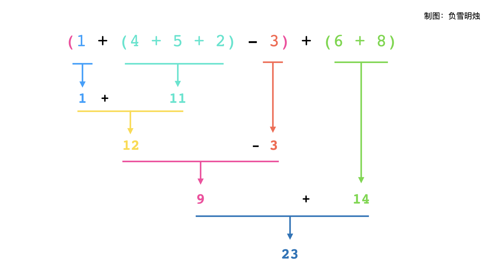

[#0224-basic-calculator]
= 224. 基本计算器

https://leetcode.cn/problems/basic-calculator/[LeetCode - 224. 基本计算器^]

给你一个字符串表达式 `s` ，请你实现一个基本计算器来计算并返回它的值。

注意:不允许使用任何将字符串作为数学表达式计算的内置函数，比如 `+eval()+`。

*示例 1：*

....
输入：s = "1 + 1"
输出：2
....

*示例 2：*

....
输入：s = " 2-1 + 2 "
输出：3
....

*示例 3：*

....
输入：s = "(1+(4+5+2)-3)+(6+8)"
输出：23
....

*提示：*

* `1 \<= s.length \<= 3 * 10^5^`
* `s` 由数字、`+`、`-`、`(`、`)`、和 ` ` 组成
* `s` 表示一个有效的表达式
* `\+` 不能用作一元运算(例如， `+1` 和 `+(2 + 3)` 无效)
* `-` 可以用作一元运算(即 `-1` 和 `-(2 + 3)` 是有效的)
* 输入中不存在两个连续的操作符
* 每个数字和运行的计算将适合于一个有符号的 32位 整数

== 思路分析

使用双栈来分别存数字和操作符。

官方题解的思路将括号展开。代码非常简洁，整体思路还要再思路一下。

[[src-0224]]
[tabs]
====
一刷::
+
--
[{java_src_attr}]
----
include::{sourcedir}/_0224_BasicCalculator.java[tag=answer]
----
--

二刷::
+
--
[{java_src_attr}]
----
include::{sourcedir}/_0224_BasicCalculator_2.java[tag=answer]
----
--
====

== 参考资料

. https://leetcode.cn/problems/basic-calculator/solutions/646369/ji-ben-ji-suan-qi-by-leetcode-solution-jvir/[224. 基本计算器 - 官方题解^] -- 还是官方题解的思路更简单！
. https://leetcode.cn/problems/basic-calculator/solutions/646865/shuang-zhan-jie-jue-tong-yong-biao-da-sh-olym/[224. 基本计算器 - 【进阶补充】双栈解决通用「表达式计算」问题^]
. https://leetcode.cn/problems/basic-calculator/solutions/646800/ru-he-xiang-dao-yong-zhan-si-lu-lai-zi-y-gpca/[224. 基本计算器 - 如何想到用「栈」？思路来自于递归^]
