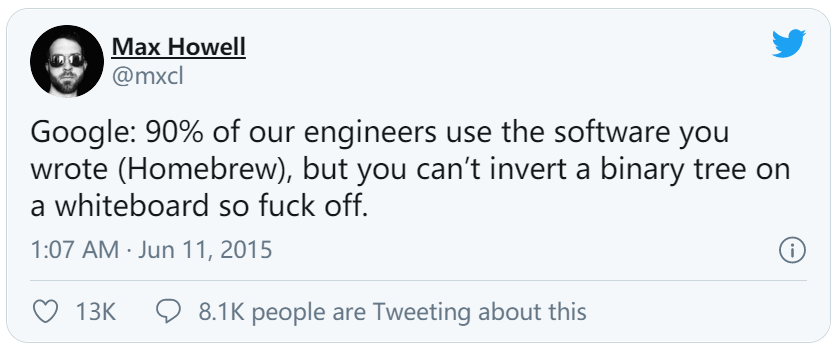

[#0226-invert-binary-tree]
= 226. 翻转二叉树

https://leetcode.cn/problems/invert-binary-tree/[LeetCode - 226. 翻转二叉树^]

给你一棵二叉树的根节点 `root`，翻转这棵二叉树，并返回其根节点。

*示例 1：*

image::images/0226-01.jpg[{image_attr}]

....
输入：root = [4,2,7,1,3,6,9]
输出：[4,7,2,9,6,3,1]
....

*示例 2：*

image::images/0226-02.jpg[{image_attr}]

....
输入：root = [2,1,3]
输出：[2,3,1]
....

*示例 3：*

....
输入：root = []
输出：[]
....

*提示：*

* 树中节点数目范围在 `[0, 100]` 内
* `+-100 <= Node.val <= 100+`

== 思路分析

D瓜哥也不会做这道题，现在可以说跟大神一个水平了，😆

TIP: 现在D瓜哥可以顺利做出这道题，水平稳超大神，😁😁

其实，思路很简单：就是递归地反转每棵树即可。

image::images/0226-11.png[{image_attr}]

动图演示如下：

image::images/0226-12.gif[{image_attr}]

[[src-0226]]
[tabs]
====
一刷::
+
--
[{java_src_attr}]
----
include::{sourcedir}/_0226_InvertBinaryTree.java[tag=answer]
----
--

二刷::
+
--
[{java_src_attr}]
----
include::{sourcedir}/_0226_InvertBinaryTree_2.java[tag=answer]
----
--

三刷::
+
--
[{java_src_attr}]
----
include::{sourcedir}/_0226_InvertBinaryTree_3.java[tag=answer]
----
--
====

== 参考资料

. https://leetcode.cn/problems/invert-binary-tree/solutions/2713610/shi-pin-shen-ru-li-jie-di-gui-pythonjava-zhqh/[226. 翻转二叉树 - 两种递归写法^]
. https://leetcode.cn/problems/invert-binary-tree/solutions/73159/dong-hua-yan-shi-liang-chong-shi-xian-226-fan-zhua/[226. 翻转二叉树 - 动画演示 两种实现^]
. https://leetcode.cn/problems/invert-binary-tree/solutions/415507/shou-hua-tu-jie-san-chong-xie-fa-di-gui-liang-chon/[226. 翻转二叉树 - 「手画图解」剖析Howell大神没写出的面试题^]
. https://leetcode.cn/problems/invert-binary-tree/solutions/415160/fan-zhuan-er-cha-shu-by-leetcode-solution/[226. 翻转二叉树 - 官方题解^]
. https://leetcode.cn/problems/invert-binary-tree/solutions/2361621/226-fan-zhuan-er-cha-shu-fen-zhi-qing-xi-tqlf/[226. 翻转二叉树 - 深度优先搜索，清晰图解^]
