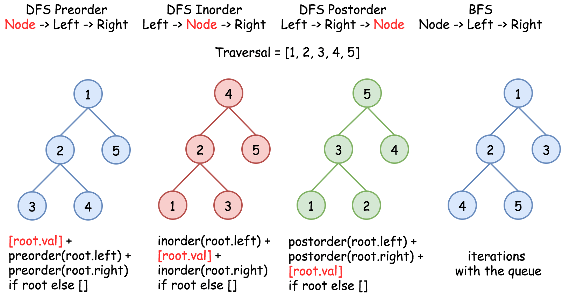

== 230. Kth Smallest Element in a BST

https://leetcode.com/problems/kth-smallest-element-in-a-bst/[LeetCode - Kth Smallest Element in a BST]

TODO: 树的非递归遍历还需要多加推敲，加强理解。

image::images/0230-2.png[]

image::images/0230-3.png[]

image::images/0230-4.png[]

Given a binary search tree, write a function `kthSmallest` to find the *k*th smallest element in it.

*Note: *

You may assume k is always valid, 1 ≤ k ≤ BST's total elements.

*Example 1:*

[subs="verbatim,quotes,macros"]
----
*Input:* root = [3,1,4,null,2], k = 1
   3
  / \
 1   4
  \
   2
*Output:* 1
----

*Example 2:*

[subs="verbatim,quotes,macros"]
----
*Input:* root = [5,3,6,2,4,null,null,1], k = 3
       5
      / \
     3   6
    / \
   2   4
  /
 1
*Output:* 3

----

*Follow up:*

What if the BST is modified (insert/delete operations) often and you need to find the kth smallest frequently? How would you optimize the kthSmallest routine?

[[src-0230]]
[source,{java_source_attr}]
----
include::{sourcedir}/_0230_KthSmallestElementInABST.java[]
----

