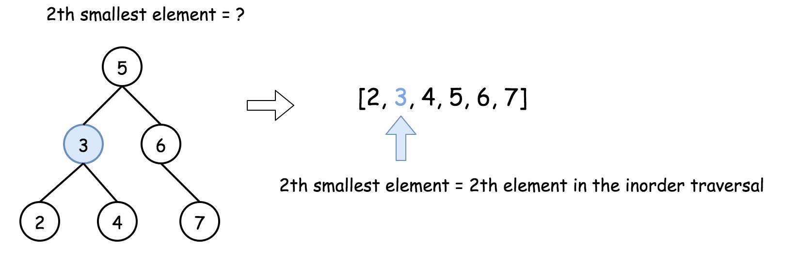
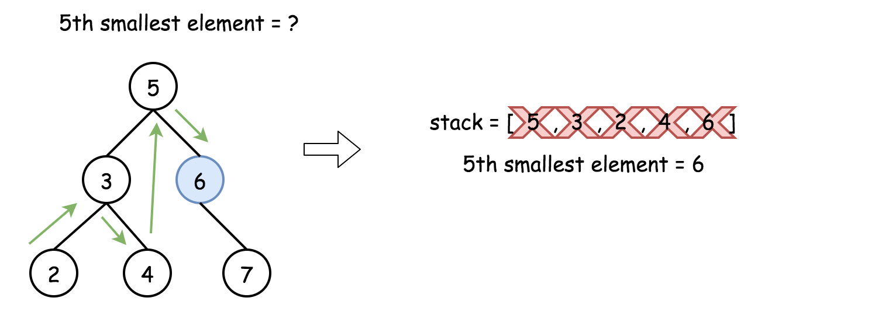
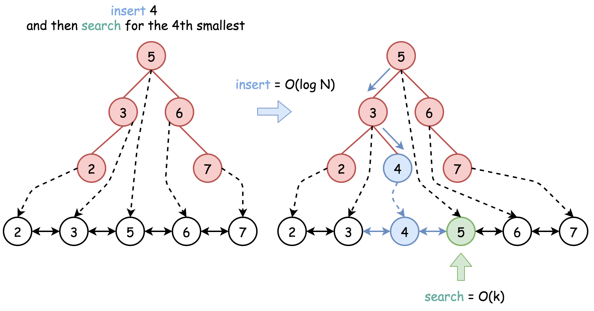

[#0230-kth-smallest-element-in-a-bst]
= 230. Kth Smallest Element in a BST

https://leetcode.com/problems/kth-smallest-element-in-a-bst/[LeetCode - Kth Smallest Element in a BST]

Given a binary search tree, write a function `kthSmallest` to find the *k*th smallest element in it.

*Note: *

You may assume k is always valid, 1 ≤ k ≤ BST's total elements.

*Example 1:*

[subs="verbatim,quotes,macros"]
----
*Input:* root = [3,1,4,null,2], k = 1
   3
  / \
 1   4
  \
   2
*Output:* 1
----

*Example 2:*

[subs="verbatim,quotes,macros"]
----
*Input:* root = [5,3,6,2,4,null,null,1], k = 3
       5
      / \
     3   6
    / \
   2   4
  /
 1
*Output:* 3

----

*Follow up:*

What if the BST is modified (insert/delete operations) often and you need to find the kth smallest frequently? How would you optimize the kthSmallest routine?

== 思路分析

二叉搜索树的中根遍历是排好序的，所以，求第 K 最小值，直接中根遍历即可。

树的非递归遍历还需要多加推敲，加强理解。

image::images/0230-05.png[{image_attr}]

image::images/0230-01.png[{image_attr}]

[[src-0230]]
[{java_src_attr}]
----
include::{sourcedir}/_0230_KthSmallestElementInABST.java[tag=answer]
----

[[src-0230]]
[{java_src_attr}]
----
include::{sourcedir}/_0230_KthSmallestElementInABst_2.java[tag=answer]
----

== 参考资料

. https://leetcode.cn/problems/kth-smallest-element-in-a-bst/solutions/1050055/er-cha-sou-suo-shu-zhong-di-kxiao-de-yua-8o07/[230. 二叉搜索树中第K小的元素 - 官方题解^]
. https://leetcode.cn/problems/kth-smallest-element-in-a-bst/solutions/2361685/230-er-cha-sou-suo-shu-zhong-di-k-xiao-d-n3he/[230. 二叉搜索树中第K小的元素 - 中序遍历，清晰图解^]

