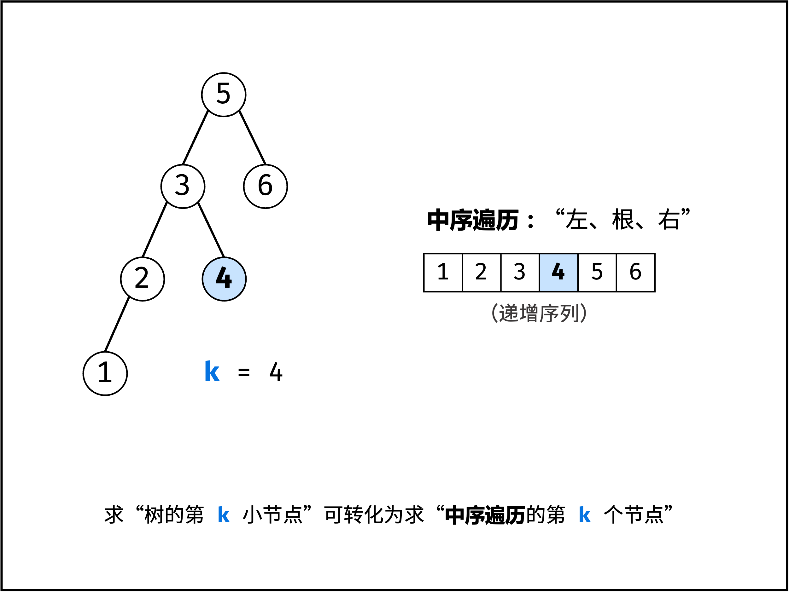

[#0230-kth-smallest-element-in-a-bst]
= 230. 二叉搜索树中第 K 小的元素

https://leetcode.cn/problems/kth-smallest-element-in-a-bst/[LeetCode - 230. 二叉搜索树中第 K 小的元素^]

给定一个二叉搜索树的根节点 `root` ，和一个整数 `k`，请你设计一个算法查找其中第 `k` 小的元素（从 1 开始计数）。

*示例 1：*

image::images/0230-01.jpg[{image_attr}]

....
输入：root = [3,1,4,null,2], k = 1
输出：1
....

*示例 2：*

image::images/0230-02.jpg[{image_attr}]

....
输入：root = [5,3,6,2,4,null,null,1], k = 3
输出：3
....

*提示：*

* 树中的节点数为 `n` 。
* `1 \<= k \<= n \<= 10^4^`
* `0 \<= Node.val \<= 10^4^`

**进阶：**如果二叉搜索树经常被修改（插入/删除操作）并且你需要频繁地查找第 `k` 小的值，你将如何优化算法？

== 思路分析

二叉搜索树的中根遍历是排好序的，所以，求第 K 最小值，直接中根遍历即可。

树的非递归遍历还需要多加推敲，加强理解。

image::images/0230-02.png[{image_attr}]

image::images/0230-03.png[{image_attr}]

[[src-0230]]
[tabs]
====
一刷::
+
--
[{java_src_attr}]
----
include::{sourcedir}/_0230_KthSmallestElementInABst.java[tag=answer]
----
--

二刷::
+
--
[{java_src_attr}]
----
include::{sourcedir}/_0230_KthSmallestElementInABst_2.java[tag=answer]
----
--

三刷::
+
--
[{java_src_attr}]
----
include::{sourcedir}/_0230_KthSmallestElementInABst_3.java[tag=answer]
----
--

四刷::
+
--
[{java_src_attr}]
----
include::{sourcedir}/_0230_KthSmallestElementInABst_4.java[tag=answer]
----
--
====

== 参考资料

. https://leetcode.cn/problems/kth-smallest-element-in-a-bst/solutions/1050055/er-cha-sou-suo-shu-zhong-di-kxiao-de-yua-8o07/[230. 二叉搜索树中第K小的元素 - 官方题解^]
. https://leetcode.cn/problems/kth-smallest-element-in-a-bst/solutions/2361685/230-er-cha-sou-suo-shu-zhong-di-k-xiao-d-n3he/[230. 二叉搜索树中第K小的元素 - 中序遍历，清晰图解^]

