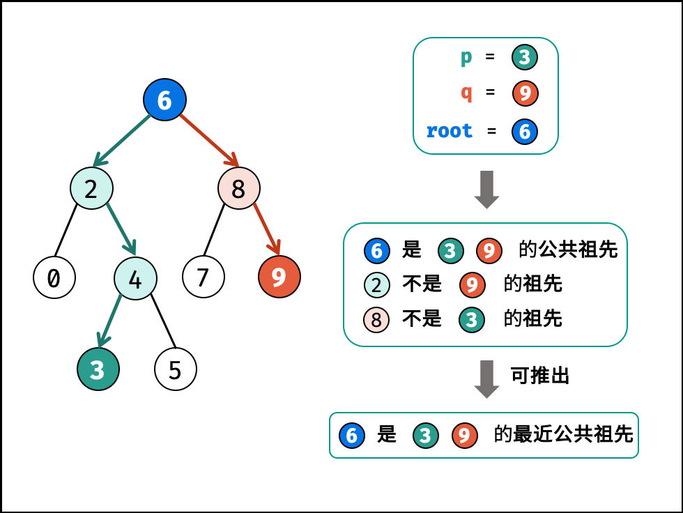
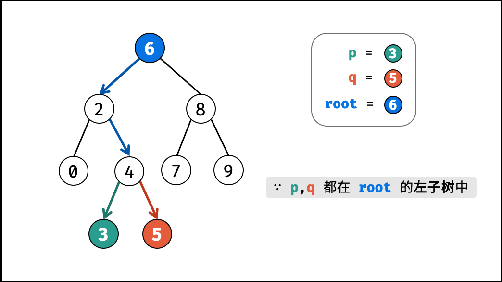
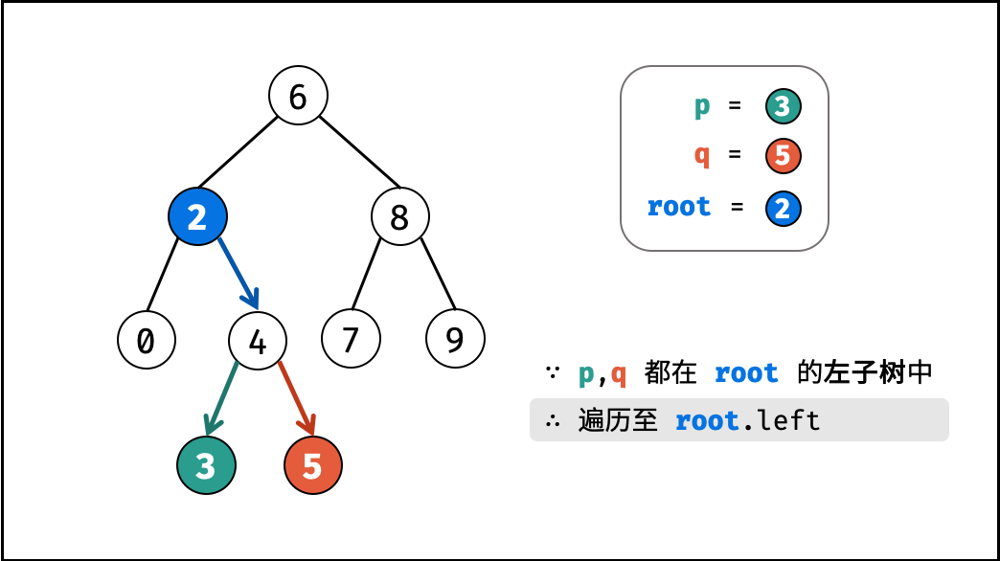
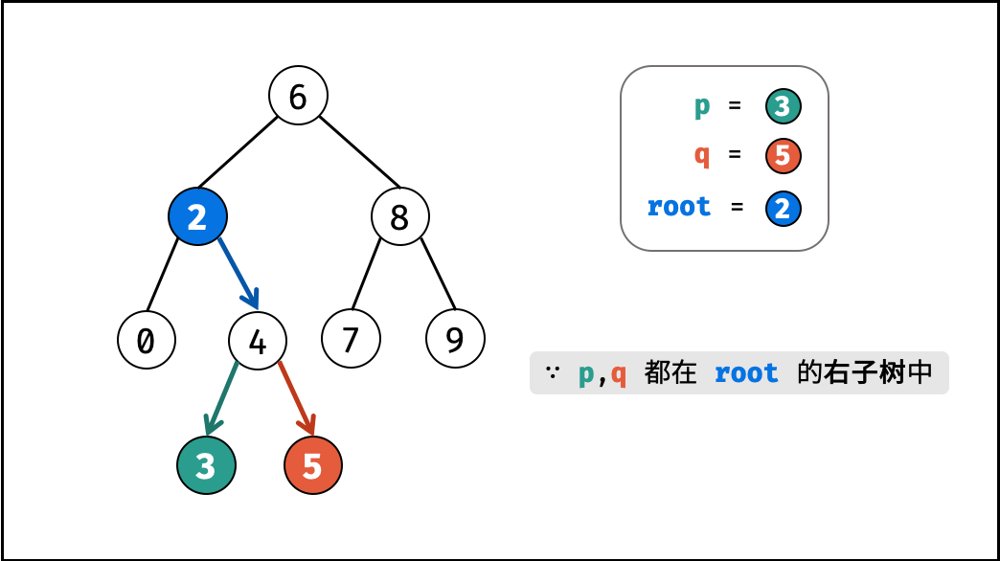
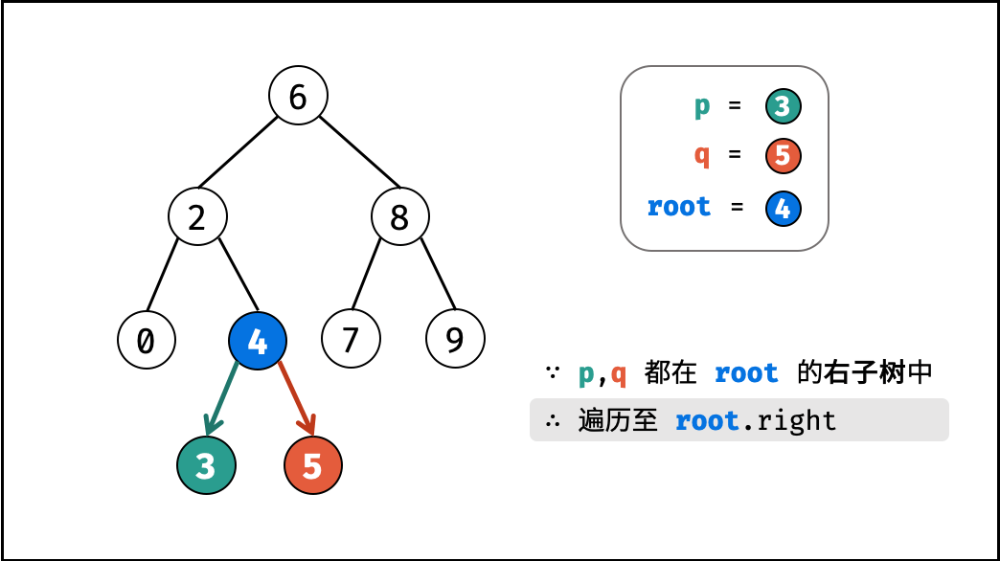
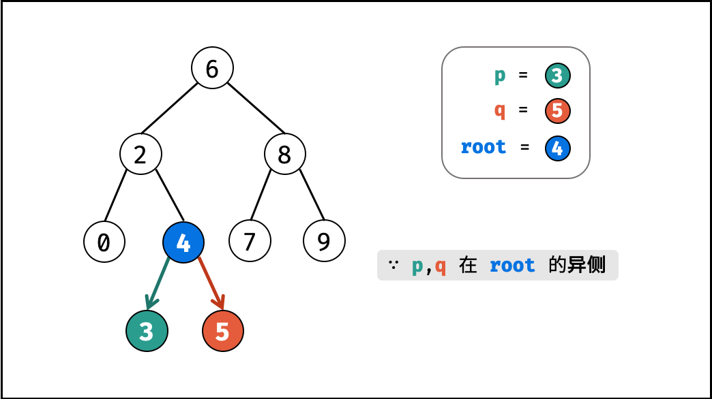
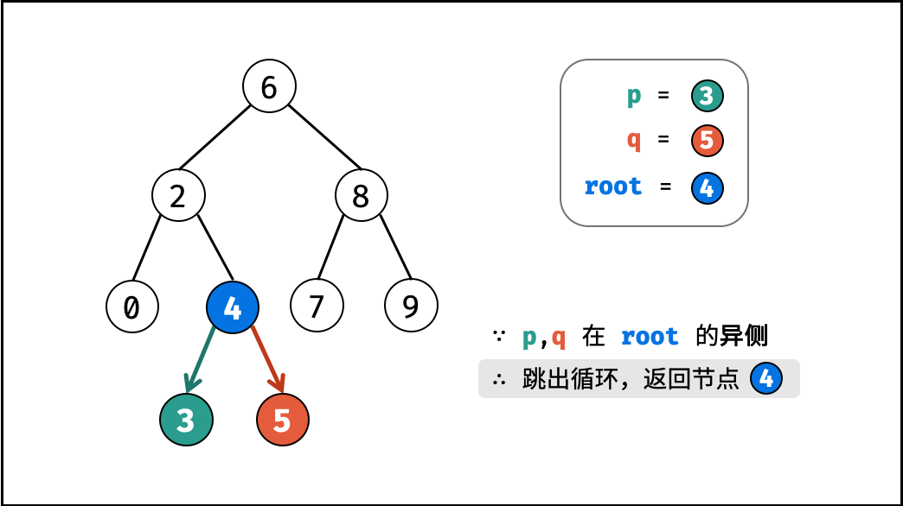

= 235. Lowest Common Ancestor of a Binary Search Tree

https://leetcode.com/problems/lowest-common-ancestor-of-a-binary-search-tree/[LeetCode - Lowest Common Ancestor of a Binary Search Tree]

Given a binary search tree (BST), find the lowest common ancestor (LCA) of two given nodes in the BST.

According to the https://en.wikipedia.org/wiki/Lowest_common_ancestor[definition of LCA on Wikipedia]: &ldquo;The lowest common ancestor is defined between two nodes p and q as the lowest node in T that has both p and q as descendants (where we allow *a node to be a descendant of itself*).&rdquo;

Given binary search tree:  root = [6,2,8,0,4,7,9,null,null,3,5]

image::https://assets.leetcode.com/uploads/2018/12/14/binarysearchtree_improved.png[]
 

*Example 1:*

[subs="verbatim,quotes,macros"]
----
*Input:* root = [6,2,8,0,4,7,9,null,null,3,5], p = 2, q = 8
*Output:* 6
*Explanation:* The LCA of nodes `2` and `8` is `6`.
----

*Example 2:*

[subs="verbatim,quotes,macros"]
----
*Input:* root = [6,2,8,0,4,7,9,null,null,3,5], p = 2, q = 4
*Output:* 2
*Explanation:* The LCA of nodes `2` and `4` is `2`, since a node can be a descendant of itself according to the LCA definition.
----

 

*Note:*

* All of the nodes' values will be unique.
* p and q are different and both values will exist in the BST.

== 思路分析

要充分利用二叉搜索树的特性：左大右小，如果根节点大于两个指定节点的值，那么公共祖先就在左子树上；如果根节点小于两个指定节点的值，那么公共祖先就在右子树上；否则就是他们的公共祖先节点。

[[src-0235]]
[{java_src_attr}]
----
include::{sourcedir}/_0235_LowestCommonAncestorOfABinarySearchTree.java[]
----

== 参考资料

. https://leetcode.cn/problems/lowest-common-ancestor-of-a-binary-search-tree/solutions/428633/er-cha-sou-suo-shu-de-zui-jin-gong-gong-zu-xian-26/[235. 二叉搜索树的最近公共祖先 - 官方题解^]
. https://leetcode.cn/problems/lowest-common-ancestor-of-a-binary-search-tree/solutions/2361725/235-er-cha-sou-suo-shu-de-zui-jin-gong-g-qqck/[235. 二叉搜索树的最近公共祖先 - 深度优先搜索，清晰图解^]
. https://leetcode.cn/problems/lowest-common-ancestor-of-a-binary-search-tree/solutions/428739/er-cha-sou-suo-shu-de-zui-jin-gong-gong-zu-xian-3c/[235. 二叉搜索树的最近公共祖先 - 3种解决方式^] -- 根节点与两个节点的差值相乘，如果小于 `0` 则节点分布在左右子树上，当前根节点就是公共祖先节点。

