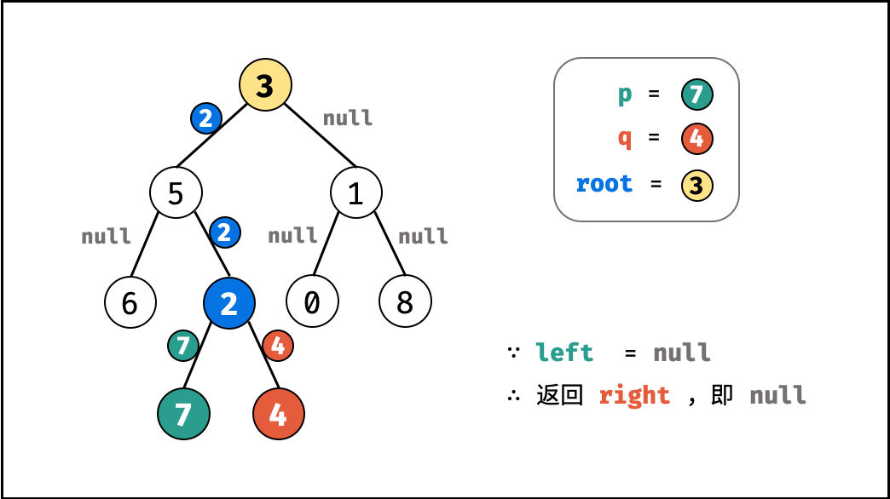

[#0236-lowest-common-ancestor-of-a-binary-tree]
= 236. Lowest Common Ancestor of a Binary Tree

https://leetcode.com/problems/lowest-common-ancestor-of-a-binary-tree/[LeetCode - Lowest Common Ancestor of a Binary Tree]

D瓜哥的思路：先找出一条从根节点到某个节点的路径；然后从这条路径上以此去寻找另外一个节点。找到这返回此节点。

思考题：如何按照"路径"的思路实现一遍？

== 解题分析

Given a binary tree, find the lowest common ancestor (LCA) of two given nodes in the tree.

According to the https://en.wikipedia.org/wiki/Lowest_common_ancestor[definition of LCA on Wikipedia]: &ldquo;The lowest common ancestor is defined between two nodes p and q as the lowest node in T that has both p and q as descendants (where we allow *a node to be a descendant of itself*).&rdquo;

Given the following binary tree:  root = [3,5,1,6,2,0,8,null,null,7,4]

image::https://assets.leetcode.com/uploads/2018/12/14/binarytree.png[{image_attr}]
 

*Example 1:*

[subs="verbatim,quotes,macros"]
----
*Input:* root = [3,5,1,6,2,0,8,null,null,7,4], p = 5, q = 1
*Output:* 3
*Explanation:* The LCA of nodes `5` and `1` is `3.`
----

*Example 2:*

[subs="verbatim,quotes,macros"]
----
*Input:* root = [3,5,1,6,2,0,8,null,null,7,4], p = 5, q = 4
*Output:* 5
*Explanation:* The LCA of nodes `5` and `4` is `5`, since a node can be a descendant of itself according to the LCA definition.
----

 

*Note:*

* All of the nodes' values will be unique.
* p and q are different and both values will exist in the binary tree.

== 思路分析

这道题是 xref:0235-lowest-common-ancestor-of-a-binary-search-tree.adoc[235. Lowest Common Ancestor of a Binary Search Tree] 的延伸。但是，解题思路略有不同，本体的解题思路也可用于前者。

有两种情况：

. 两个节点是一个树下的两个节点；
. 一个节点就是另外一个节点的祖先节点；

根据这两点，针对一棵树进行递归遍历，去寻找当前节点与两个指定节点相等的节点，找到就返回当前节点（也就是两个节点其中之一），找不到就返回 `null`。

当左右子树都返回不为 `null` 时，那么当前节点就是两棵树的公共祖先节点。情况如下：

image::images/0236-19.png[{image_attr}]

image::images/0236-00.png[{image_attr}]

image::images/0236-03.png[{image_attr}]

image::images/0236-04.png[{image_attr}]

image::images/0236-05.png[{image_attr}]

image::images/0236-06.png[{image_attr}]

image::images/0236-07.png[{image_attr}]

image::images/0236-08.png[{image_attr}]

image::images/0236-10.png[{image_attr}]

image::images/0236-13.png[{image_attr}]

image::images/0236-14.png[{image_attr}]

image::images/0236-18.png[{image_attr}]

[[src-0236]]
[{java_src_attr}]
----
include::{sourcedir}/_0236_LowestCommonAncestorOfABinaryTree.java[]
----

[{java_src_attr}]
----
include::{sourcedir}/_0236_LowestCommonAncestorOfABinaryTree_2.java[]
----

== 参考资料

. https://en.wikipedia.org/wiki/Lowest_common_ancestor[Lowest common ancestor - Wikipedia]
. https://leetcode.cn/problems/lowest-common-ancestor-of-a-binary-tree/solutions/238552/er-cha-shu-de-zui-jin-gong-gong-zu-xian-by-leetc-2/[236. 二叉树的最近公共祖先 - 官方题解^]
. https://leetcode.cn/problems/lowest-common-ancestor-of-a-binary-tree/solutions/240096/236-er-cha-shu-de-zui-jin-gong-gong-zu-xian-hou-xu/[236. 二叉树的最近公共祖先 - DFS ，清晰图解^]
. https://leetcode.cn/problems/lowest-common-ancestor-of-a-binary-tree/solutions/2023872/fen-lei-tao-lun-luan-ru-ma-yi-ge-shi-pin-2r95/[236. 二叉树的最近公共祖先 - 本题最简单写法！^]

