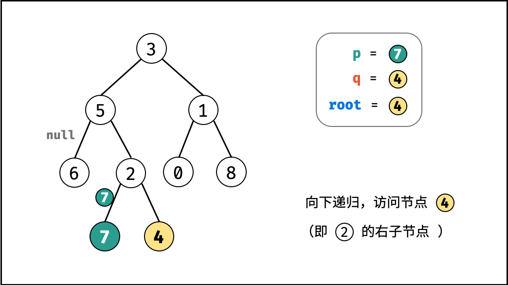

[#0236-lowest-common-ancestor-of-a-binary-tree]
= 236. 二叉树的最近公共祖先

https://leetcode.cn/problems/lowest-common-ancestor-of-a-binary-tree/[LeetCode - 236. 二叉树的最近公共祖先^]

给定一个二叉树, 找到该树中两个指定节点的最近公共祖先。

https://baike.baidu.com/item/%E6%9C%80%E8%BF%91%E5%85%AC%E5%85%B1%E7%A5%96%E5%85%88/8918834?fr=aladdin[百度百科] 中最近公共祖先的定义为：“对于有根树 T 的两个节点 p、q，最近公共祖先表示为一个节点 x，满足 x 是 p、q 的祖先且 x 的深度尽可能大（*一个节点也可以是它自己的祖先*）。”

*示例 1：*

image::images/0236-1.png[{image_attr}]

....
输入：root = [3,5,1,6,2,0,8,null,null,7,4], p = 5, q = 1
输出：3
解释：节点 5 和节点 1 的最近公共祖先是节点 3 。
....

*示例 2：*

image::images/0236-1.png[{image_attr}]

....
输入：root = [3,5,1,6,2,0,8,null,null,7,4], p = 5, q = 4
输出：5
解释：节点 5 和节点 4 的最近公共祖先是节点 5 。因为根据定义最近公共祖先节点可以为节点本身。
....

*示例 3：*

....
输入：root = [1,2], p = 1, q = 2
输出：1
....

*提示：*

* 树中节点数目在范围 `[2, 10^5^]` 内。
* `-10^9^ \<= Node.val \<= 10^9^`
* 所有 `Node.val` 互不相同。
* `p != q`
* `p` 和 `q` 均存在于给定的二叉树中。

== 思路分析

D瓜哥的思路：先找出一条从根节点到某个节点的路径；然后从这条路径上以此去寻找另外一个节点。找到这返回此节点。

思考题：如何按照"路径"的思路实现一遍？

这道题是 xref:0235-lowest-common-ancestor-of-a-binary-search-tree.adoc[235. Lowest Common Ancestor of a Binary Search Tree] 的延伸。但是，解题思路略有不同，本体的解题思路也可用于前者。

有两种情况：

. 两个节点是一个树下的两个节点；
. 一个节点就是另外一个节点的祖先节点；

根据这两点，针对一棵树进行递归遍历，去寻找当前节点与两个指定节点相等的节点，找到就返回当前节点（也就是两个节点其中之一），找不到就返回 `null`。

当左右子树都返回不为 `null` 时，那么当前节点就是两棵树的公共祖先节点。情况如下：

image::images/0236-01.png[{image_attr}]

image::images/0236-02.png[{image_attr}]

image::images/0236-09.png[{image_attr}]

image::images/0236-11.png[{image_attr}]

image::images/0236-12.png[{image_attr}]

image::images/0236-15.png[{image_attr}]

image::images/0236-16.png[{image_attr}]

image::images/0236-17.png[{image_attr}]

[[src-0236]]
[tabs]
====
一刷::
+
--
[{java_src_attr}]
----
include::{sourcedir}/_0236_LowestCommonAncestorOfABinaryTree.java[tag=answer]
----
--

二刷::
+
--
[{java_src_attr}]
----
include::{sourcedir}/_0236_LowestCommonAncestorOfABinaryTree_2.java[tag=answer]
----
--

三刷::
+
--
[{java_src_attr}]
----
include::{sourcedir}/_0236_LowestCommonAncestorOfABinaryTree_3.java[tag=answer]
----
--

四刷::
+
--
[{java_src_attr}]
----
include::{sourcedir}/_0236_LowestCommonAncestorOfABinaryTree_4.java[tag=answer]
----
--

五刷::
+
--
[{java_src_attr}]
----
include::{sourcedir}/_0236_LowestCommonAncestorOfABinaryTree_5.java[tag=answer]
----
--
====

== 参考资料

. https://leetcode.cn/problems/lowest-common-ancestor-of-a-binary-tree/solutions/2023872/fen-lei-tao-lun-luan-ru-ma-yi-ge-shi-pin-2r95/[236. 二叉树的最近公共祖先 - 【视频讲解】简洁写法^]
. https://leetcode.cn/problems/lowest-common-ancestor-of-a-binary-tree/solutions/240096/236-er-cha-shu-de-zui-jin-gong-gong-zu-xian-hou-xu/[236. 二叉树的最近公共祖先 - DFS ，清晰图解^]
. https://leetcode.cn/problems/lowest-common-ancestor-of-a-binary-tree/solutions/238552/er-cha-shu-de-zui-jin-gong-gong-zu-xian-by-leetc-2/[236. 二叉树的最近公共祖先 - 官方题解^]
. https://leetcode.cn/problems/lowest-common-ancestor-of-a-binary-tree/solutions/625063/236-er-cha-shu-de-zui-jin-gong-gong-zu-x-tl5b/[236. 二叉树的最近公共祖先 - 【递归与回溯】详解^]
. https://en.wikipedia.org/wiki/Lowest_common_ancestor[Lowest common ancestor - Wikipedia^]
