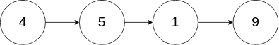
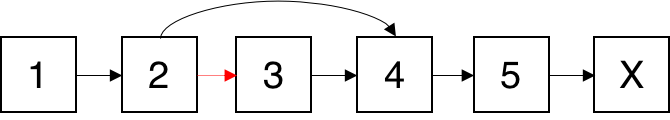
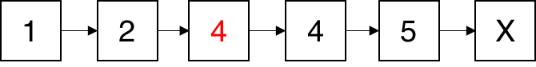

[#0237-delete-node-in-a-linked-list]
= 237. Delete Node in a Linked List

https://leetcode.com/problems/delete-node-in-a-linked-list/[LeetCode - Delete Node in a Linked List]

这个题其实很简单！把节点的值覆盖当前节点的值即可。

没想到打脸如此之快！还有更简单的办法，两行代码搞定：①把下一个节点的值拷贝到当前节点；②把当前节点的下一节点指向下下一个节点即可。

Write a function to delete a node (except the tail) in a singly linked list, given only access to that node.

Given linked list -- head = [4,5,1,9], which looks like following:

image::https://assets.leetcode.com/uploads/2018/12/28/237_example.png[{image_attr}]

 

*Example 1:*

[subs="verbatim,quotes,macros"]
----
*Input:* head = [4,5,1,9], node = 5
*Output:* [4,1,9]
*Explanation:* You are given the second node with value 5, the linked list should become 4 -> 1 -> 9 after calling your function.
----

*Example 2:*

[subs="verbatim,quotes,macros"]
----
*Input:* head = [4,5,1,9], node = 1
*Output:* [4,5,9]
*Explanation:* You are given the third node with value 1, the linked list should become 4 -> 5 -> 9 after calling your function.
----

 

*Note:*

* The linked list will have at least two elements.
* All of the nodes' values will be unique.
* The given node will not be the tail and it will always be a valid node of the linked list.
* Do not return anything from your function.

[[src-0237]]
[{java_src_attr}]
----
include::{sourcedir}/_0237_DeleteNodeInALinkedList.java[]
----

