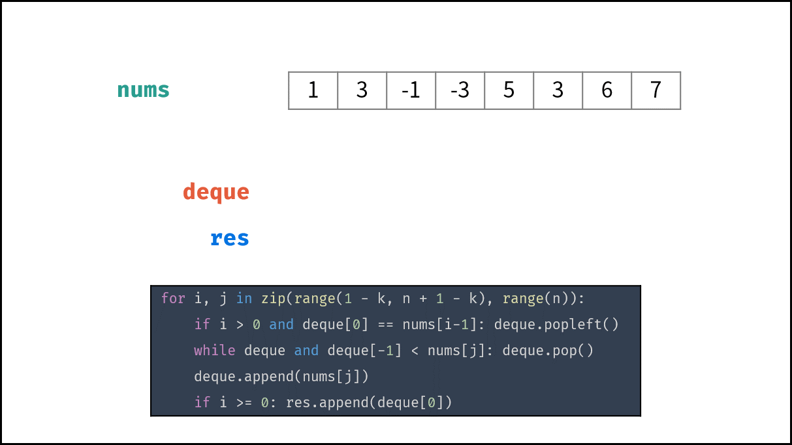
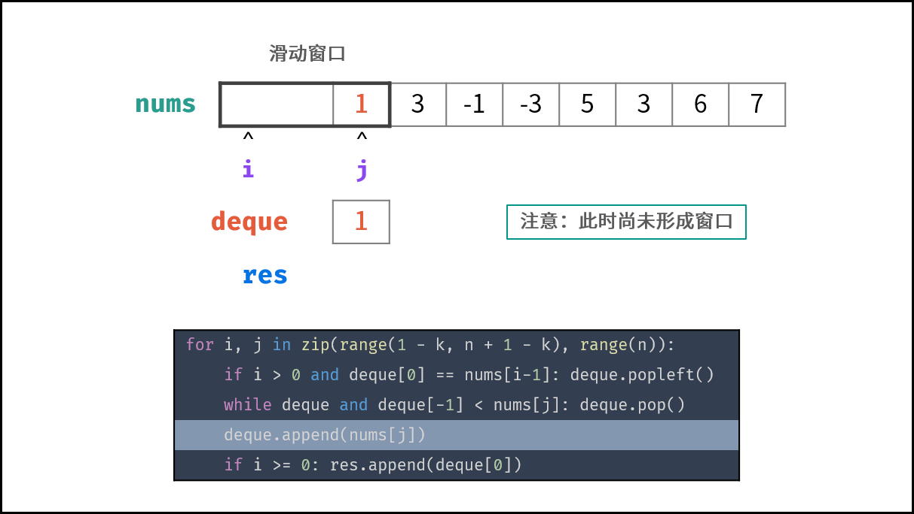
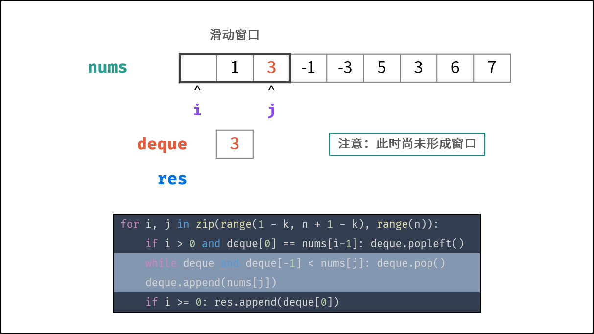
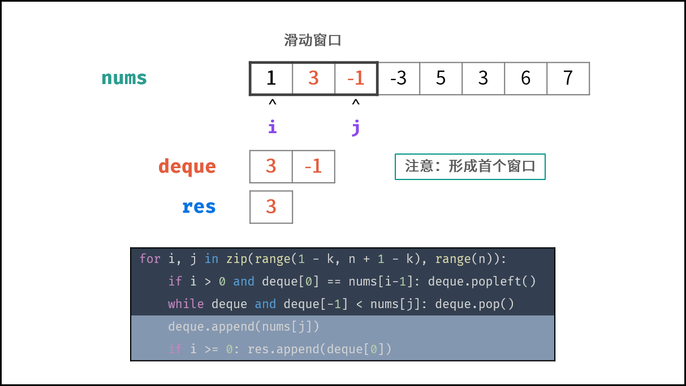
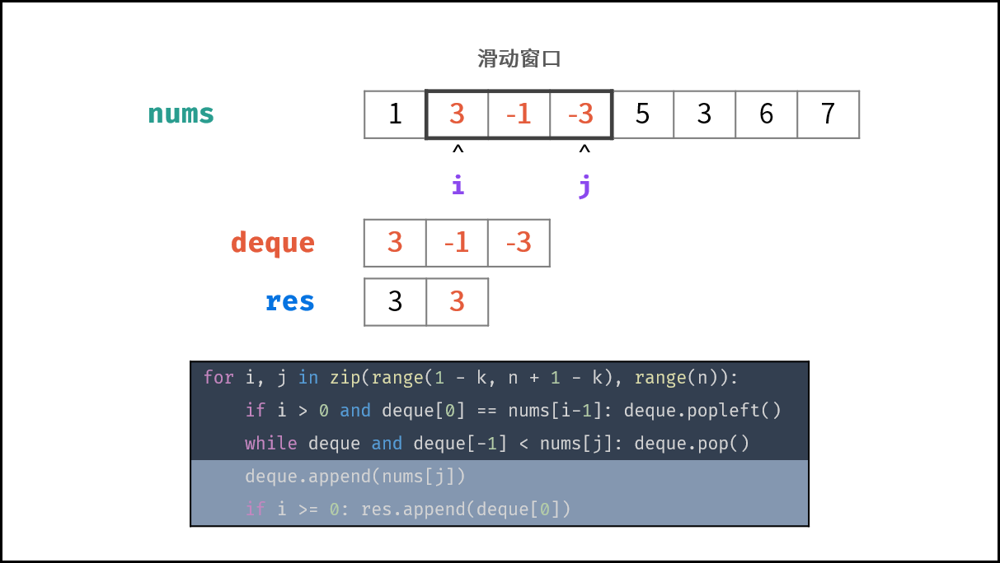
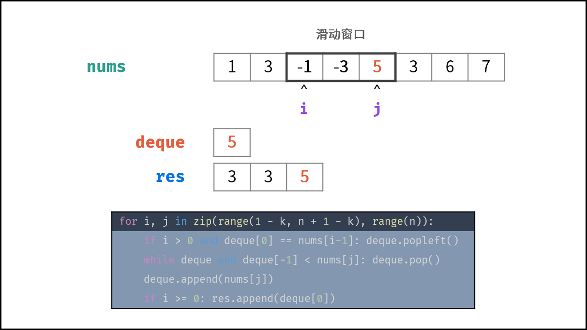
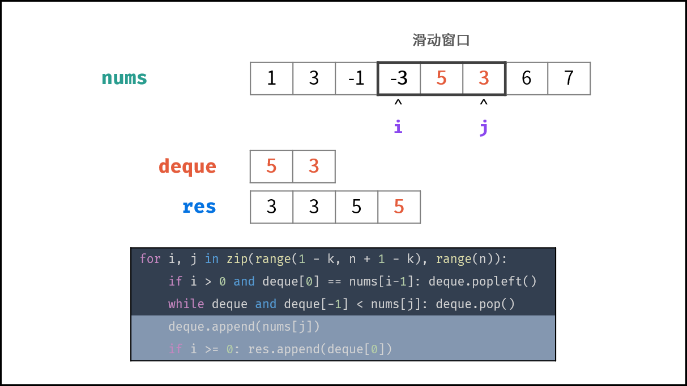
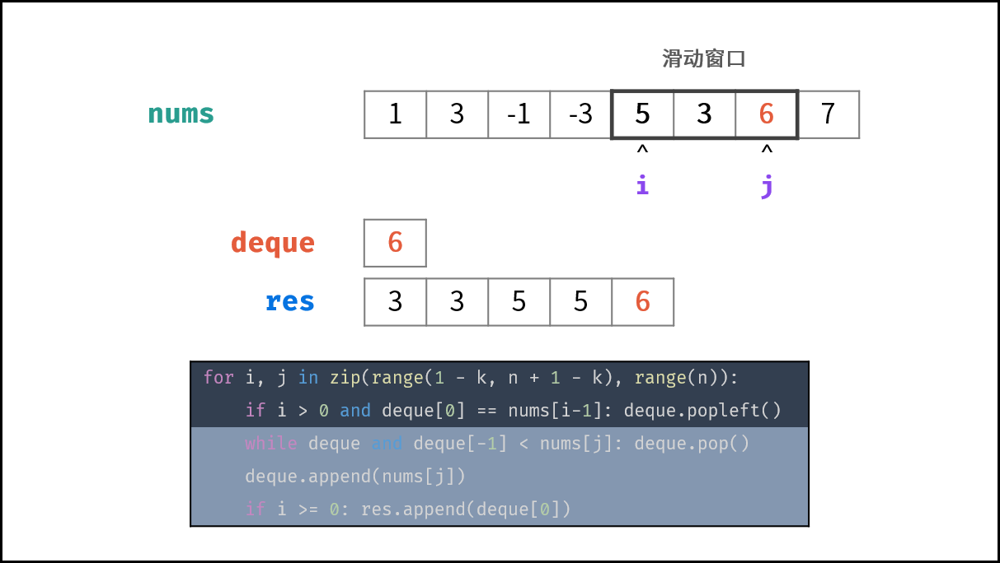
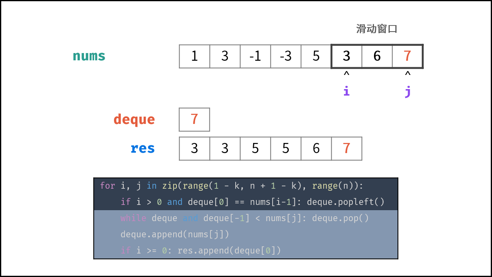
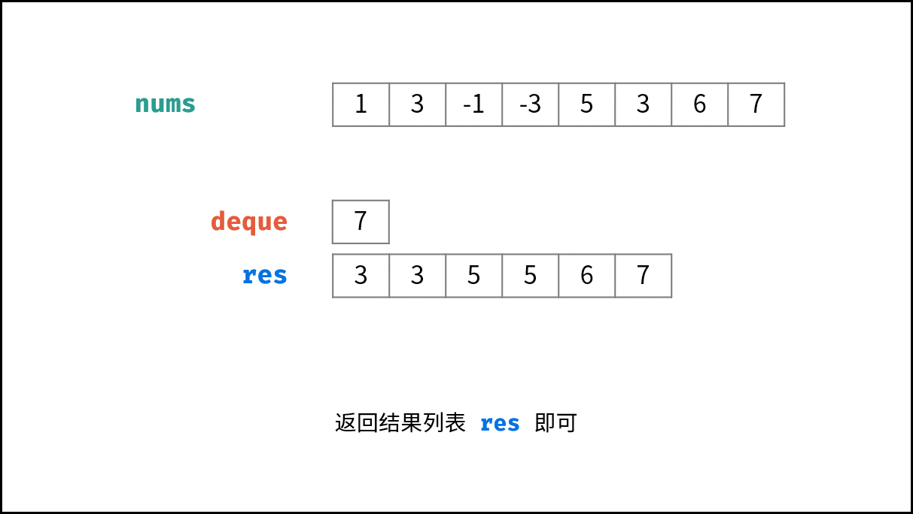

[#0239-sliding-window-maximum]
= 239. 滑动窗口最大值

https://leetcode.cn/problems/sliding-window-maximum/[LeetCode - 239. 滑动窗口最大值 ^]

给你一个整数数组 `nums`，有一个大小为 `k` 的滑动窗口从数组的最左侧移动到数组的最右侧。你只可以看到在滑动窗口内的 `k` 个数字。滑动窗口每次只向右移动一位。

返回 _滑动窗口中的最大值_ 。

*示例 1：*

....
输入：nums = [1,3,-1,-3,5,3,6,7], k = 3
输出：[3,3,5,5,6,7]
解释：
滑动窗口的位置                最大值
---------------               -----
[1  3  -1] -3  5  3  6  7       3
 1 [3  -1  -3] 5  3  6  7       3
 1  3 [-1  -3  5] 3  6  7       5
 1  3  -1 [-3  5  3] 6  7       5
 1  3  -1  -3 [5  3  6] 7       6
 1  3  -1  -3  5 [3  6  7]      7
....

*示例 2：*

....
输入：nums = [1], k = 1
输出：[1]
....

*提示：*

* `1 \<= nums.length \<= 10^5^`
* `-10^4^ \<= nums[i] \<= 10^4^`
* `+1 <= k <= nums.length+`

== 思路分析

最佳解决方案是单调栈：下面最大，单调递增。

// image::images/0239-1.png[{image_attr}]
//
// image::images/0239-2.png[{image_attr}]
//
// image::images/0239-3.png[{image_attr}]
//
// image::images/0239-4.png[{image_attr}]
//
// image::images/0239-5.png[{image_attr}]

image::images/0239-00.png[{image_attr}]

使用单调栈，即使数组最大元素在最前面也没事，可以通过判断栈的长度，超过指定长度则将第一个元素删除，那么第一个元素就是当前窗口的最大值。

[[src-0239]]
[tabs]
====
一刷::
+
--
[{java_src_attr}]
----
include::{sourcedir}/_0239_SlidingWindowMaximum.java[tag=answer]
----
--

二刷::
+
--
[{java_src_attr}]
----
include::{sourcedir}/_0239_SlidingWindowMaximum_2.java[tag=answer]
----
--

三刷::
+
--
[{java_src_attr}]
----
include::{sourcedir}/_0239_SlidingWindowMaximum_3.java[tag=answer]
----
--
====

== 思考题

思考一下动态规划解法的正确性！

== 参考资料

. https://leetcode.cn/problems/sliding-window-maximum/solutions/543426/hua-dong-chuang-kou-zui-da-zhi-by-leetco-ki6m/[239. 滑动窗口最大值 - 官方题解^]
. https://leetcode.cn/problems/sliding-window-maximum/solutions/2361228/239-hua-dong-chuang-kou-zui-da-zhi-dan-d-u6h0/[239. 滑动窗口最大值 - 单调队列，清晰图解^]
. https://leetcode.cn/problems/sliding-window-maximum/solutions/5458/shuang-xiang-dui-lie-jie-jue-hua-dong-chuang-kou-z/[239. 滑动窗口最大值 - 双项队列解决滑动窗口最大值难题^]
. https://leetcode.cn/problems/sliding-window-maximum/solutions/1212012/acm-xuan-shou-tu-jie-leetcode-hua-dong-c-i3wj/[239. 滑动窗口最大值 - ACM 选手图解 LeetCode 滑动窗口最大值^]

