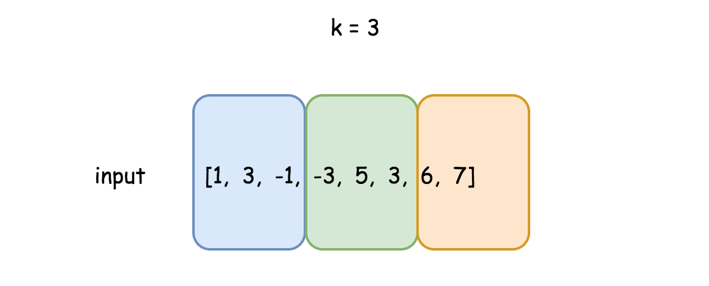
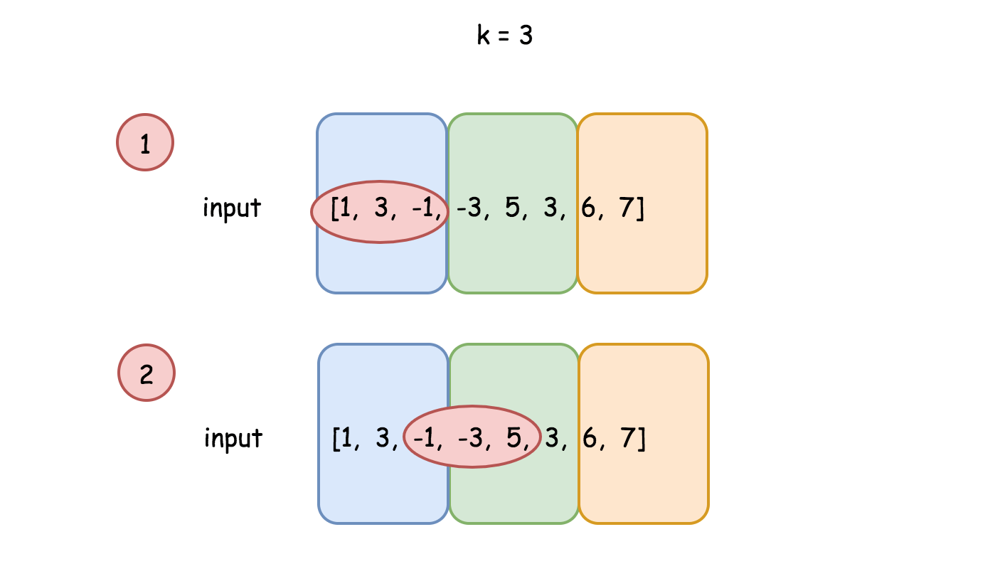
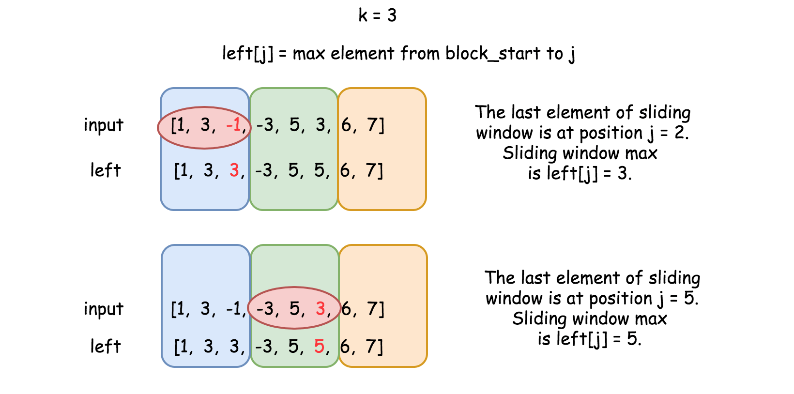
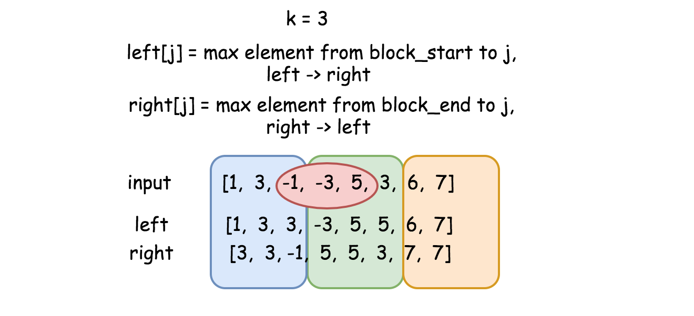
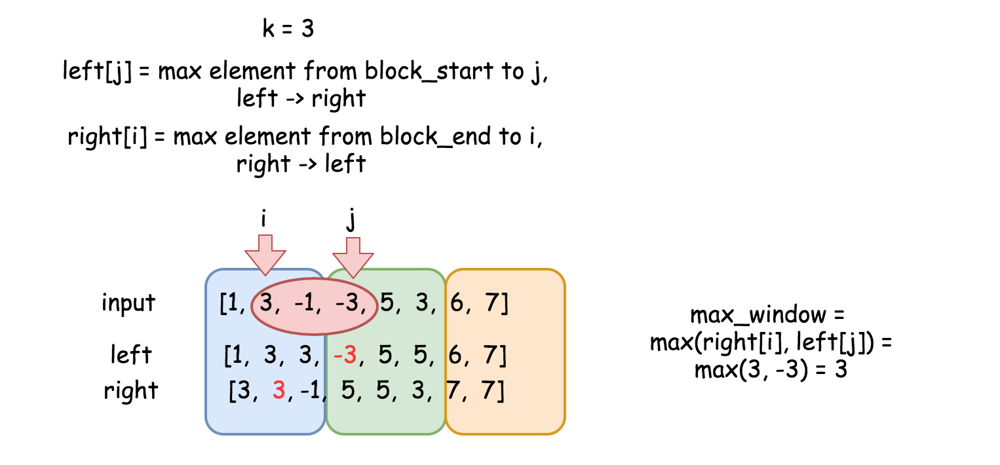

== 239. Sliding Window Maximum

https://leetcode.com/problems/sliding-window-maximum/[LeetCode - Sliding Window Maximum]

Given an array `nums`, there is a sliding window of size `k` which is moving from the very left of the array to the very right. You can only see the `k` numbers in the window. Each time the sliding window moves right by one position. Return the max sliding window.

.Example:
----
Input: nums = [1,3,-1,-3,5,3,6,7], and k = 3
Output: [3,3,5,5,6,7]
Explanation:

Window position                Max
---------------               -----
[1  3  -1] -3  5  3  6  7       3
 1 [3  -1  -3] 5  3  6  7       3
 1  3 [-1  -3  5] 3  6  7       5
 1  3  -1 [-3  5  3] 6  7       5
 1  3  -1  -3 [5  3  6] 7       6
 1  3  -1  -3  5 [3  6  7]      7
----

*Note:*

You may assume `k` is always valid, `1 ≤ k ≤` input array's size for non-empty array.

*Follow up:*

Could you solve it in linear time?

=== 解题分析

=== 思考题

思考一下动态规划解法的正确性！

=== 参考资料

. https://leetcode-cn.com/problems/sliding-window-maximum/solution/hua-dong-chuang-kou-zui-da-zhi-by-leetcode-3/[滑动窗口最大值 - 滑动窗口最大值 - 力扣（LeetCode）]