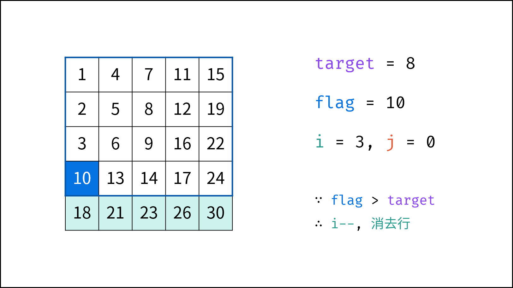
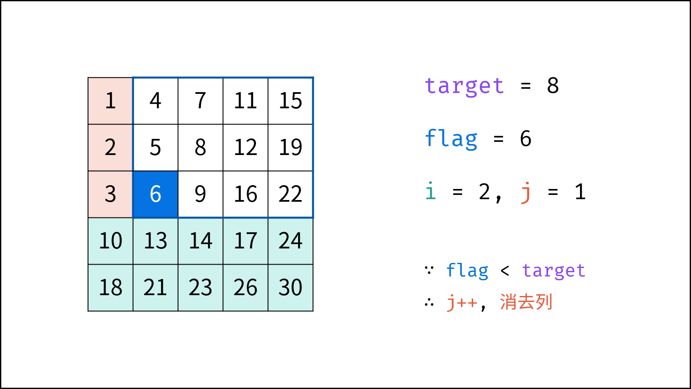
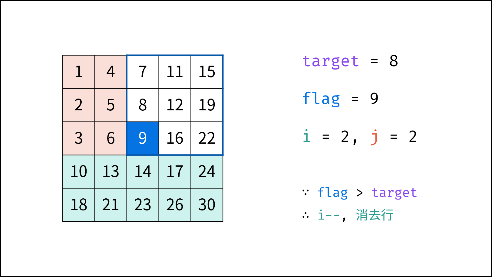
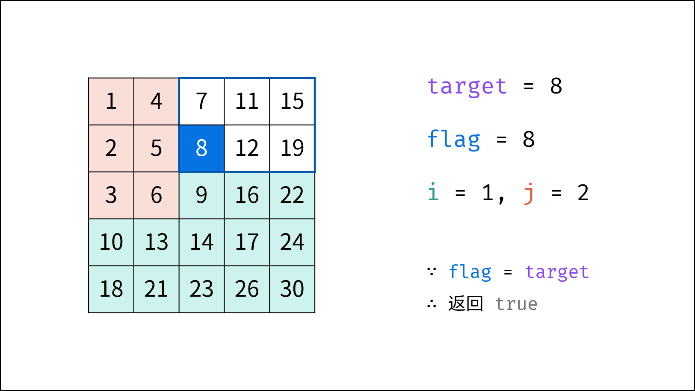

[#0240-search-a-2d-matrix-ii]
= 240. Search a 2D Matrix II

{leetcode}/problems/search-a-2d-matrix-ii/[LeetCode - Search a 2D Matrix II^]

Write an efficient algorithm that searches for a value in an _m_ x _n_ matrix. This matrix has the following properties:

* Integers in each row are sorted in ascending from left to right.
* Integers in each column are sorted in ascending from top to bottom.

*Example:*

Consider the following matrix:

[subs="verbatim,quotes,macros"]
----
[
  [1,   4,  7, 11, 15],
  [2,   5,  8, 12, 19],
  [3,   6,  9, 16, 22],
  [10, 13, 14, 17, 24],
  [18, 21, 23, 26, 30]
]
----

Given target = `5`, return `true`.

Given target = `20`, return `false`.

== 思路分析

不能对真个矩阵进行二分查找！可以对单行做二分查找。

从右上角开始搜索，小则下移，大则左移，这个方案真是精妙！

image::images/0240-01.png[{image_attr}]

image::images/0240-03.png[{image_attr}]

[[src-0240]]
[tabs]
====
一刷::
+
--
[{java_src_attr}]
----
include::{sourcedir}/_0240_SearchA2DMatrixII.java[tag=answer]
----
--

二刷::
+
--
[{java_src_attr}]
----
include::{sourcedir}/_0240_SearchA2DMatrixII_2.java[tag=answer]
----
--
====

== 参考资料

. https://leetcode.cn/problems/search-a-2d-matrix-ii/solutions/1062538/sou-suo-er-wei-ju-zhen-ii-by-leetcode-so-9hcx/?envType=study-plan-v2&envId=selected-coding-interview[240. 搜索二维矩阵 II - 官方题解^]
. https://leetcode.cn/problems/search-a-2d-matrix-ii/solutions/2361487/240-sou-suo-er-wei-ju-zhen-iitan-xin-qin-7mtf/?envType=study-plan-v2&envId=selected-coding-interview[240. 搜索二维矩阵 II - 贪心，清晰图解^]

