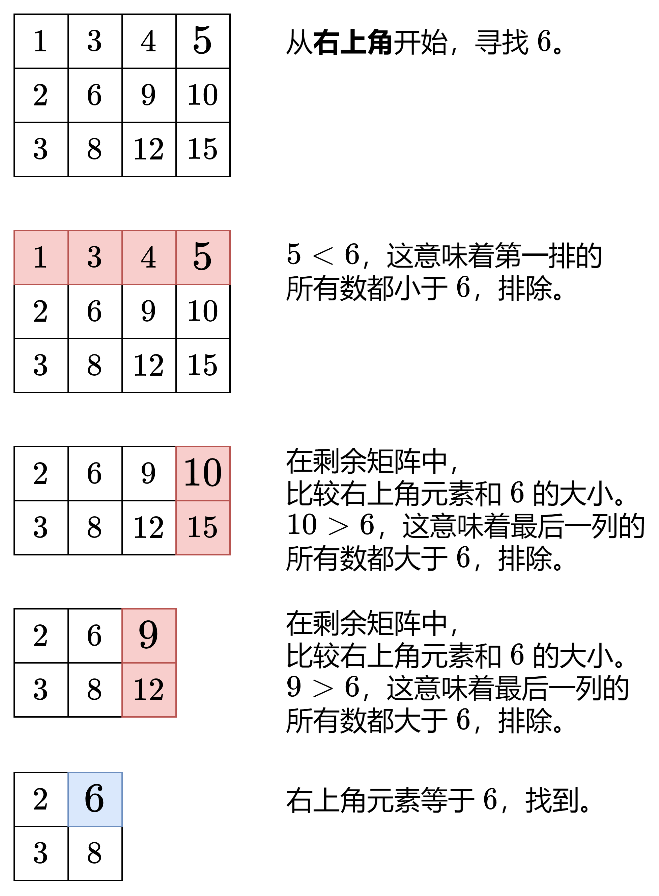
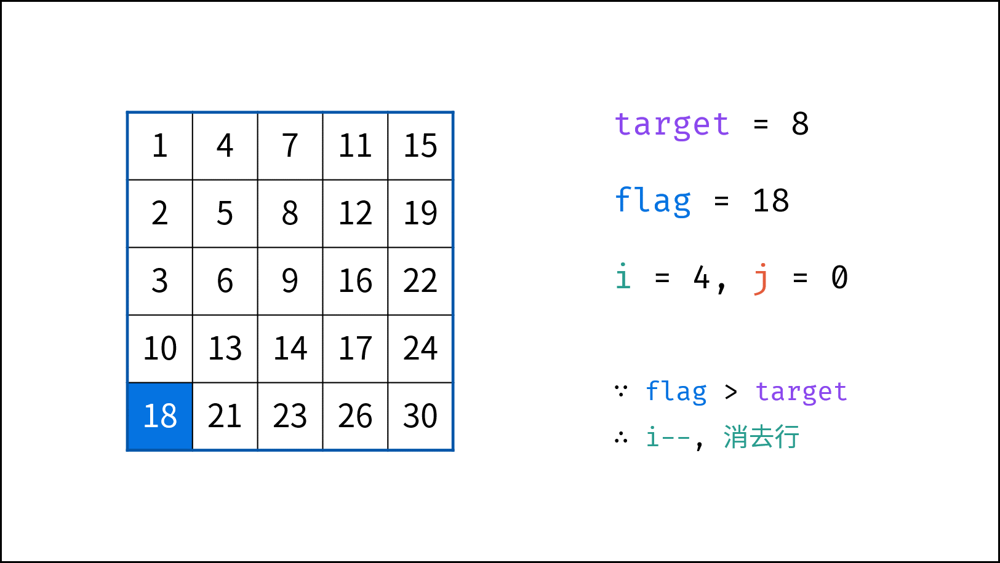
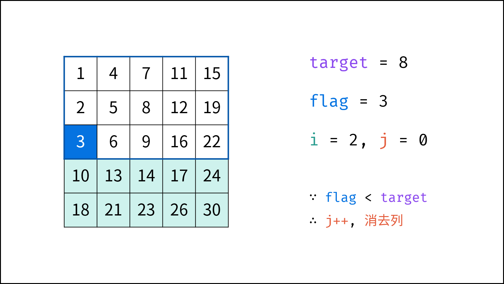
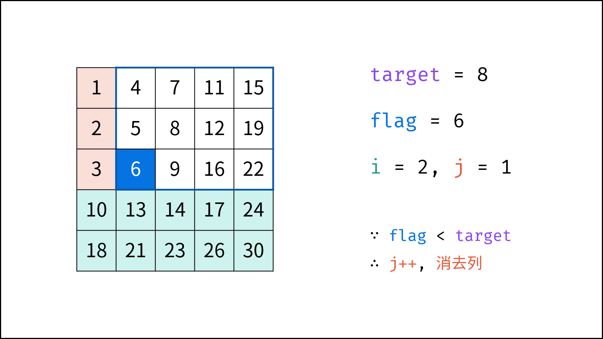
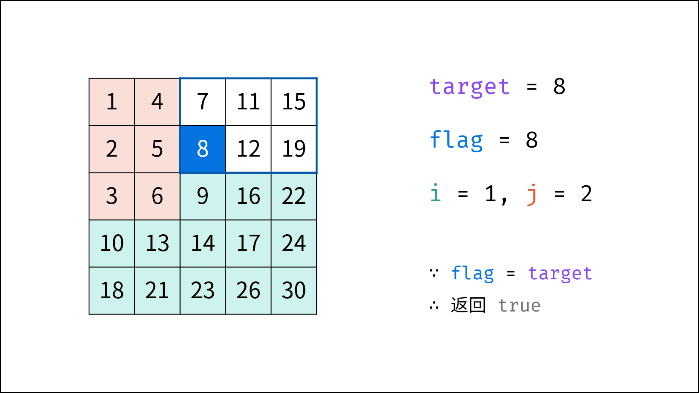

[#0240-search-a-2d-matrix-ii]
= 240. 搜索二维矩阵 II

https://leetcode.cn/problems/search-a-2d-matrix-ii/[LeetCode - 240. 搜索二维矩阵 II^]

编写一个高效的算法来搜索 `m x n` 矩阵 `matrix` 中的一个目标值 `target`。该矩阵具有以下特性：

* 每行的元素从左到右升序排列。
* 每列的元素从上到下升序排列。

*示例 1：*

image::images/0240-01.jpg[{image_attr}]

....
输入：matrix = [[1,4,7,11,15],[2,5,8,12,19],[3,6,9,16,22],[10,13,14,17,24],[18,21,23,26,30]], target = 5
输出：true
....

*示例 2：*

image::images/0240-02.jpg[{image_attr}]

....
输入：matrix = [[1,4,7,11,15],[2,5,8,12,19],[3,6,9,16,22],[10,13,14,17,24],[18,21,23,26,30]], target = 20
输出：false
....

*提示：*

* `m == matrix.length`
* `n == matrix[i].length`
* `+1 <= n, m <= 300+`
* `-10^9^ \<= matrix[i][j] \<= 10^9^`
* 每行的所有元素从左到右升序排列
* 每列的所有元素从上到下升序排列
* `-10^9^ \<= target \<= 10^9^`

== 思路分析

TIP: **不能对整个矩阵进行二分查找！**可以对所有行或者列，做二分查找。

从右上角开始搜索，小于目标值则下移，大于目标值则左移，这个方案真是精妙！

观察矩阵，右上角和左下角的元素有代表性：根据大小，可以删除左边一列（大于等于右上角元素）或上一行（小于等于右上角元素），或者下面一行（大于等于左上角元素）或坐标一列（小于等于左下角元素）。可以根据这个规律，来排查不符合条件的元素。

也可以从左下角开始，小于目标值则右移，大于目标值则上移。

image::images/0240-12.png[{image_attr}]

image::images/0240-15.png[{image_attr}]

将矩阵旋转一下，会发现上面的解题思路类似于 *二叉搜索树*，即对于每个元素，其左分支元素更小、右分支元素更大。。因此，通过从 “根节点” 开始搜索，遇到比 `target` 大的元素就向左，反之向右，即可找到目标值 `target`。应该更容易理解：

image::images/0240-17.png[{image_attr}]

[[src-0240]]
[tabs]
====
一刷::
+
--
[{java_src_attr}]
----
include::{sourcedir}/_0240_SearchA2DMatrixII.java[tag=answer]
----
--

二刷::
+
--
[{java_src_attr}]
----
include::{sourcedir}/_0240_SearchA2DMatrixII_2.java[tag=answer]
----
--

三刷::
+
--
[{java_src_attr}]
----
include::{sourcedir}/_0240_SearchA2DMatrixIi_3.java[tag=answer]
----
--
====

== 参考资料

. https://leetcode.cn/problems/search-a-2d-matrix-ii/solutions/2361487/240-sou-suo-er-wei-ju-zhen-iitan-xin-qin-7mtf/[240. 搜索二维矩阵 II - 贪心，清晰图解^]
. https://leetcode.cn/problems/search-a-2d-matrix-ii/solutions/2783938/tu-jie-pai-chu-fa-yi-tu-miao-dong-python-kytg/[240. 搜索二维矩阵 II - 【图解】排除法，一图秒懂！^]
. https://leetcode.cn/problems/search-a-2d-matrix-ii/solutions/1062538/sou-suo-er-wei-ju-zhen-ii-by-leetcode-so-9hcx/[240. 搜索二维矩阵 II - 官方题解^]
