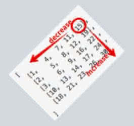

== 240. Search a 2D Matrix II

https://leetcode.com/problems/search-a-2d-matrix-ii/[LeetCode - Search a 2D Matrix II]

从右上角开始搜索，小则下移，大则左移，这个方案真是精妙！

Write an efficient algorithm that searches for a value in an _m_ x _n_ matrix. This matrix has the following properties:

* Integers in each row are sorted in ascending from left to right.
* Integers in each column are sorted in ascending from top to bottom.

*Example:*

Consider the following matrix:

[subs="verbatim,quotes,macros"]
----
[
  [1,   4,  7, 11, 15],
  [2,   5,  8, 12, 19],
  [3,   6,  9, 16, 22],
  [10, 13, 14, 17, 24],
  [18, 21, 23, 26, 30]
]
----

Given target = `5`, return `true`.

Given target = `20`, return `false`.

