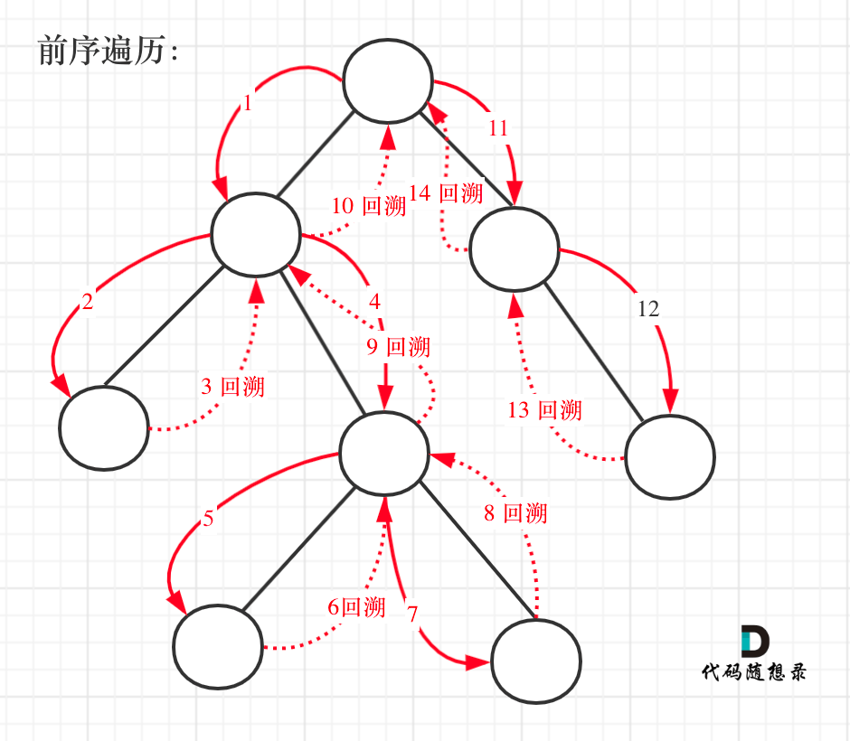

[#0257-binary-tree-paths]
= 257. Binary Tree Paths

https://leetcode.com/problems/binary-tree-paths/[LeetCode - Binary Tree Paths]

Given a binary tree, return all root-to-leaf paths.

*Note:* A leaf is a node with no children.

*Example:*

[subs="verbatim,quotes,macros"]
----
*Input:*

   1
 /   \
2     3
 \
  5

*Output:* ["1->2->5", "1->3"]

*Explanation:* All root-to-leaf paths are: 1->2->5, 1->3
----

== 思路分析

直接递归就可以搞定。

这次尝试了一下回溯的写法，过程大概如下：

[[src-0257]]
[{java_src_attr}]
----
include::{sourcedir}/_0257_BinaryTreePaths.java[]
----

== 参考资料

. https://leetcode.cn/problems/binary-tree-paths/solutions/400326/er-cha-shu-de-suo-you-lu-jing-by-leetcode-solution/[257. 二叉树的所有路径 - 官方题解^]
. https://leetcode.cn/problems/binary-tree-paths/solutions/400434/257-er-cha-shu-de-suo-you-lu-jing-tu-wen-jie-xi-by/[257. 二叉树的所有路径 - 4种解法（图文详解）^]
. https://leetcode.cn/problems/binary-tree-paths/solutions/866952/dai-ma-sui-xiang-lu-dai-ni-xue-tou-er-ch-cxmu/[257. 二叉树的所有路径 - 明显的递归，隐藏着回溯^]

