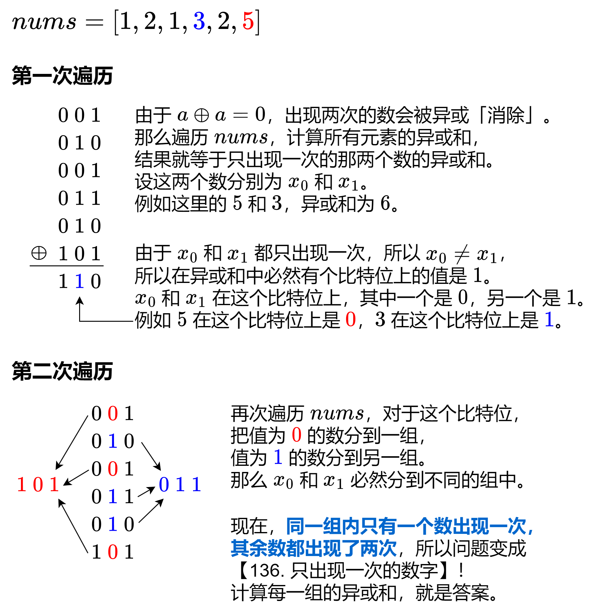

[#0260-single-number-iii]
= 260. 只出现一次的数字 III

https://leetcode.cn/problems/single-number-iii/[LeetCode - 260. 只出现一次的数字 III^]

给你一个整数数组 `nums`，其中恰好有两个元素只出现一次，其余所有元素均出现两次。找出只出现一次的那两个元素。你可以按 *任意顺序* 返回答案。

你必须设计并实现线性时间复杂度的算法且仅使用常量额外空间来解决此问题。

*示例 1：*

....
输入：nums = [1,2,1,3,2,5]
输出：[3,5]
解释：[5, 3] 也是有效的答案。
....

*示例 2：*

....
输入：nums = [-1,0]
输出：[-1,0]
....

*示例 3：*

....
输入：nums = [0,1]
输出：[1,0]
....

*提示：*

* `2 \<= nums.length \<= 3 * 10^4^`
* `-2^31^ \<= nums[i] \<= 2^31^ - 1`
* 除两个只出现一次的整数外，`nums` 中的其他数字都出现两次

== 思路分析

在 xref:0136-single-number.adoc[136. 只出现一次的数字] 基础上，做了进一步延伸。需要先根据所有数异或值的最后一位 `1`，将数字分为两部分，再分别做异或。

[[src-0260]]
[tabs]
====
一刷::
+
--
[{java_src_attr}]
----
include::{sourcedir}/_0260_SingleNumberIii.java[tag=answer]
----
--

二刷::
+
--
[{java_src_attr}]
----
include::{sourcedir}/_0260_SingleNumberIii_2.java[tag=answer]
----
--
====

== 参考资料

. https://leetcode.cn/problems/single-number-iii/solutions/1/tu-jie-yi-zhang-tu-miao-dong-zhuan-huan-np9d2/[260. 只出现一次的数字 III - 图解】一张图秒懂！转换成 136！^]
. https://leetcode.cn/problems/single-number-iii/solutions/587516/zhi-chu-xian-yi-ci-de-shu-zi-iii-by-leet-4i8e/[260. 只出现一次的数字 III - 官方题解^]
