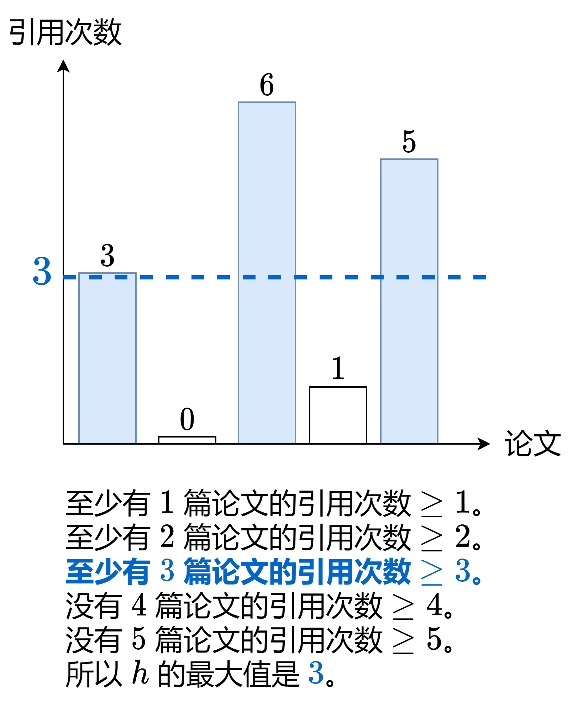

[#0274-h-index]
= 274. H 指数

https://leetcode.cn/problems/h-index/[LeetCode - 274. H 指数^]

给你一个整数数组 `citations` ，其中 `citations[i]` 表示研究者的第 `i` 篇论文被引用的次数。计算并返回该研究者的 **`h` 指数**。

根据维基百科上 https://baike.baidu.com/item/h-index/3991452?fr=aladdin[h 指数的定义]：`h` 代表“高引用次数” ，一名科研人员的 `h` *指数* 是指他（她）至少发表了 `h` 篇论文，并且 **至少** 有 `h` 篇论文被引用次数大于等于 `h`。如果 `h` 有多种可能的值，*`h` 指数* 是其中最大的那个。

*示例 1：*

....
输入：citations = [3,0,6,1,5]
输出：3
解释：给定数组表示研究者总共有 5 篇论文，每篇论文相应的被引用了 3, 0, 6, 1, 5 次。
     由于研究者有 3 篇论文每篇 至少 被引用了 3 次，其余两篇论文每篇被引用 不多于 3 次，所以她的 h 指数是 3。
....

*示例 2：*

....
输入：citations = [1,3,1]
输出：1
....

*提示：*

* `n == citations.length`
* `+1 <= n <= 5000+`
* `+0 <= citations[i] <= 1000+`

== 思路分析

排序，从后向前，假如当前数字大于 `h` 指数，则向前移动，同时 `h++`，直到不符合条件。

没想到，竟然一次过！

[[src-0274]]
[tabs]
====
一刷::
+
--
[{java_src_attr}]
----
include::{sourcedir}/_0274_HIndex.java[tag=answer]
----
--

// 二刷::
// +
// --
// [{java_src_attr}]
// ----
// include::{sourcedir}/_0274_HIndex_2.java[tag=answer]
// ----
// --
====

== 参考资料

. https://leetcode.cn/problems/h-index/solutions/869042/h-zhi-shu-by-leetcode-solution-fnhl/[274. H 指数 - 官方题解^] -- 三种解法
. https://leetcode.cn/problems/h-index/solutions/2502837/mei-kan-dong-ti-yi-yi-zhang-tu-miao-dong-8zps/[274. H 指数 - 没看懂题意？一张图秒懂^]
. https://leetcode.cn/problems/h-index/solutions/869420/gong-shui-san-xie-li-yong-er-duan-xing-z-1jxw/[274. H 指数 - 利用二段性找最大 H 指数（附二分目录）^]

