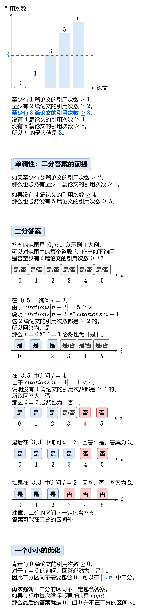

[#0275-h-index-ii]
= 275. H 指数 II

https://leetcode.cn/problems/h-index-ii/[LeetCode - 275. H 指数 II ^]

给你一个整数数组 `citations` ，其中 `citations[i]` 表示研究者的第 `i` 篇论文被引用的次数，`citations` 已经按照 *升序排列*。计算并返回该研究者的 `h` 指数。

https://baike.baidu.com/item/h-index/3991452?fr=aladdin[h 指数的定义]：h 代表“高引用次数”（high citations），一名科研人员的 `h` 指数是指他（她）的 （`n` 篇论文中）**至少** 有 `h` 篇论文分别被引用了 **至少** `h` 次。

请你设计并实现对数时间复杂度的算法解决此问题。

*示例 1：*

....
输入：citations = [0,1,3,5,6]
输出：3
解释：给定数组表示研究者总共有 5 篇论文，每篇论文相应的被引用了 0, 1, 3, 5, 6 次。
     由于研究者有3篇论文每篇 至少 被引用了 3 次，其余两篇论文每篇被引用 不多于 3 次，所以她的 h 指数是 3 。
....

*示例 2：*

....
输入：citations = [1,2,100]
输出：2
....

*提示：*

* `+n == citations.length+`
* `1 \<= n \<= 10^5^`
* `+0 <= citations[i] <= 1000+`
* `citations` 按 *升序排列*

== 思路分析

已经排好序了，直接二分查找就好！

关于左右指针移动的判断条件，就需要稍作调整：由于计算 `h` 指数，要求“有 `h` 篇论文分别被引用了 **至少** `h` 次”，“`h` 篇论文” 可以从中间 `mid` 下标到结尾的距离来获得；“引用 `h` 次”则可以直接使用坐标 `mid` 从引用数组中获得。比较两者的值即可。

[[src-0275]]
[tabs]
====
一刷::
+
--
[{java_src_attr}]
----
include::{sourcedir}/_0275_HIndexIi.java[tag=answer]
----
--

// 二刷::
// +
// --
// [{java_src_attr}]
// ----
// include::{sourcedir}/_0275_HIndexIi_2.java[tag=answer]
// ----
// --
====

== 参考资料

. https://leetcode.cn/problems/h-index-ii/solutions/2504326/tu-jie-yi-tu-zhang-wo-er-fen-da-an-si-ch-d15k/[275. H 指数 II - 【图解】一图掌握二分答案！四种写法！附题单！^]
. https://leetcode.cn/problems/h-index-ii/solutions/871112/gong-shui-san-xie-liang-chong-er-fen-ji-sovjb/[275. H 指数 II - 【宫水三叶】两种二分基本思路（附二分目录）^]
. https://leetcode.cn/problems/h-index-ii/solutions/870989/h-zhi-shu-ii-by-leetcode-solution-si7h/[275. H 指数 II - 官方题解^]
. https://leetcode.cn/problems/h-index-ii/solutions/20185/jian-er-zhi-zhi-er-fen-cha-zhao-by-liweiwei1419-2/[275. H 指数 II - 二分查找猜论文篇数（Java）^]
