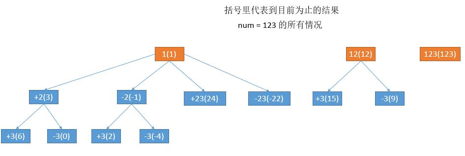

[#0282-expression-add-operators]
= 282. 给表达式添加运算符

https://leetcode.cn/problems/expression-add-operators/[LeetCode - 282. 给表达式添加运算符 ^]

给定一个仅包含数字 `0-9` 的字符串 `num` 和一个目标值整数 `target`，在 `num` 的数字之间添加 *二元* 运算符（不是一元）`+`、`-` 或 `*` ，返回 *所有* 能够得到 `target` 的表达式。

注意，返回表达式中的操作数 *不应该* 包含前导零。

*示例 1:*

....
输入: num = "123", target = 6
输出: ["123", "1*2*3"]
解释: “1*2*3” 和 “123” 的值都是6。
....

*示例 2:*

....
输入: num = "232", target = 8
输出: ["2*3+2", "2+3*2"]
解释: “2*3+2” 和 “2+3*2” 的值都是8。
....

*示例 3:*

....
输入: num = "3456237490", target = 9191
输出: []
解释: 表达式 “3456237490” 无法得到 9191 。
....

*提示：*

* `+1 <= num.length <= 10+`
* `num` 仅含数字
* `-2^31^ \<= target \<= 2^31^ - 1`

== 思路分析

回溯！

回溯就是对两个变量做遍历来：

. 根据不同长度，把数字切分成更小的数字。但是，不能有以 `0` 开头的数字。
. 三种运算符。

[[src-0282]]
[tabs]
====
一刷::
+
--
[{java_src_attr}]
----
include::{sourcedir}/_0282_ExpressionAddOperators.java[tag=answer]
----
--

// 二刷::
// +
// --
// [{java_src_attr}]
// ----
// include::{sourcedir}/_0282_ExpressionAddOperators_2.java[tag=answer]
// ----
// --
====

== 参考资料

. https://leetcode.cn/problems/expression-add-operators/solutions/174926/xiang-xi-tong-su-de-si-lu-fen-xi-duo-jie-fa-by-52/[282. 给表达式添加运算符 - 详细通俗的思路分析，多解法^]
. https://leetcode.cn/problems/expression-add-operators/solutions/1049768/gong-shui-san-xie-hui-su-suan-fa-yun-yon-nl9z/[282. 给表达式添加运算符 - 【宫水三叶】一道利用「代数系统」的回溯题^]
. https://leetcode.cn/problems/expression-add-operators/solutions/1048321/gei-biao-da-shi-tian-jia-yun-suan-fu-by-2o1s7/[282. 给表达式添加运算符 - 官方题解^]
