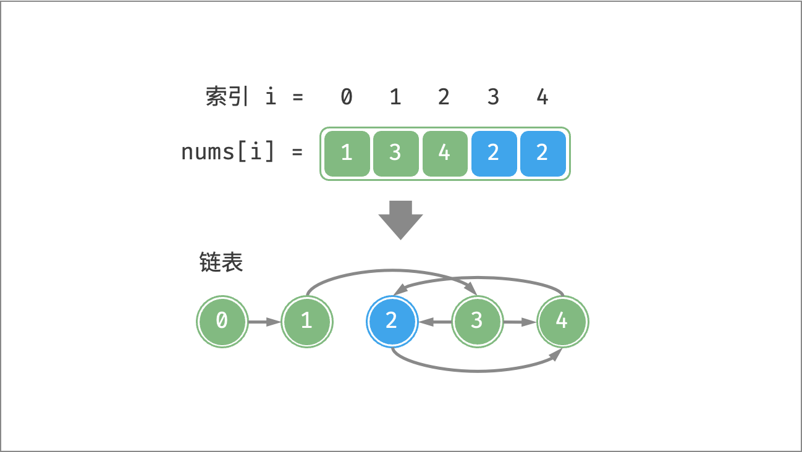
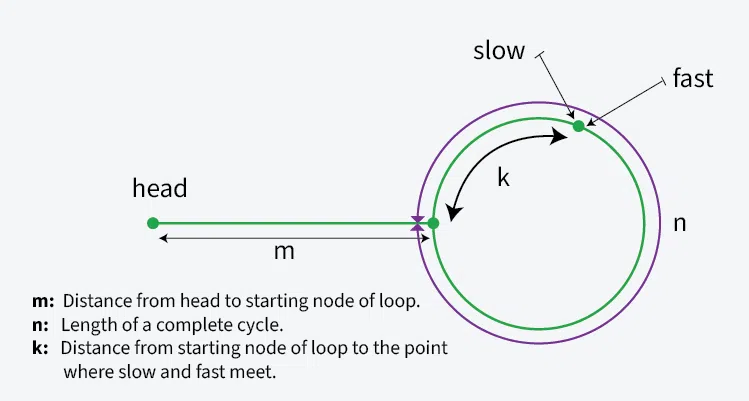

[#0287-find-the-duplicate-number]
= 287. 寻找重复数

https://leetcode.cn/problems/find-the-duplicate-number/[LeetCode - 287. 寻找重复数^]

给定一个包含 `n + 1` 个整数的数组 `nums`，其数字都在 `+[1, n]+` 范围内（包括 `1` 和 `n`），可知至少存在一个重复的整数。

假设 `nums` 只有 *一个重复的整数* ，返回 *这个重复的数* 。

你设计的解决方案必须 *不修改* 数组 `nums` 且只用常量级 stem:[O(1)] 的额外空间。

*示例 1：*

....
输入：nums = [1,3,4,2,2]
输出：2
....

*示例 2：*

....
输入：nums = [3,1,3,4,2]
输出：3
....

*示例 3 :*

....
输入：nums = [3,3,3,3,3]
输出：3
....

*提示：*

* `1 \<= n \<= 10^5^`
* `nums.length == n + 1`
* `+1 <= nums[i] <= n+`
* `nums` 中 *只有一个整数* 出现 *两次或多次*，其余整数均只出现 *一次*

*进阶：*

* 如何证明 `nums` 中至少存在一个重复的数字?
* 你可以设计一个线性级时间复杂度 stem:[O(n)] 的解决方案吗？

== 思路分析

题目要求“不能修改数组”和“O(1)的空间复杂度”，就比较难办了。可以利用 xref:0142-linked-list-cycle-ii.adoc[142. 环形链表 II]中 龟兔赛跑找环的思路来解决：

[TIP]
====
这里应该有一副这样的图片：

这张图也不够完美，没有把计算公式写出来。
====

如果抛开题目要求的“不能修改数组”和“O(1)的空间复杂度”要求，有更多解法：

. 不考虑空间复杂度，可以用 `Set` 来求解
. 如果可以修改数组，则原地交换（把 `nums[i]` 挪到 `nums[nums[i]]` 上）。
+
image::images/0287-01.png[{image_attr}]

TIP: 上图就是 xref:0000-12-cyclic-sort.adoc[Cyclic Sort 循环排序]。

[[src-0287]]
[tabs]
====
一刷::
+
--
[{java_src_attr}]
----
include::{sourcedir}/_0287_FindTheDuplicateNumber.java[tag=answer]
----
--

二刷::
+
--
[{java_src_attr}]
----
include::{sourcedir}/_0287_FindTheDuplicateNumber_2.java[tag=answer]
----
--

三刷::
+
--
[{java_src_attr}]
----
include::{sourcedir}/_0287_FindTheDuplicateNumber_3.java[tag=answer]
----
--
====

== 参考资料

. https://leetcode.cn/problems/find-the-duplicate-number/solutions/2361404/287-xun-zhao-zhong-fu-shu-yuan-di-jiao-h-0eja/[287. 寻找重复数 - 原地交换、龟兔赛跑，清晰图解^]
. https://leetcode.cn/problems/find-the-duplicate-number/solutions/3797843/yong-ji-huan-shu-li-jie-zuo-fa-tong-142-tkoc2/[287. 寻找重复数 - 用基环树理解，做法同 142. 环形链表 II^]
. https://leetcode.cn/problems/find-the-duplicate-number/solutions/261119/xun-zhao-zhong-fu-shu-by-leetcode-solution/[287. 寻找重复数 - 官方题解^]
// . https://leetcode.com/problems/find-the-duplicate-number/solution/[Find the Duplicate Number solution - LeetCode] 中 Approach #3 Floyd's Tortoise and Hare (Cycle Detection) [Accepted^] 的好精巧！类似于在链表中发现环。还需要再仔细思考一下这个问题！
. https://leetcode.cn/problems/linked-list-cycle-ii/solutions/2832831/jian-ji-qing-xi-yan-jin-de-tu-shi-tui-da-nak2/[142. 环形链表 II - 快慢指针，清晰严谨的图示推导^]
. https://www.geeksforgeeks.org/dsa/how-does-floyds-slow-and-fast-pointers-approach-work/[How does Floyd's slow and fast pointers approach work?^]
