[#0295-find-median-from-data-stream]
= 295. 数据流的中位数

https://leetcode.cn/problems/find-median-from-data-stream/[LeetCode - 295. 数据流的中位数 ^]

**中位数**是有序整数列表中的中间值。如果列表的大小是偶数，则没有中间值，中位数是两个中间值的平均值。

* 例如 `arr = [2,3,4]` 的中位数是 `3` 。
* 例如 `arr = [2,3]` 的中位数是 `(2 + 3) / 2 = 2.5` 。

实现 MedianFinder 类:

* `MedianFinder()` 初始化 `MedianFinder` 对象。
* `void addNum(int num)` 将数据流中的整数 `num` 添加到数据结构中。
* `double findMedian()` 返回到目前为止所有元素的中位数。与实际答案相差 `10^-5^` 以内的答案将被接受。

*示例 1：*

....
输入
["MedianFinder", "addNum", "addNum", "findMedian", "addNum", "findMedian"]
[[], [1], [2], [], [3], []]
输出
[null, null, null, 1.5, null, 2.0]

解释
MedianFinder medianFinder = new MedianFinder();
medianFinder.addNum(1);    // arr = [1]
medianFinder.addNum(2);    // arr = [1, 2]
medianFinder.findMedian(); // 返回 1.5 ((1 + 2) / 2)
medianFinder.addNum(3);    // arr[1, 2, 3]
medianFinder.findMedian(); // return 2.0
....

*提示:*

* `-10^5^ \<= num \<= 10^5^`
* 在调用 `findMedian` 之前，数据结构中至少有一个元素
* 最多 `5 * 10^4^` 次调用 `addNum` 和 `findMedian`

== 思路分析

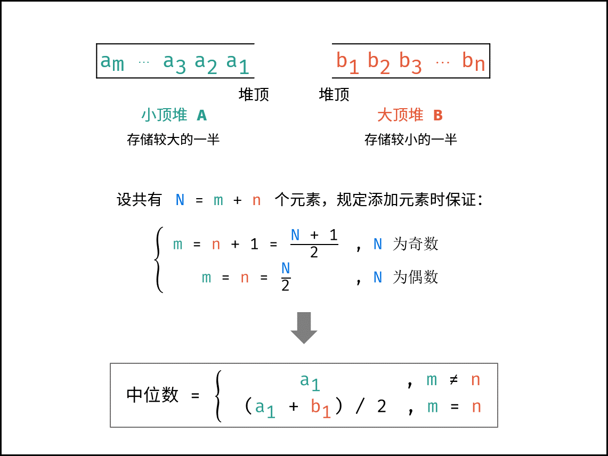

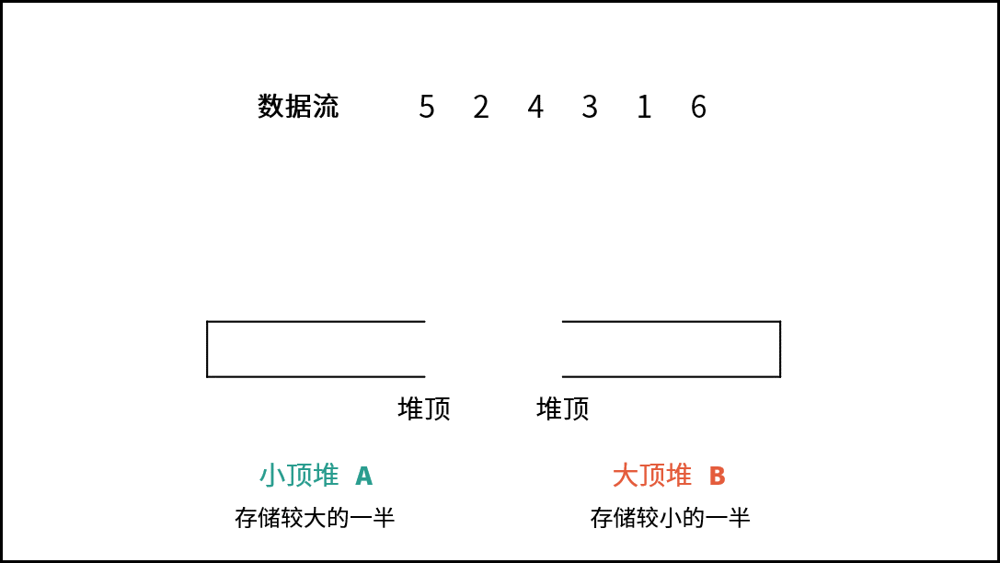

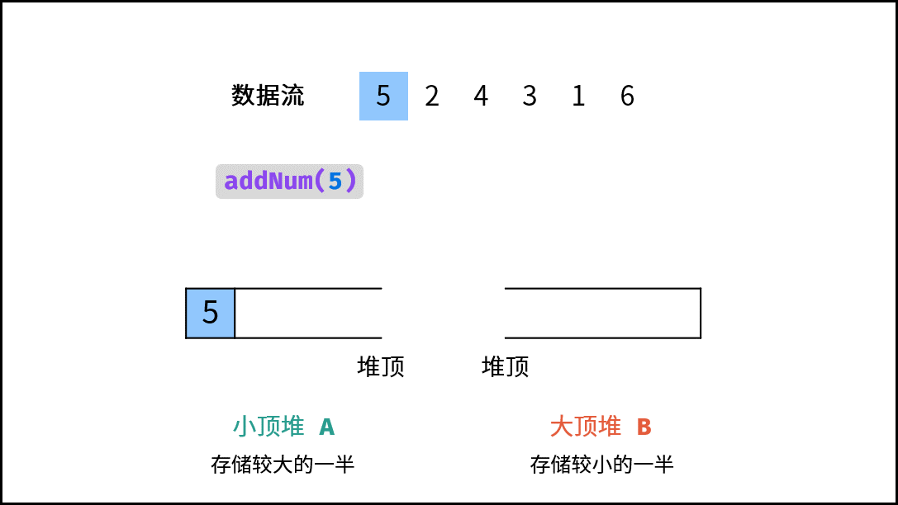

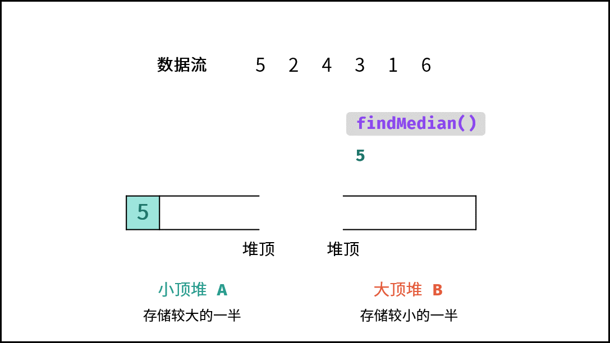

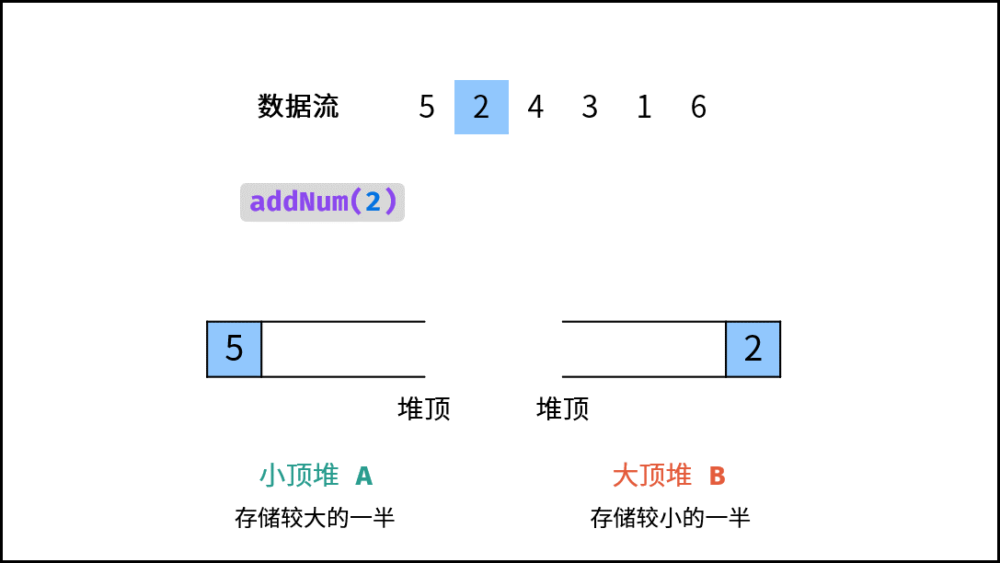

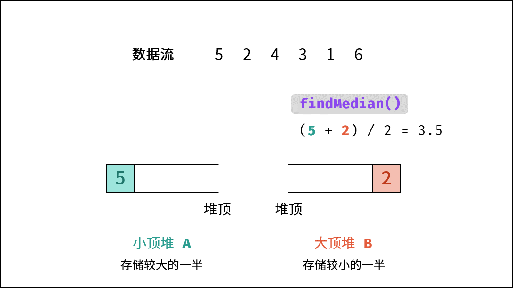

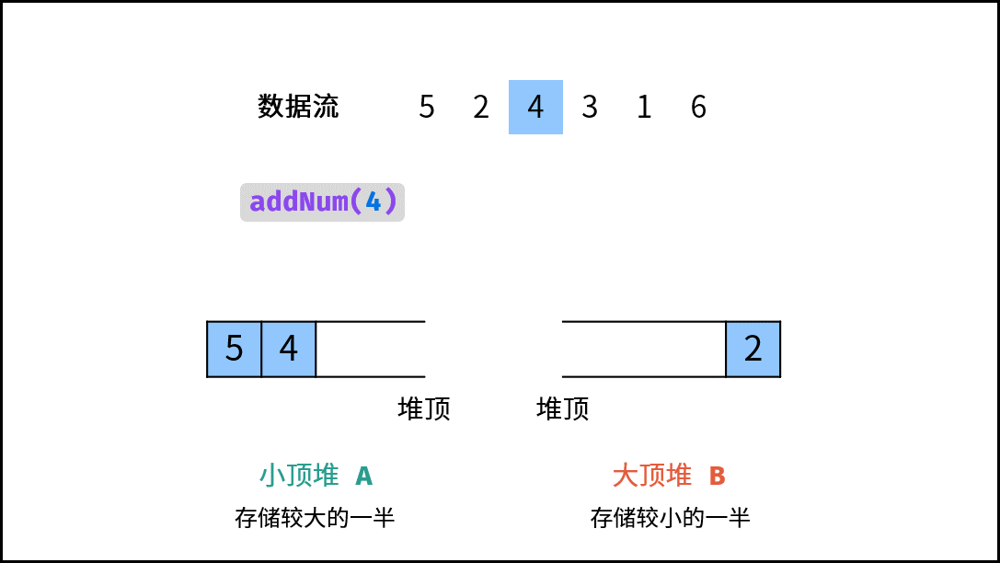

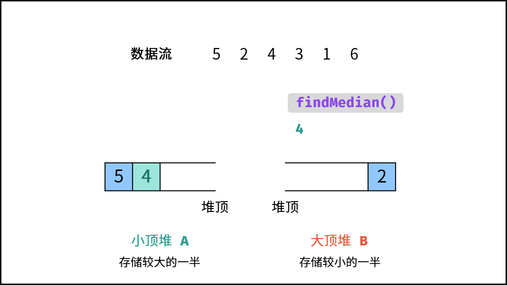

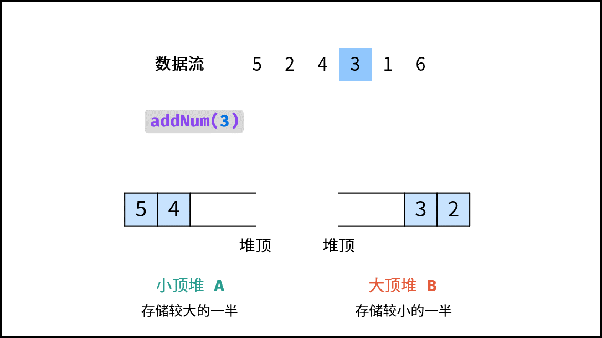

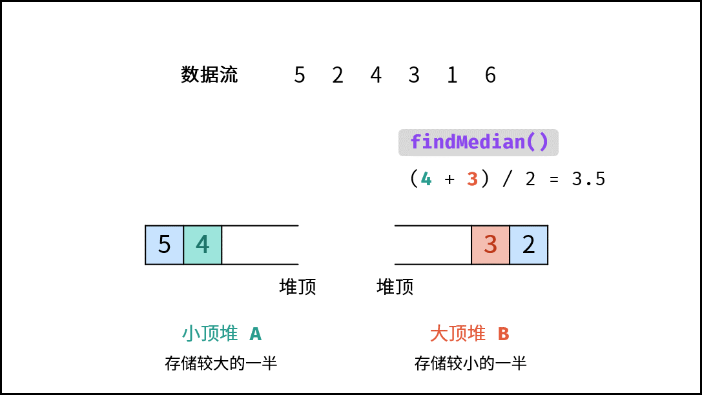

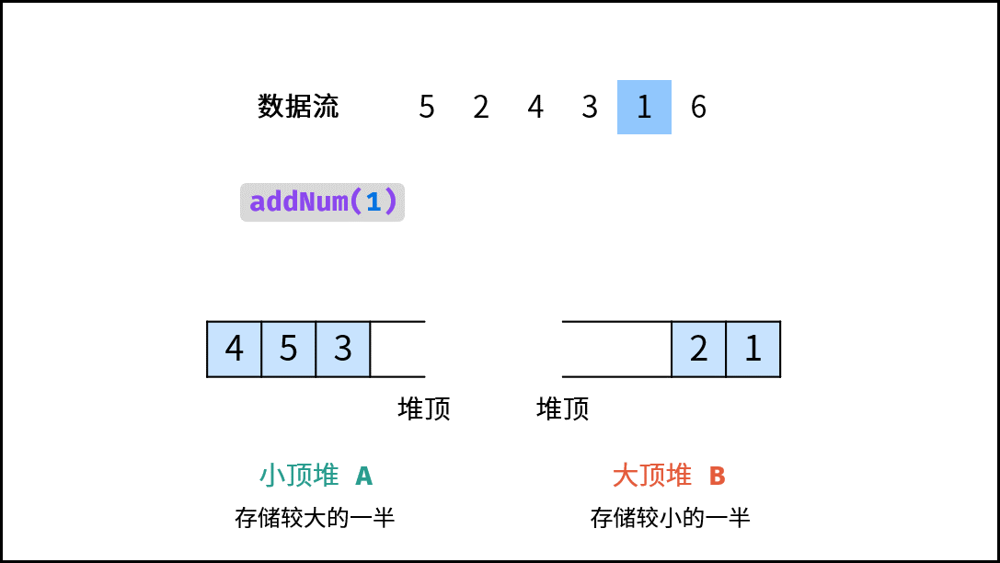

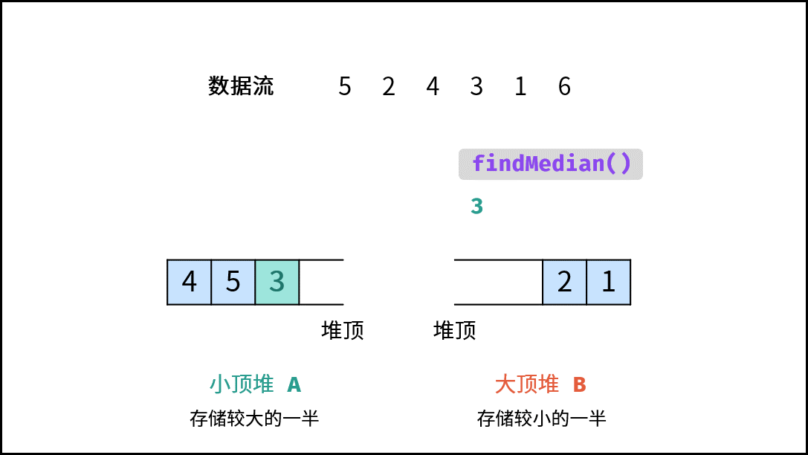

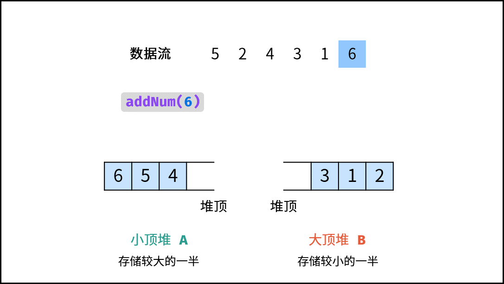

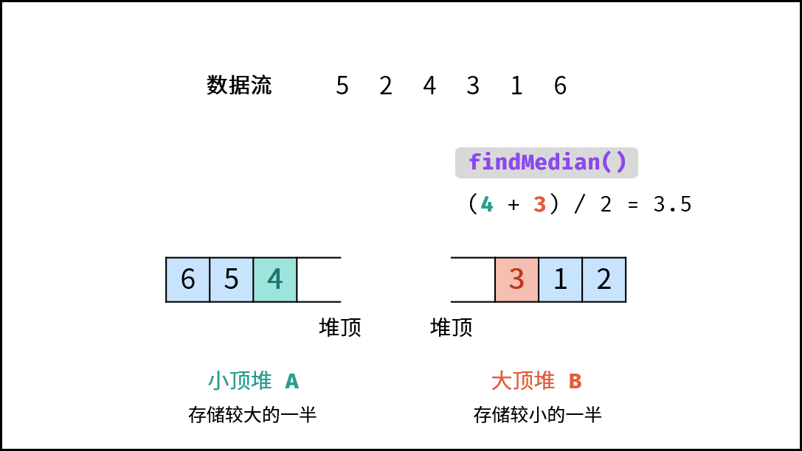

[[src-0295]]
[tabs]
====
一刷::
+
--
[{java_src_attr}]
----
include::{sourcedir}/_0295_FindMedianFromDataStream.java[tag=answer]
----
--

二刷::
+
--
[{java_src_attr}]
----
include::{sourcedir}/_0295_FindMedianFromDataStream_2.java[tag=answer]
----
--

三刷::
+
--
[{java_src_attr}]
----
include::{sourcedir}/_0295_FindMedianFromDataStream_3.java[tag=answer]
----
--
====

== 参考资料

. https://leetcode.cn/problems/find-median-from-data-stream/solutions/961062/shu-ju-liu-de-zhong-wei-shu-by-leetcode-ktkst/[295. 数据流的中位数 - 官方题解^]
. https://leetcode.cn/problems/find-median-from-data-stream/solutions/2361972/295-shu-ju-liu-de-zhong-wei-shu-dui-qing-gmdo/[295. 数据流的中位数 - 堆，清晰图解^]

