[#0297-serialize-and-deserialize-binary-tree]
= 297. Serialize and Deserialize Binary Tree

https://leetcode.com/problems/serialize-and-deserialize-binary-tree/[LeetCode - Serialize and Deserialize Binary Tree]

Serialization is the process of converting a data structure or object into a sequence of bits so that it can be stored in a file or memory buffer, or transmitted across a network connection link to be reconstructed later in the same or another computer environment.

Design an algorithm to serialize and deserialize a binary tree. There is no restriction on how your serialization/deserialization algorithm should work. You just need to ensure that a binary tree can be serialized to a string and this string can be deserialized to the original tree structure.

*Example: *

[subs="verbatim,quotes,macros"]
----
You may serialize the following tree:

    1
   / \
  2   3
     / \
    4   5

as `"[1,2,3,null,null,4,5]"`
----

*Clarification:* The above format is the same as <a href="/faq/#binary-tree">how LeetCode serializes a binary tree</a>. You do not necessarily need to follow this format, so please be creative and come up with different approaches yourself.

*Note: *Do not use class member/global/static variables to store states. Your serialize and deserialize algorithms should be stateless.

== 解题分析

一个比较简单的思路是分层进行序列化。这里一个误区就是把二叉树按照满二叉树转化成一个数组形式。

一个解决办法就是：在序列化的时候，先出力父节点，然后循环调用处理子节点，这样的话，就会把父子节点的关联关系给用上，也可以正常应对极端不平衡的情况。

[[src-0297]]
[{java_src_attr}]
----
include::{sourcedir}/_0297_SerializeAndDeserializeBinaryTree.java[]
----

.前序遍历序列化
[{java_src_attr}]
----
include::{sourcedir}/_0297_SerializeAndDeserializeBinaryTree_2.java[]
----

这里有一个思维误区：总感觉如果二叉树有大量空节点（比如左子树只有左边有值，右子树只要右边有值），无法正常进行序列化！但是，实际这里是错误的感觉！在进行递归序列化时，递归调用到每棵树时，会被当前节点的左右节点都做一下序列化，那么没有值的节点会被处理成 `#`，这样，当前节点和左右子节点都会被标识出来。不会漏标或者错标。另外需要注意，叶子节点也会产生两个 `#` 值来表示叶子节点的子节点，这点和前序遍历不一样。看下图：

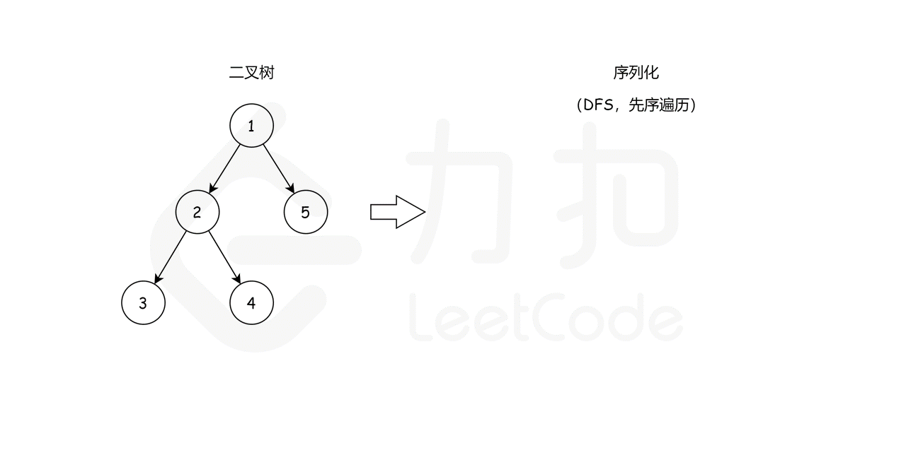

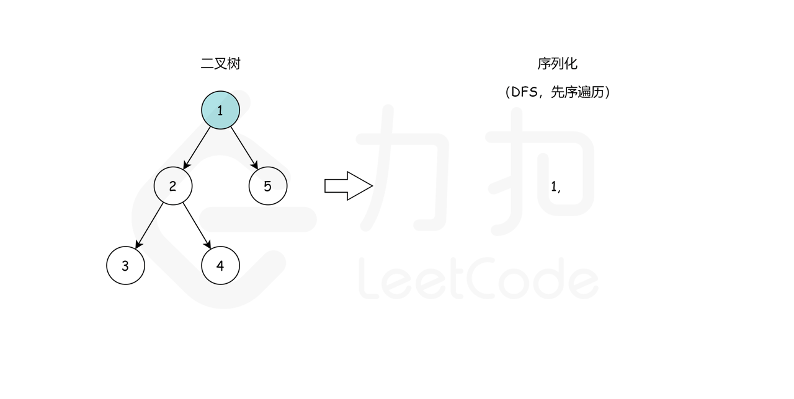

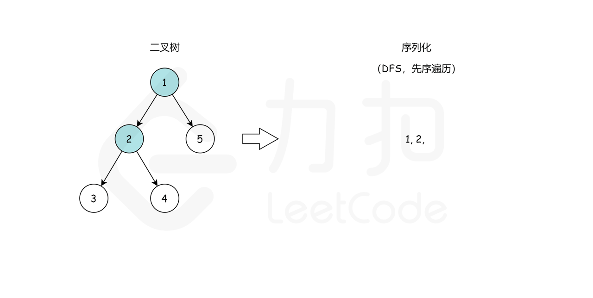

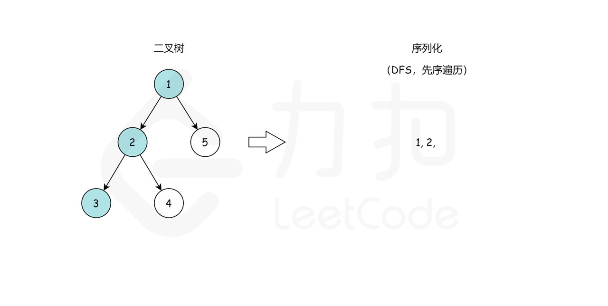

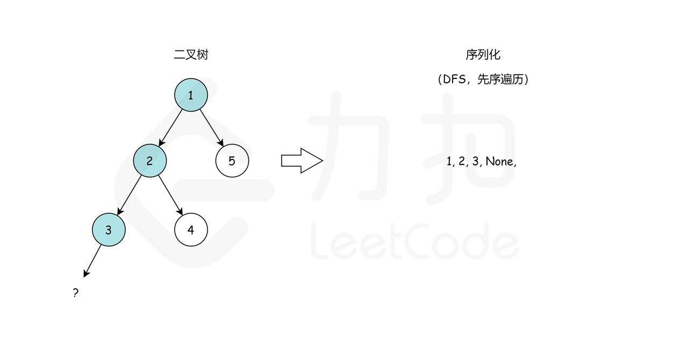

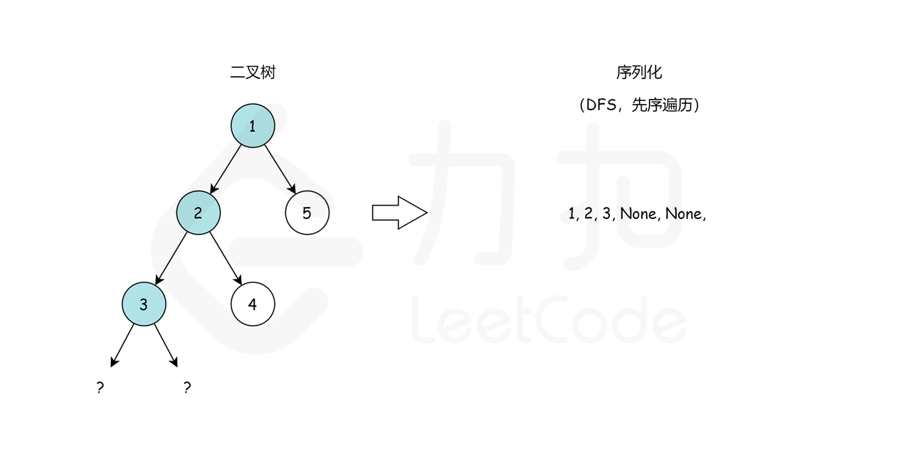

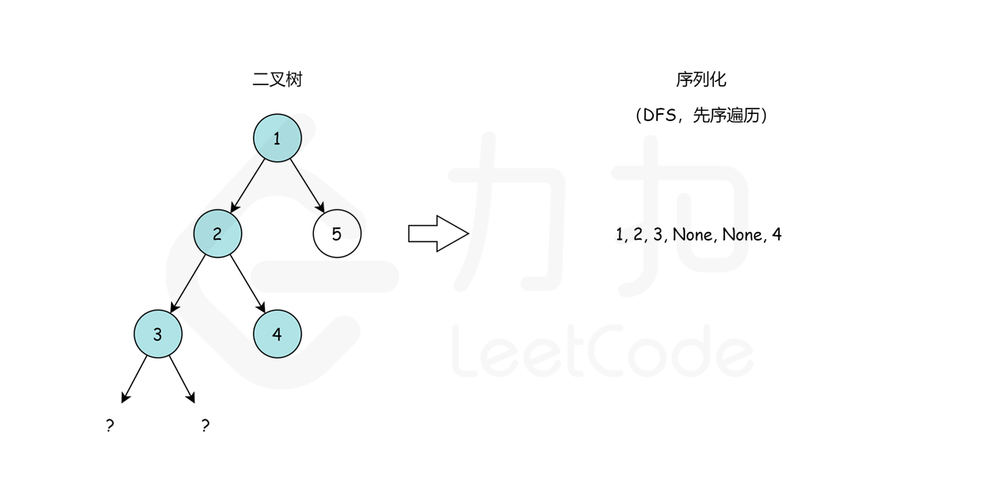

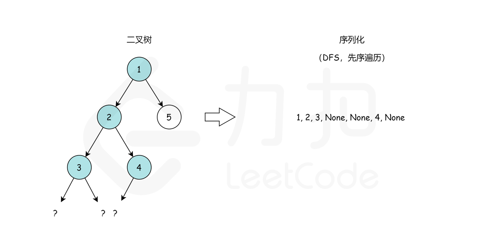

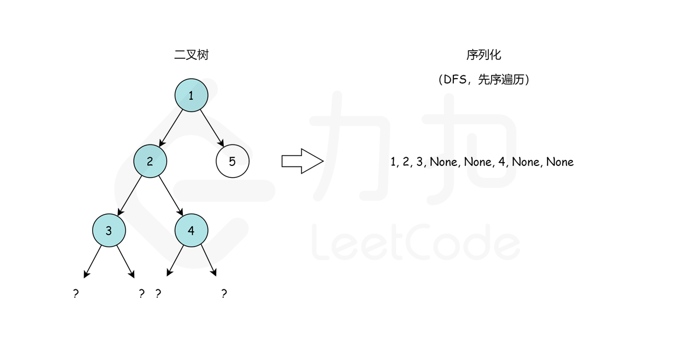

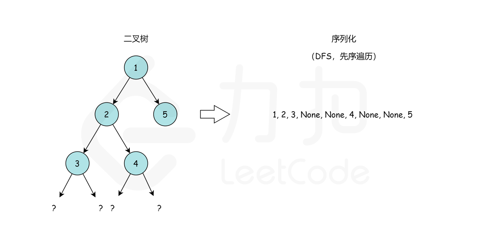

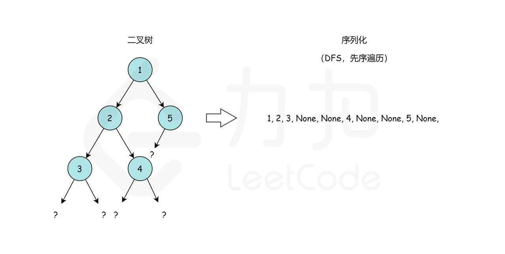

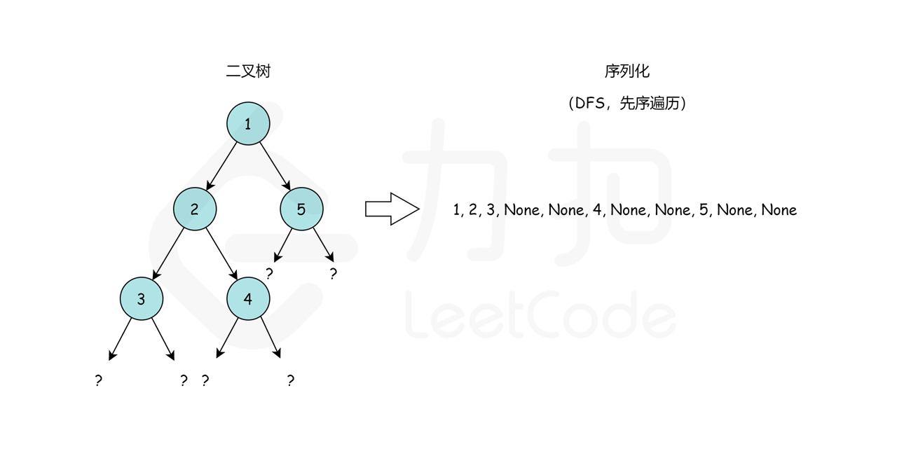

