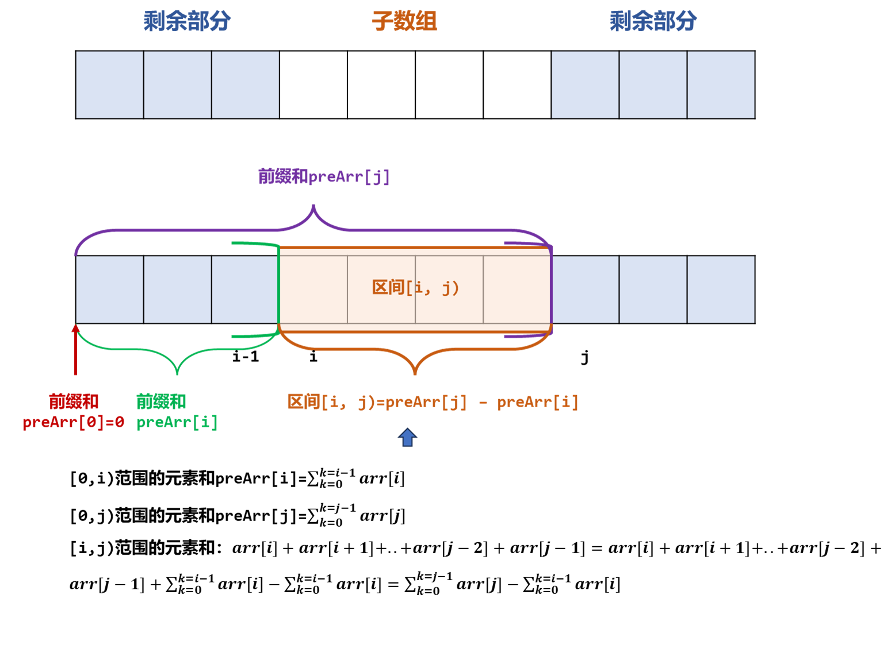
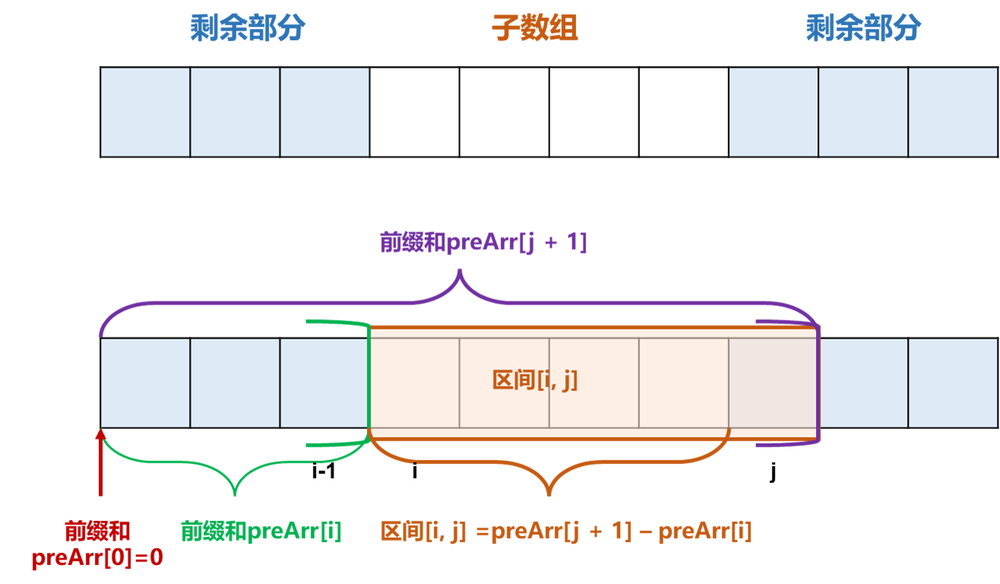

[#0303-range-sum-query-immutable]
= 303. 区域和检索 - 数组不可变

https://leetcode.cn/problems/range-sum-query-immutable/[LeetCode - 303. 区域和检索 - 数组不可变^]

给定一个整数数组  `nums`，处理以下类型的多个查询:

. 计算索引 `left` 和 `right` （包含 `left` 和 `right`）之间的 `nums` 元素的 *和* ，其中 `+left <= right+`

实现 `NumArray` 类：

* `NumArray(int[] nums)` 使用数组 `nums` 初始化对象
* `int sumRange(int i, int j)` 返回数组 `nums` 中索引 `left` 和 `right` 之间的元素的 *总和*，包含 `left` 和 `right` 两点（也就是 `nums[left] + nums[left + 1] + ... + nums[right]`)

*示例 1：*

....
输入：
["NumArray", "sumRange", "sumRange", "sumRange"]
[[[-2, 0, 3, -5, 2, -1]], [0, 2], [2, 5], [0, 5]]
输出：
[null, 1, -1, -3]

解释：
NumArray numArray = new NumArray([-2, 0, 3, -5, 2, -1]);
numArray.sumRange(0, 2); // return 1 ((-2) + 0 + 3)
numArray.sumRange(2, 5); // return -1 (3 + (-5) + 2 + (-1))
numArray.sumRange(0, 5); // return -3 ((-2) + 0 + 3 + (-5) + 2 + (-1))
....

*提示：*

* `1 \<= nums.length \<= 10^4^`
* `-10^5^ \<= nums[i] \<= 10^5^`
* `+0 <= i <= j < nums.length+`
* 最多调用 `10^4^` 次 `sumRange` 方法

== 思路分析

前缀和

[[src-0303]]
[tabs]
====
一刷::
+
--
[{java_src_attr}]
----
include::{sourcedir}/_0303_RangeSumQueryImmutable.java[tag=answer]
----
--

二刷::
+
--
[{java_src_attr}]
----
include::{sourcedir}/_0303_RangeSumQueryImmutable_2.java[tag=answer]
----
--
====

== 参考资料

. https://leetcode.cn/problems/range-sum-query-immutable/solutions/627052/qu-yu-he-jian-suo-shu-zu-bu-ke-bian-by-l-px41/[303. 区域和检索 - 数组不可变 - 官方题解^]
. https://leetcode.cn/problems/range-sum-query-immutable/solutions/2772310/chao-hao-li-jie-jia-chao-kuai-yong-shi-b-l2os/[303. 区域和检索 - 数组不可变 - 超好理解，加超快用时^]
. https://leetcode.cn/problems/range-sum-query-immutable/solutions/627185/jian-dan-wen-ti-xi-zhi-fen-xi-qian-tan-q-t2nz/[303. 区域和检索 - 数组不可变 - 简单问题细致分析，『前缀和』优化了什么^]
. https://leetcode.cn/problems/range-sum-query-immutable/solutions/2693473/javapython3cqian-zhui-he-qiu-ren-yi-qu-j-zwpz/[303. 区域和检索 - 数组不可变 - 【图解】^]

