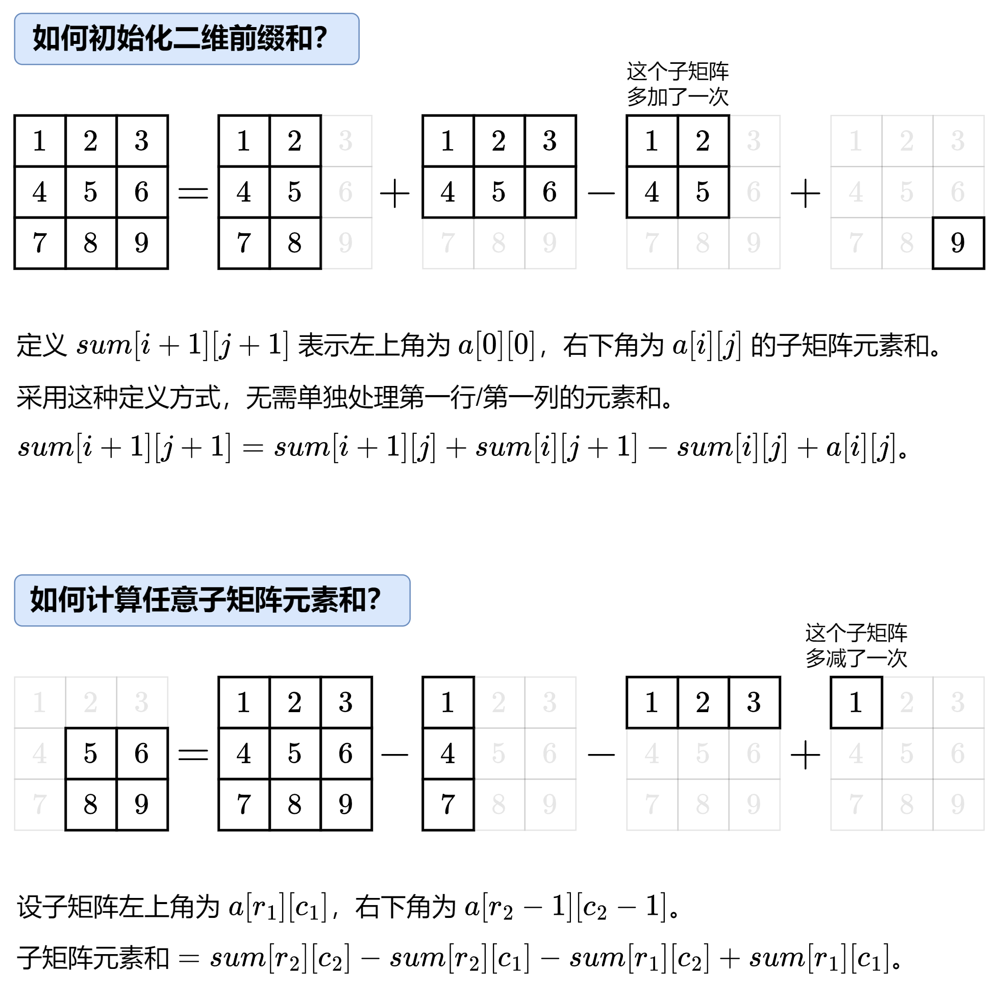

[#0304-range-sum-query-2d-immutable]
= 304. Range Sum Query 2D - Immutable

https://leetcode.com/problems/range-sum-query-2d-immutable/[LeetCode - Range Sum Query 2D - Immutable]

Given a 2D matrix _matrix_, find the sum of the elements inside the rectangle defined by its upper left corner (_row_1, _col_1) and lower right corner (_row_2, _col_2).

image::images/0304-00.png[{image_attr}]

[.small]#The above rectangle (with the red border) is defined by (row1, col1) = *(2, 1)* and (row2, col2) = *(4, 3)*, which contains sum = *8*.#

*Example:*
[subs="verbatim,quotes,macros"]
----
Given matrix = [
  [3, 0, 1, 4, 2],
  [5, 6, 3, 2, 1],
  [1, 2, 0, 1, 5],
  [4, 1, 0, 1, 7],
  [1, 0, 3, 0, 5]
]

sumRegion(2, 1, 4, 3) -> 8 // return 8 (红色矩形框的元素总和)
sumRegion(1, 1, 2, 2) -> 11 // return 11 (绿色矩形框的元素总和)
sumRegion(1, 2, 2, 4) -> 12 // return 12 (蓝色矩形框的元素总和)
----

*Note:*

. You may assume that the matrix does not change.
. There are many calls to _sumRegion_ function.
. You may assume that _row_1 ≤ _row_2 and _col_1 ≤ _col_2.

== 思路分析

image::images/0304-01.png[{image_attr}]

[[src-0304]]
[{java_src_attr}]
----
include::{sourcedir}/_0304_RangeSumQuery2DImmutable.java[]
----

== 参考资料

. https://leetcode.cn/problems/range-sum-query-2d-immutable/solutions/627420/er-wei-qu-yu-he-jian-suo-ju-zhen-bu-ke-b-2z5n/[304. 二维区域和检索 - 矩阵不可变 - 官方题解^]
. https://leetcode.cn/problems/range-sum-query-2d-immutable/solutions/2667331/tu-jie-yi-zhang-tu-miao-dong-er-wei-qian-84qp/[304. 二维区域和检索 - 矩阵不可变 - 一张图秒懂二维前缀和！^]
. https://leetcode.cn/problems/range-sum-query-2d-immutable/solutions/629187/ru-he-qiu-er-wei-de-qian-zhui-he-yi-ji-y-6c21/[304. 二维区域和检索 - 矩阵不可变 - 如何求二维的前缀和，以及用前缀和求子矩形的面积^]

