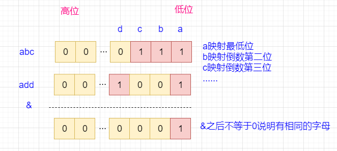

[#0318-maximum-product-of-word-lengths]
= 318. 最大单词长度乘积

https://leetcode.cn/problems/maximum-product-of-word-lengths/[LeetCode - 318. 最大单词长度乘积 ^]

给你一个字符串数组 `words` ，找出并返回 `length(words[i]) * length(words[j])` 的最大值，并且这两个单词不含有公共字母。如果不存在这样的两个单词，返回 `0` 。

*示例 1：*

....
输入：words = ["abcw","baz","foo","bar","xtfn","abcdef"]
输出：16
解释：这两个单词为 "abcw", "xtfn"。
....

*示例 2：*

....
输入：words = ["a","ab","abc","d","cd","bcd","abcd"]
输出：4
解释：这两个单词为 "ab", "cd"。
....

*示例 3：*

....
输入：words = ["a","aa","aaa","aaaa"]
输出：0
解释：不存在这样的两个单词。
....

*提示：*

* `+2 <= words.length <= 1000+`
* `+1 <= words[i].length <= 1000+`
* `words[i]` 仅包含小写字母

== 思路分析

计算每一个单词的字母占用情况，然后逐个比较，没有相同字母，则计算单词长度乘积，最后取最大值返回即可。

用位运算更节省内存。

[[src-0318]]
[tabs]
====
一刷::
+
--
[{java_src_attr}]
----
include::{sourcedir}/_0318_MaximumProductOfWordLengths.java[tag=answer]
----
--

// 二刷::
// +
// --
// [{java_src_attr}]
// ----
// include::{sourcedir}/_0318_MaximumProductOfWordLengths_2.java[tag=answer]
// ----
// --
====

== 参考资料

. https://leetcode.cn/problems/maximum-product-of-word-lengths/solutions/1105955/gong-shui-san-xie-jian-dan-wei-yun-suan-cqtxq/[318. 最大单词长度乘积 - 【宫水三叶】简单位运算模拟题^]
. https://leetcode.cn/problems/maximum-product-of-word-lengths/solutions/1104441/zui-da-dan-ci-chang-du-cheng-ji-by-leetc-lym9/[318. 最大单词长度乘积 - 官方题解^]
. https://leetcode.cn/problems/maximum-product-of-word-lengths/solutions/1106275/tong-ge-lai-shua-ti-la-zhao-dao-ti-mu-de-y37h/[318. 最大单词长度乘积 - 位运算 & 图解！^]
