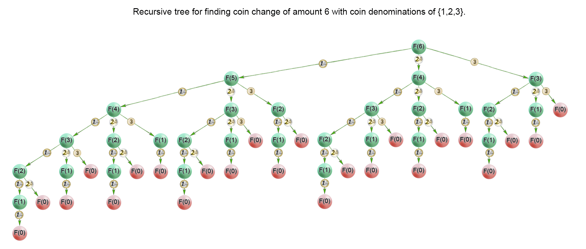
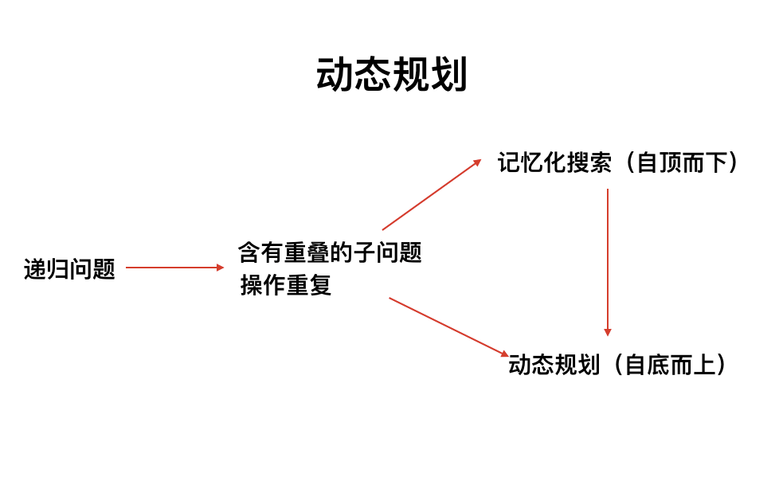
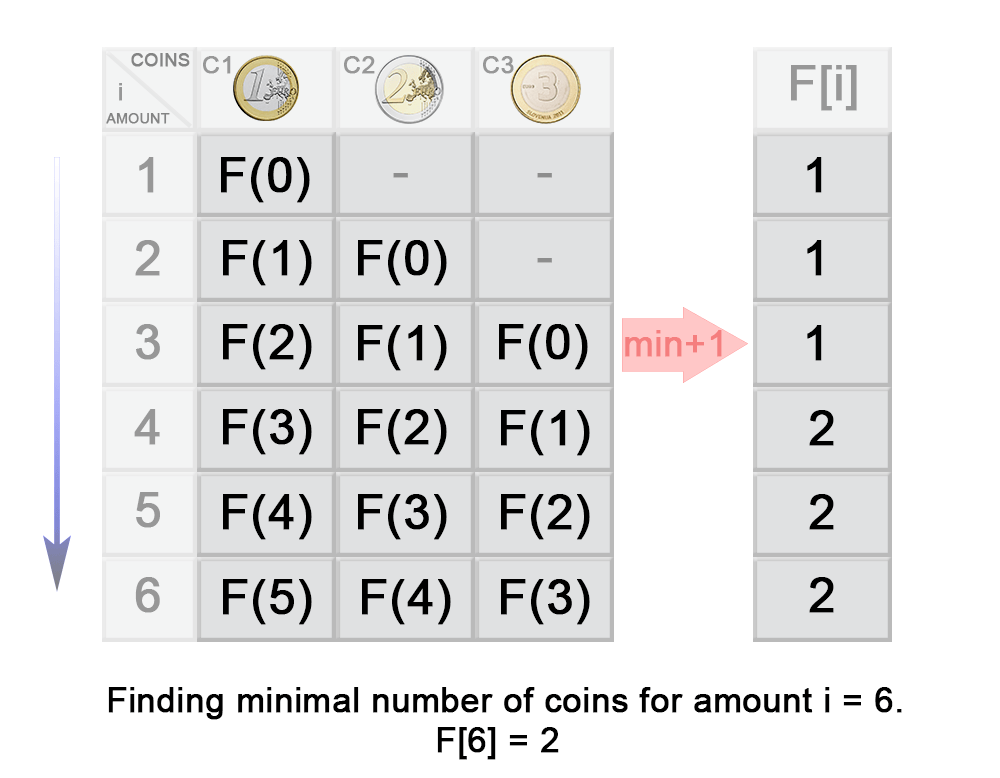

[#0322-coin-change]
= 322. Coin Change

{leetcode}/problems/coin-change/[LeetCode - Coin Change^]

思考题：

. 如何把动态规划代码写得更简洁一些？
. 如何使用自底向上方法来实现一遍动态规划？

You are given coins of different denominations and a total amount of money _amount_. Write a function to compute the fewest number of coins that you need to make up that amount. If that amount of money cannot be made up by any combination of the coins, return `-1`.

*Example 1:*

[subs="verbatim,quotes,macros"]
----
*Input:* coins = `[1, 2, 5]`, amount = `11`
*Output:* `3` 
*Explanation:* 11 = 5 + 5 + 1
----

*Example 2:*

[subs="verbatim,quotes,macros"]
----
*Input:* coins = `[2]`, amount = `3`
*Output:* -1

----

*Note*:

You may assume that you have an infinite number of each kind of coin.

== 思路分析

解题思路

. 这种找路径，找方法的题一般可以使用回溯法来解决，回溯法也可以说是树形图法，解题的时候使用类似于树状图的结构，使用 *自顶而下* 的方法。
. 而在回溯法中，如果含有很多的重复的计算的时候，就可以使用记忆化的搜索，将可能出现的重复计算大状态使用一个数组来保存其值，在进行重复的计算的时候，就可以直接的调用数组中的值，较少了不必要的递归。
. 使用了记忆化搜索后，一般还可以进行优化，在记忆化搜索的基础上，变成 *自底而上* 的动态规划。

=== 暴力穷举

[{java_src_attr}]
----
include::{sourcedir}/_0322_CoinChange_2.java[tag=answer]
----

=== 动态规划

[source,linenums,indent=0,subs="attributes,verbatim,quotes"]
----
F(3) =min(F(3−c~1~),F(3−c ~2~),F(3−c~3~))+1
     =min(F(3−1),F(3−2),F(3−3))+1
     =min(F(2),F(1),F(0))+1
     =min(1,1,0)+1
     =1
----

[{java_src_attr}]
----
include::{sourcedir}/_0322_CoinChange_22.java[tag=answer]
----

[[src-0322]]
[{java_src_attr}]
----
include::{sourcedir}/_0322_CoinChange.java[tag=answer]
----

[{java_src_attr}]
----
include::{sourcedir}/_0322_CoinChange_21.java[tag=answer]
----

== 参考资料

. https://leetcode.cn/problems/coin-change/solutions/132979/322-ling-qian-dui-huan-by-leetcode-solution/[322. 零钱兑换 - 官方题解^]
. https://leetcode.cn/problems/coin-change/solutions/137661/javadi-gui-ji-yi-hua-sou-suo-dong-tai-gui-hua-by-s/[322. 零钱兑换 - Java 递归、记忆化搜索、动态规划^]
